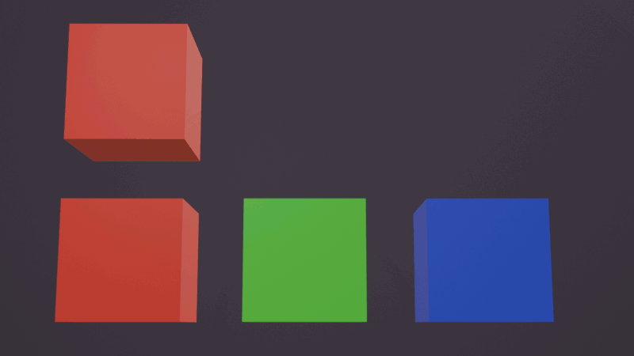

## Screenshot

## Description

This model tests the [`KHR_animation_pointer`](https://github.com/KhronosGroup/glTF/tree/main/extensions/2.0/Khronos/KHR_animation_pointer) extension's effect on the `baseColorFactor` of a material.  When animated, the top cube should rotate above other colored cubes, and change its own color to match the cubes below.

If the top cube moves but stays red the entire time, it may indicate that `KHR_animation_pointer` is not supported in your renderer.

This model was created in Blender 4.2.0 by placing keyframes for a material's default base color and using the "Push Down Action" button in the NLA Track Editor.  The glTF export settings were configured with "Animation Mode" set to "NLA Tracks" and with a checkmark placed on "Animation Pointer (experimental)".
