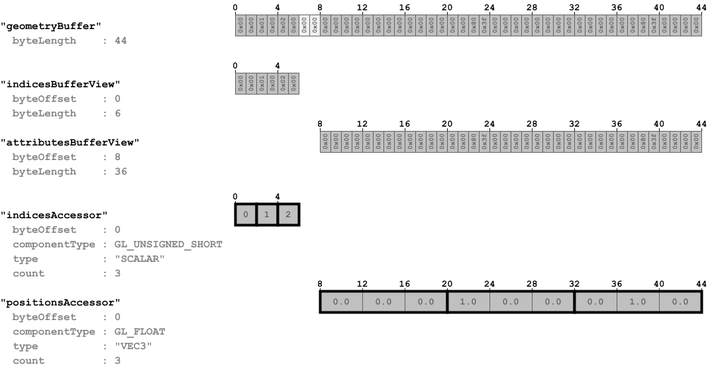
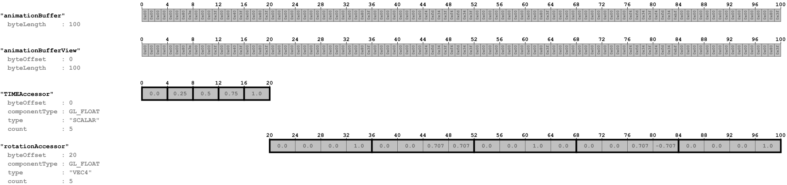

# Animated Triangle

## Tags

[core](../../Models-core.md), [testing](../../Models-testing.md), [written](../../Models-written.md)

## Summary

This sample is similar to the Triangle, but the node has a rotation property that is modified with a simple animation

## Operations

* [Display](https://github.khronos.org/glTF-Sample-Viewer-Release/?model=https://raw.GithubUserContent.com/KhronosGroup/glTF-Sample-Assets/main/./Models/AnimatedTriangle/glTF/AnimatedTriangle.gltf) in SampleViewer
* [Model Directory](./)

## Screenshot

## Data layout

The following images show the data layout of this sample:

## Legal

&copy; 2017, Public. [CC0 1.0 Universal](https://creativecommons.org/publicdomain/zero/1.0/legalcode)

 - javagl for Everything

#### Assembled by modelmetadata