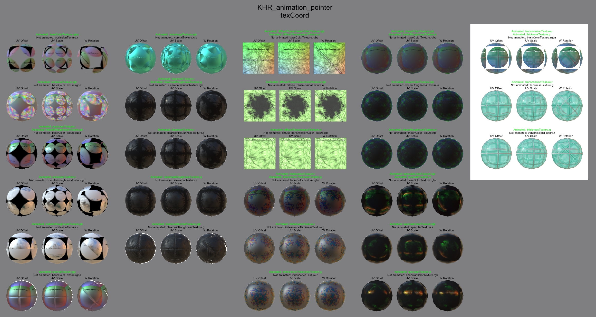

## Screenshot

 _Screenshot from [Babylon.js Sandbox](https://sandbox.babylonjs.com/)_

## Description

This model tests UV transform animations with [KHR_animation_pointer](https://github.com/KhronosGroup/glTF/blob/main/extensions/2.0/Khronos/KHR_animation_pointer/README.md) for position, scale, and rotation for each of the currently available texture slots:
* `baseColorTexture`
* `emissiveTexture`
* `occlusionTexture`
* `metallicRoughnessTexture`
* `normalTexture`
* `anisotropyTexture` from [KHR_materials_anisotropy](https://github.com/KhronosGroup/glTF/blob/main/extensions/2.0/Khronos/KHR_materials_anisotropy/README.md)
* `clearcoatTexture` from [KHR_materials_clearcoat](https://github.com/KhronosGroup/glTF/blob/main/extensions/2.0/Khronos/KHR_materials_clearcoat/README.md)
* `clearcoatRoughnessTexture` from [KHR_materials_clearcoat](https://github.com/KhronosGroup/glTF/blob/main/extensions/2.0/Khronos/KHR_materials_clearcoat/README.md)
* `clearcoatNormalTexture` from [KHR_materials_clearcoat](https://github.com/KhronosGroup/glTF/blob/main/extensions/2.0/Khronos/KHR_materials_clearcoat/README.md)
* `diffuseTransmissionColorTexture` from [KHR_materials_diffuse_transmission](https://github.com/KhronosGroup/glTF/pull/1825)
* `diffuseTransmissionTexture` from [KHR_materials_diffuse_transmission](https://github.com/KhronosGroup/glTF/pull/1825)
* `iridescenceTexture` from [KHR_materials_iridescence](https://github.com/KhronosGroup/glTF/blob/main/extensions/2.0/Khronos/KHR_materials_iridescence/README.md)
* `iridescenceThicknessTexture` from [KHR_materials_iridescence](https://github.com/KhronosGroup/glTF/blob/main/extensions/2.0/Khronos/KHR_materials_iridescence/README.md)
* `sheenColorTexture` from [KHR_materials_sheen](https://github.com/KhronosGroup/glTF/blob/main/extensions/2.0/Khronos/KHR_materials_sheen/README.md)
* `sheenRoughnessTexture` from [KHR_materials_sheen](https://github.com/KhronosGroup/glTF/blob/main/extensions/2.0/Khronos/KHR_materials_sheen/README.md)
* `specularColorTexture` from [KHR_materials_specular](https://github.com/KhronosGroup/glTF/blob/main/extensions/2.0/Khronos/KHR_materials_specular/README.md)
* `specularTexture` from [KHR_materials_specular](https://github.com/KhronosGroup/glTF/blob/main/extensions/2.0/Khronos/KHR_materials_specular/README.md)
* `transmissionTexture` from [KHR_materials_transmission](https://github.com/KhronosGroup/glTF/blob/main/extensions/2.0/Khronos/KHR_materials_transmission/README.md)
* `thicknessTexture` from [KHR_materials_volume](https://github.com/KhronosGroup/glTF/blob/main/extensions/2.0/Khronos/KHR_materials_volume/README.md)

Each material contains a "control" texture which is not animated, to test that only the desired texture is being animated instead of all textures in the material. 

Each texture includes a text label for easier verification of which are animated versus static. 

 _Animation of KHR_materials_anisotropy_

A directional light has been added behind the assets to provide back lighting for the diffuse transmission extension.

Cameras are provided for views of each extension or property type.

The asset was created in 3ds Max 2024, and exported with the [HS glTF Exporter](https://nu1963u.wixsite.com/custom3dsmax/gltfpluginfor3dsmax). Textures were generated with [Filter Forge](https://www.filterforge.com/).