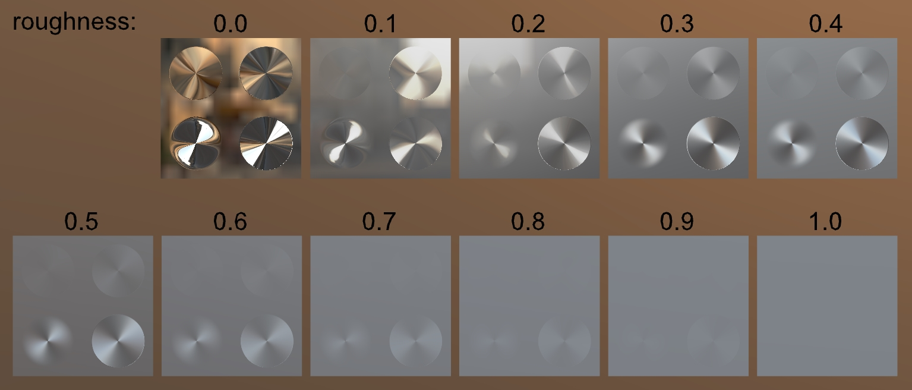

## Screenshot

 _Screenshot from [glTF Sample Viewer](https://github.khronos.org/glTF-Sample-Viewer-Release/) with the environment Pisa._

## Description

This model tests the main texturemap for [`KHR_materials_anisotropy`](https://github.com/KhronosGroup/glTF/tree/main/extensions/2.0/Khronos/KHR_materials_anisotropy).  It has the following features:

- An array of base material roughness values are tested with the same texturemap each time.

- The upper-left quadrant tests a disc-shaped anisotropic pattern at a strength of about 3%.

- The upper-right quadrant tests a disc-shaped anisotropic pattern at a strength of about 10%.

- The lower-right quadrant tests a disc-shaped anisotropic pattern at a full strength.

- The lower-left quadrant tests a disc-shaped anisotropic pattern with a gradient strength, starting at zero around the edges and increasing to full strength in the center.

Per the anisotropy specification, anisotropic strength increases the material's roughness along a particular direction.  Therefore, zero base roughness with full-strength anisotropy displays the most pronounced result.  Full 1.0 base roughness cannot increase more, and does not show any effects from anisotropy.
