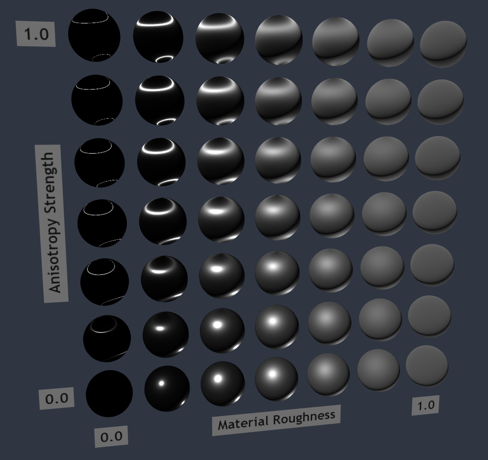

## Screenshot

## Description

This model tests the strength parameter for [`KHR_materials_anisotropy`](https://github.com/KhronosGroup/glTF/tree/main/extensions/2.0/Khronos/KHR_materials_anisotropy).

A grid of spheres compares material roughness (horizontally) to anisotropy strength (vertically).

Note the `KHR_materials_anisotropy` specification provides formulas to clearly define how anisotropy strength interacts with material roughness.  The effects should be most apparent in the column with zero material roughness, and anisotropy should not offer any effect when material roughness is 1.0.

