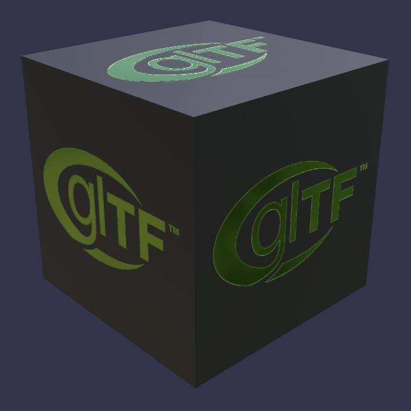

## Screenshot

## Description

The binary file is called `Box With Spaces.bin`, testing runtime support for the presence of spaces in a URI.  Three textures
also have spaces in their URIs, but each space character is URI-encoded as `%20`.

Client implementations are expected to URI-decode all URIs present in a glTF model, even when they represent files on a
local disk.  See [#1449](https://github.com/KhronosGroup/glTF/issues/1449) for additional comments.
