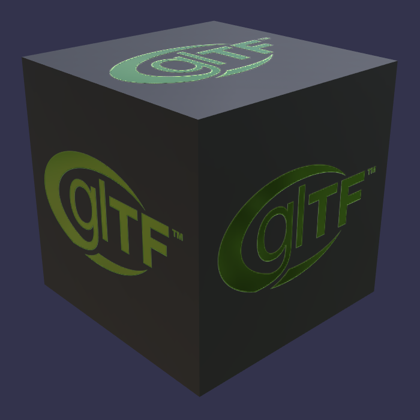

# Box With Spaces

<!-- This file is auto-generated by modelmetadata. Do not edit by hand. -->

## Tags

[core](../Models-core.md), [testing](../Models-testing.md)

## Summary

Box with URI-encoded spaces in the texture names used by a simple PBR material.

## Operations

* [Display](https://github.khronos.org/glTF-Sample-Viewer-Release/?model=https://raw.githubusercontent.com/KhronosGroup/glTF-Sample-Assets/main/./Models/Box%20With%20Spaces/glTF/Box%20With%20Spaces.gltf) in SampleViewer
* [Model Directory](./)

## Screenshot

## Description

The binary file is called `Box With Spaces.bin`, testing runtime support for the presence of spaces in a URI.  Three textures
also have spaces in their URIs, but each space character is URI-encoded as `%20`.

Client implementations are expected to URI-decode all URIs present in a glTF model, even when they represent files on a
local disk.  See [#1449](https://github.com/KhronosGroup/glTF/issues/1449) for additional comments.

## Legal

&copy; 2017, Analytical Graphics, Inc.. [Creative Commons Zero v1.0 Universal](https://creativecommons.org/publicdomain/zero/1.0/legalcode)

 - Ed Mackey for Everything

&copy; 2017, Khronos Group. [Khronos Trademark or Logo](../../LICENSES/LicenseRef-LegalMark-Khronos.txt)

 - Non-copyrightable logo for glTF logo

<!-- This file is auto-generated by modelmetadata. Do not edit by hand. -->
