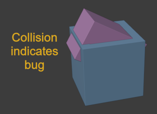

# Box Animated

## Tags

[core](../../Models-core.md), [testing](../../Models-testing.md)

## Summary

Rotation and Translation Animations. Start with this to test animations.

## Operations

* [Display](https://github.khronos.org/glTF-Sample-Viewer-Release/?model=https://raw.GithubUserContent.com/KhronosGroup/glTF-Sample-Assets/main/./Models/BoxAnimated/glTF-Binary/BoxAnimated.glb) in SampleViewer
* [Download GLB](https://raw.GithubUserContent.com/KhronosGroup/glTF-Sample-Assets/main/./Models/BoxAnimated/glTF-Binary/BoxAnimated.glb)
* [Model Directory](./)

## Screenshot

## Description

This model demonstrates a two-channel animation, one for rotation and the other
translation.  A smaller box rises up out of a larger hollow one, flips over, and
sinks back down.

## Common Problems

This model features a single animation with a pair of channels that have different
lengths.  The "rotation" channel finishes its work before the "translation" channel
is done.  However, these channels are not permitted to get out of sync: The shorter
channel may not loop and begin repeating until all of the channels within that
animation have finished playing.  Client runtimes must ensure that a single input
time is given to all of the channels within a particular animation, for the
animation to remain sensible.

This model will reveal such an issue on subsequent bounces of the inner purple box.
In affected runtimes, the box will begin rotating before it has moved to the top
position, and collide with the blue box.  If you see this, please file an issue
on the affected runtime's issue tracker.

## Legal

&copy; 2017, Cesium. [CC BY 4.0 International](https://creativecommons.org/licenses/by/4.0/legalcode)

 - Cesium for Everything

#### Assembled by modelmetadata