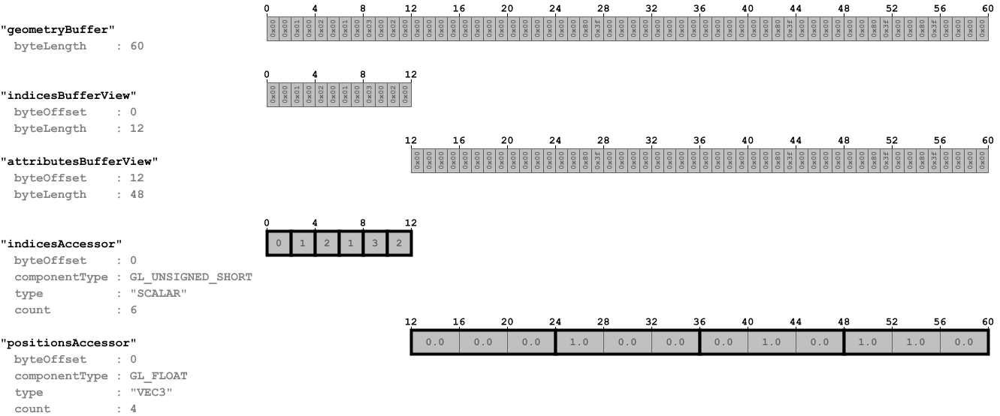

# Cameras

## Tags

[core](../../Models-core.md), [testing](../../Models-testing.md)

## Summary

A sample with two different camera objects

## Operations

* [Display](https://github.khronos.org/glTF-Sample-Viewer-Release/?model=https://raw.GithubUserContent.com/KhronosGroup/glTF-Sample-Assets/main/./Models/Cameras/glTF/Cameras.gltf) in SampleViewer
* [Model Directory](./)

## Screenshot

## Description

Two cameras and a simple plane mesh; a perspective camera and an orthographic camera.

## Data layout

The following image shows the data layout of this sample:

## Legal

&copy; 2017, Public. [CC0 1.0 Universal](https://creativecommons.org/publicdomain/zero/1.0/legalcode)

 - javagl for Everything

#### Assembled by modelmetadata