# CarConcept

## Tags

[showcase](../../Models-showcase.md), [extension](../../Models-extension.md)

## Extensions Used

* KHR_materials_clearcoat
* KHR_materials_emissive_strength
* KHR_materials_iridescence
* KHR_materials_transmission
* KHR_materials_variants
* KHR_texture_transform

## Summary

Concept car with Khronos logos and material variants

## Operations

* [Display](https://github.khronos.org/glTF-Sample-Viewer-Release/?model=https://raw.GithubUserContent.com/KhronosGroup/glTF-Sample-Assets/main/./Models/CarConcept/glTF/CarConcept.gltf) in SampleViewer
* [Model Directory](./)

## Screenshot

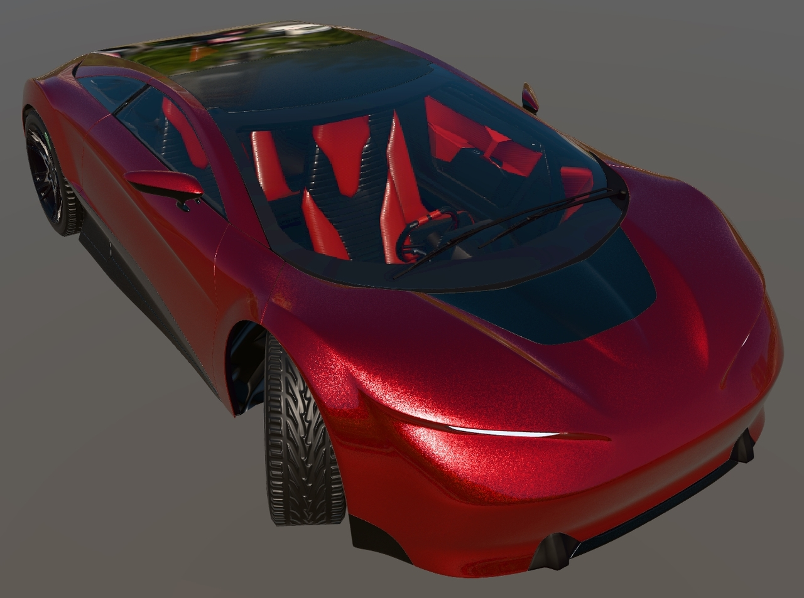
<br/>_Screenshot from [glTF Sample Viewer](https://github.khronos.org/glTF-Sample-Viewer-Release/) with the lighting environment Wide Street._


## Description

This asset represents an automotive "concept car" with material variants. 

The asset was started from a public domain [3D model created by Unity Fan](https://sketchfab.com/3d-models/free-concept-car-004-public-domain-cc0-4cba124633eb494eadc3bb0c4660ad7e), then optimized and converted into a well-formed glTF asset, to showcase the potential for high graphical quality in glTF while maintaining a small download size.

Instructions are provided on how to create similar assets using current industry-accepted 3D content creation techniques. 


## Model Cleanup

The source model is provided in FBX, glTF, and USDz formats. FBX is usually the best for editing because it preserves quads and polygons, which allows edgeloop workflows for content authoring.

The source FBX file has skinned meshes with bone animations, however the meshes have non-uniform and negative transforms, which causes issues when importing the model into [3ds Max](https://www.autodesk.com/products/3ds-max/overview).

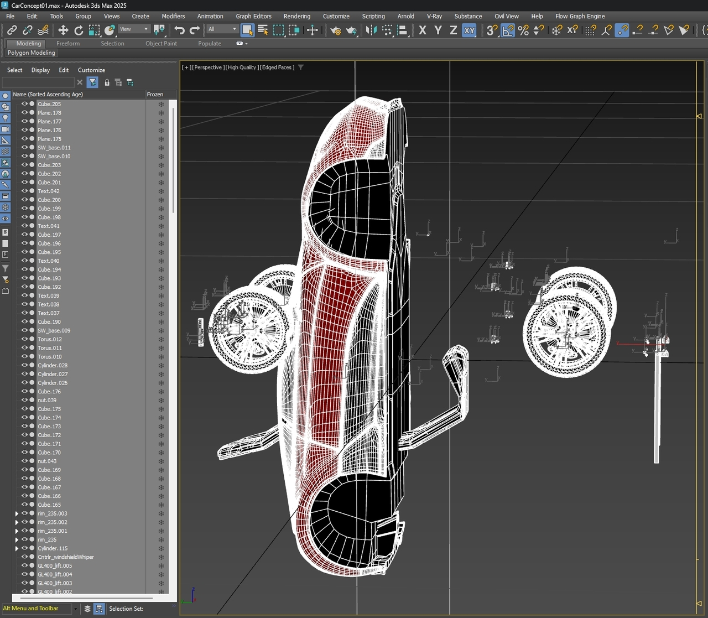
<br/>_The initial FBX import into 3ds Max._

To solve this, animation import was disabled, the model was re-imported, the bones and skin weights were removed, then the model parts were repositioned as needed, and all transforms were reset.

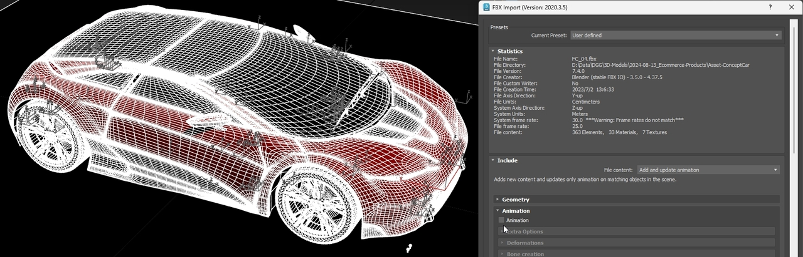
<br/>_FBX import after disabling animation._


## Names and Pivots

Model parts were changed to use logical names. This helps keep the model organized, and makes it easier for others to use the asset. 

Meshes had their transforms reset. This means the positions, rotations, and scales of the meshes were set to the default values. Clean transforms are necessary for a well-formed 3D asset, as they allow renderers and editing tools to transform the parts accurately. 

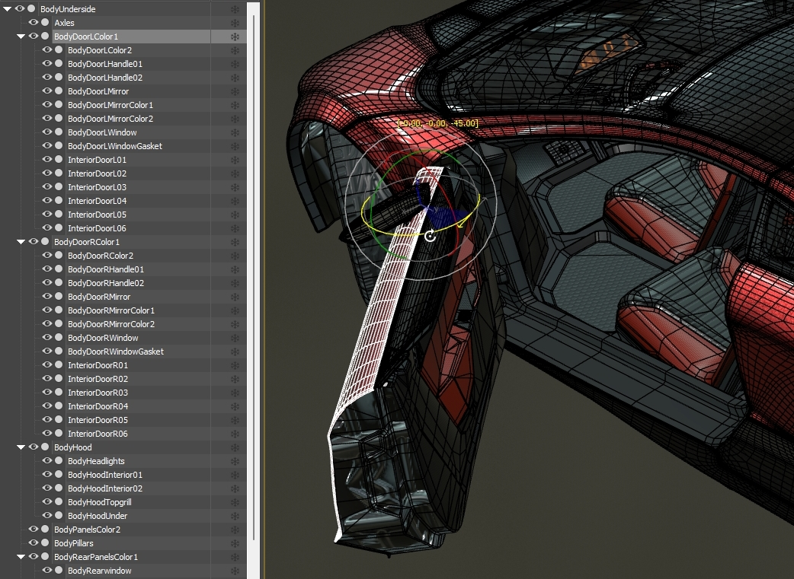
<br/>_The mesh names and hierarchies, and the left door being rotated open._

Meshes were linked together into hierarchies and pivots were adjusted, so parts can be rotated for examination and to allow interactivity. This allows a car door to be opened, and the associated parts will move along with it in a natural fashion.


## Double-Sided Surfaces

Many parts in the source model were created as shells with thickness. This is inefficient for web 3D delivery, because it doubles the vertex count, which increases the file size for downloading, as well as the memory size and transform cost for rendering. 

Instead of using costly extra vertices, these meshes can use the glTF material property `"doubleSided": true` as needed to force the backsides to be rendered.

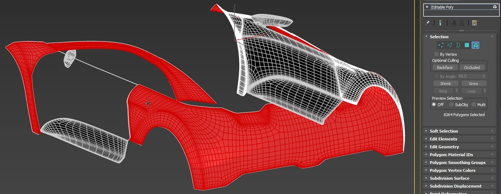
<br/>_The unseen inner surfaces of shells were deleted, using edgeloop selection techniques._


## UV Coordinates

Consistently-scaled and low-distortion texture coordinates were needed for the car body panels. The car paint materials use a normal map made of per-pixel noise, to emulate the effect of fine metallic flakes embedded within the paint. 

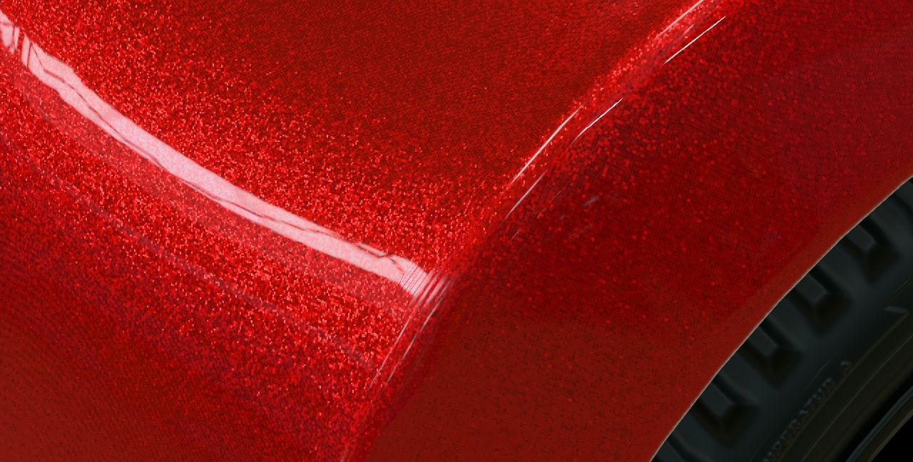
<br/>_The metallic flakes in the red car paint._

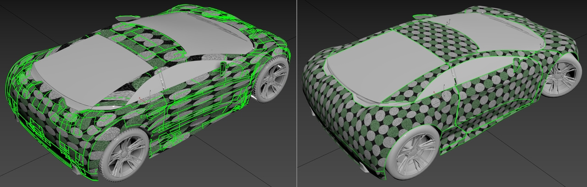
<br/>_Texture coordinates before and after. A circles texture helps show distortions, and UV seams are bright green._

New UVs were generated for the body panels using the Least Squares Conformal Map (LSCM) technique, which minimizes distortion while requiring less cuts or seams. 


## Small Parts Removal

The source model had many small parts which were removed to make a smaller file size. Individual nuts and bolts can add nice details to a model but they also increase the file size. Tradeoffs like these need to be made to achieve efficient real-time 3D models. 

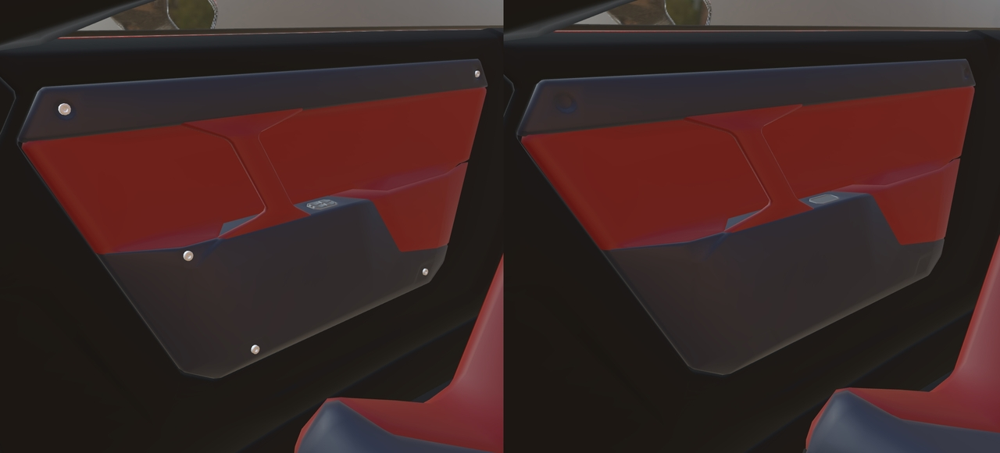
<br/>_Bolts on the door panels, before and after removal._


[RapidPipeline 3D Processor](https://docs.rapidpipeline.com/docs/componentDocs/3dProcessor/3d-processor-overview) was used to automatically remove all mesh parts below a specified size. In this case, any parts smaller than 3cm were removed. This avoided the tedium of finding and deleting all these bolts manually. Additional unseen mechanical parts were also removed for efficiency; the less unseen vertices the better.

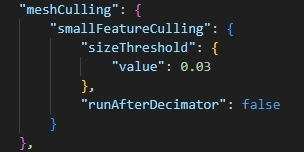
<br/>_smallFeatureCulling was used in RapidPipeline 3D Processor to automatically remove parts smaller than 3cm._


## Wheels

The black rubber wheels in the original model used detailed geometry for the treads. This was removed and a simple tube mesh was created with a tiled normal map. 

This approach offered significant savings by reducing the number of vertices used by each wheel, from 10,260 down to only 324. A normal map also looked better at a distance than geometry alone, because texture filtering avoided the jagged edges caused by mesh aliasing.

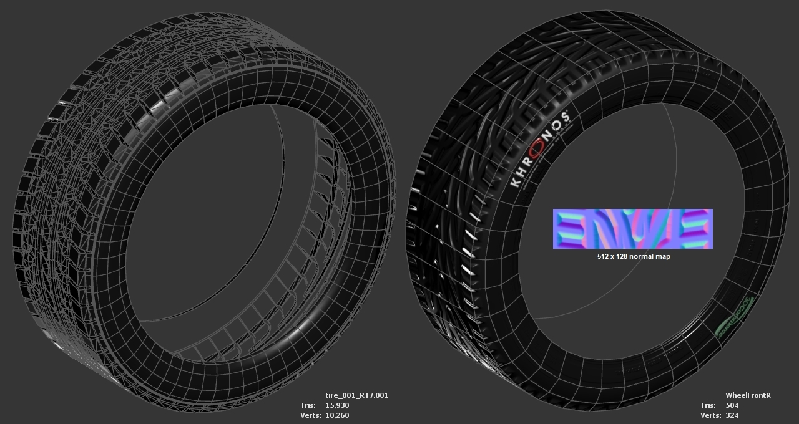
<br/>_The original wheel (left), and the recreated wheel (right)_

The tread texture started with a CC0 vector file, was converted into a normal map, then was cropped to the smallest repeating segment, and scaled to the nearest powers-of-two dimensions (512 x 128).


## Ambient Occlusion 

Ambient occlusion (AO) can be added for increased rendering realism. This effect creates soft shadowing from environment lighting, which mimics the effect of real-world lighting. 

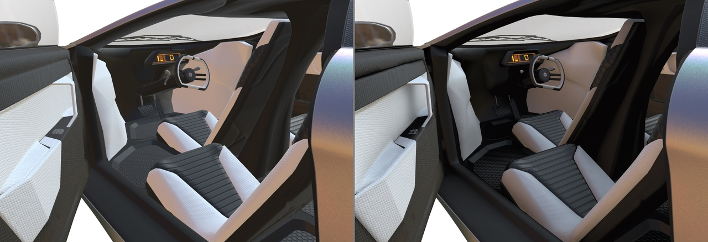
<br/>_Without ambient occlusion (left) versus with occlusion._

AO vastly improves render quality when using a real-time _rasterizer_, which is the rendering technology used for augmented reality and with most web 3D viewers because it is very fast and thus interactive. 

glTF assets can also be used by _pathtracers_ which are typically not real-time since they calculate all reflections and bounce lighting and shading. Pathtracers will simply ignore the AO texture if provided.

AO was baked for the model using [RapidPipeline 3D Processor](https://docs.rapidpipeline.com/docs/componentDocs/3dProcessor/3d-processor-overview) which has the option to create a new second UV set automatically, and bake a single AO texture for the whole asset. This avoided each material requiring its own separate AO texture, which would have greatly increased the file size.

RapidPipeline takes transmission and alpha into account when baking ambient occlusion. This prevents the windshield and other windows from occluding and darkening the interior. The glass also does not use texture space in the occlusion texture, improving the texture resolution for the rest of the model.  

The hood, doors, and rear hatch were rotated into an open position, prior to baking the occlusion. This prevented occlusion from over-darkening the interior parts of the car, and helps improve shading if these parts are opened up interactively. After baking, the rotated parts were reset to their original "closed" rotations. 

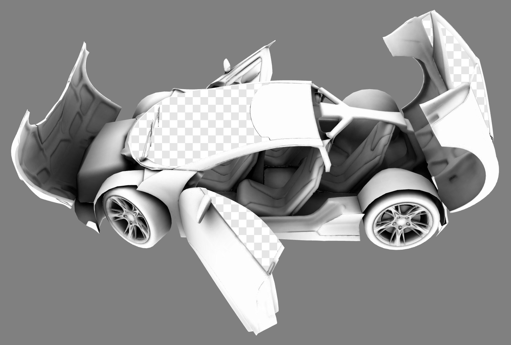
<br/>_Ambient occlusion was baked with doors rotated open._

After closing the doors, the car paint materials displaued some unwanted shadows, where the panels had received occlusion from the open doors. To remove these shadows, the occlusionTextures in the car paint materials were set to `"strength": 0`. This was better than completely removing occlusion from these materials, because that caused the glTF Validator to spawn Warnings for unused texture coordinates. 

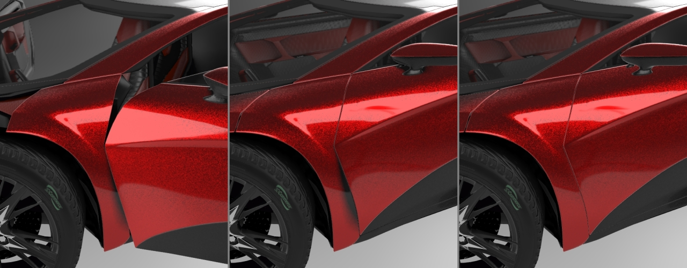
<br/>_Ambient occlusion was baked with doors open (left). Shadowing remained after closing the doors (middle). Setting the car paint occlusionTexture to zero removed unwanted shadows (right)._


## Compression

Four versions of the car asset were created using [RapidPipeline 3D Processor](https://docs.rapidpipeline.com/docs/componentDocs/3dProcessor/3d-processor-overview) with different compression techniques:

1. `\glTF` Uncompressed geometry with PNG textures.
    * Dot_C.png baseColor uses 1 bit per pixel (2 colors + alpha).
    * Rib_N.png normal map uses 4 bits per pixel (16 colors).
    * Dash_E emissive, Khronos_C.png baseColor, and Occlusion.png each use 8 bits per pixel (256 colors).
    * All other textures use 24 bits per pixel (16.7 million colors)
1. `\glTF-KTX-BasisU-Draco` Draco geometry compression with KTX2 texture compression.
    * [Draco](https://google.github.io/draco/): positionQuantization: 10, normalQuantization: 10, uvQuantization: 10.
    * [BasisU](https://github.com/BinomialLLC/basis_universal?tab=readme-ov-file#basis_universal): ETC1S for baseColor, occlusion, and emissive.
    * BasisU: UASTC for metallicRoughness, normal, and iridescencethickness.
1. `\glTF-JPG` Uncompressed geometry with JPG textures.
    * JPG level 100 for normal maps.
    * JPG level 65 for all other maps.
1. `\glTF-WEBP` Uncompressed geometry with WEBP textures.
    * WEBP level 100 for normal maps.
    * WEBP level 65 for all other maps.


## File Sizes Comparison

| Format | Download Size | Video Memory Size |
|:---|:---|:---|
| `\glTF` | 11.7 MB | 48.8 MB |
| `\glTF-KTX-BasisU-Draco` | 10.3 MB | 14.9 MB |
| `\glTF-JPG` | 9.9 MB | 48.8 MB |
| `\glTF-WEBP` | 9.8 MB | 48.8 MB |

The BasisU texture format in a KTX2 container stays compressed when the asset is uploaded to the GPU for rendering, which decreases the video memory cost from 48.8 MB down to 14.9 MB, and also reduces the time spent decompressing JPEG or PNG textures. These performance savings are especially important for configurators or any rendering setup that loads and unloads multiple models in a session.

Only the `\glTF-KTX-BasisU-Draco` version uses geometry compression. The other versions could significantly reduce their download sizes by adding geometry compression. Typically the asset in the \glTF folder does not use geometry compression, but the assets in the other folders could implement this in the future by submitting a pull request with geometry compression applied. 


## Material Variants

[Microsoft Visual Studio Code](https://code.visualstudio.com) with the [Cesium glTF Tools Extension](https://marketplace.visualstudio.com/items?itemName=cesium.gltf-vscode) was used to add material variants, employing the glTF extension [KHR_materials_variants](https://github.com/KhronosGroup/glTF/blob/main/extensions/2.0/Khronos/KHR_materials_variants/). The asset materials can be switched dynamically in viewers which support this extension.

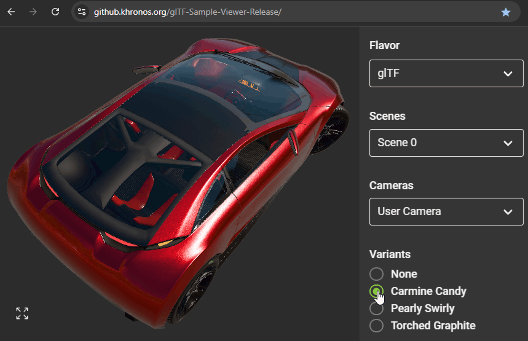
<br/>_Variants can be viewed in the [glTF Sample Viewer](https://github.khronos.org/glTF-Sample-Viewer-Release/)._

To create the variants structure in a glTF file, it helps to examine an existing asset that has material variants already. In this case the [SheenChair.gltf](https://github.com/KhronosGroup/glTF-Sample-Assets/tree/main/Models/SheenChair) from the glTF Sample Assets repo was used.
    
The "extensionsUsed" section of the car glTF needed "KHR_materials_variants" to be added. Then the "extensions" section from SheenChair was copied and added to the car glTF as a starting point. The names of the variants were edited, since these are the visible names which will appear in the UI as choices the user can pick. The car asset has three material variants: Carmine Candy, Pearly Swirly, and Torched Graphite.

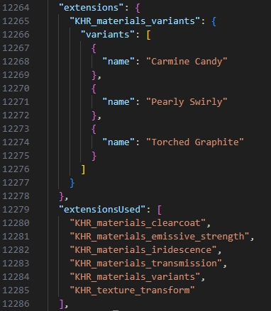
<br/>_The "extensions" section for the car, with the variant names._

In the "Materials" section of the car glTF, a material was chosen that needed a new variant created for it. All the lines that define this material were selected, copied, then pasted as a new material at the end of the Materials section. 

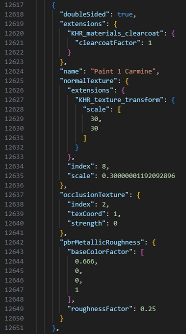
<br/>_This "Paint 1 Carmine" material was selected and copied to start a new variant._

The new material was renamed. This is optional but unique names help keep the scene organized. Then the material values were edited as desired to create a new look. It helped to use a visual editor like the Babylon.js Sandbox, which allows interactive visual editing. Colors and settings can be adjusted "live", then the resulting values can be typed into the glTF using Visual Studio Code.

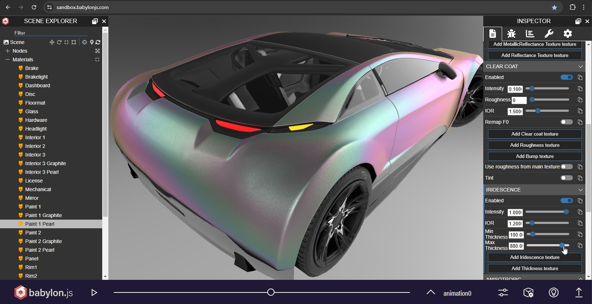
<br/>_Editing material values in the Babylon.js Sandbox._

To understand which materials need to be assigned to each variant, it helps to compile a material index list. These indices are numbers used internally by the glTF asset to identify which material is which. In Visual Studio Code, the "Materials" section was examined, and a list was made of the materials in the order they appeared in. 

Indices start with zero. In this list, 0-21 were the indices that were discovered to correspond to each of the car materials. New indices were then added afterwards, for the additional new materials which would be created for the variants.


### Material Index List
```
0   Mechanical
1   Glass
2   Panel
3   Interior 1
4   Floormat
5   Hardware
6   Interior 3
7   Interior 2
8   Dashboard
9   License
10  Paint 2
11  Paint 1
12  Signallight
13  Brakelight
14  Headlight
15  Mirror
16  Brake
17  Disc
18  Tireside
19  Tiretread
20  Rim2
21  Rim1
22  Paint 1 Pearl
23  Paint 1 Graphite
24  Paint 2 Pearl
25  Paint 2 Graphite
26  Interior 3 Pearl
27  Interior 3 Graphite
28  Panel Sides 
```

To designate which materials are used by which variants, an "extensions" section needed to be added to each of the meshes in the "Meshes" section of the car glTF. The SheenChair.gltf sample asset was used to copy the proper syntax. 
    
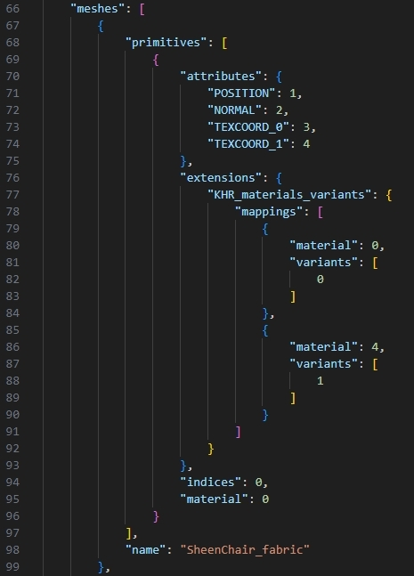
<br/>_The "extenions" section from SheenChair.gltf_

In the "Meshes" section of the car glTF, a mesh was found which needed to have its materials switched. The copied "extensions" section was then pasted in as a child inside the "primitives" section. This "extenstions" section will control which materials are assigned to the mesh whenever a user chooses that variant. 

The values inside it were then edited to match the number of variants. The car uses three so these were the numbered "variants": `0` for Carmine Candy, `1` for Pearly Swirly, and `2` for Torched Graphite. Then the "material" indices were edited to match the numbers from the Material Index List above: `11` for Paint 1 Carmine, `22` for Paint 1 Pearl, and `23` for Paint 1 Graphite.

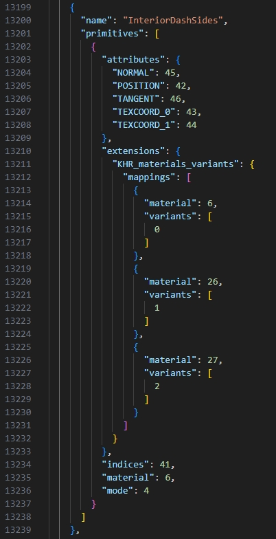
<br/>_The variant materials are defined for each mesh._

This process was repeated for each mesh that would get its materials changed, whenever the user selected the variant they wanted to see.


### Testing the Material Variants

The [glTF Sample Viewer](https://github.khronos.org/glTF-Sample-Viewer-Release/) has an easy way to test variants. 

1. Drag-and-drop your edited glTF file (along with its BIN file and textures) into the Sample Viewer. 
1. In the Models tab, click on the variant radio buttons at lower right.

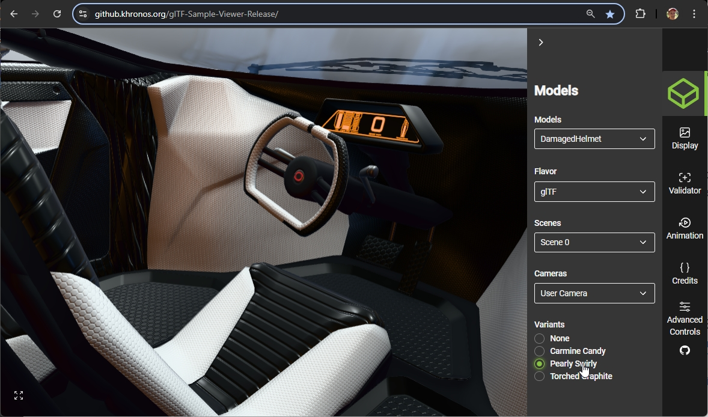
<br/>_Variants can be tested in the glTF Sample Viewer._


## Metallic Flake Car Paint

The red car variant uses a couple tricks to emulate the sparkly look of metallic flake car paint. 

* Metallic base
* Normal map with noise
* Nearest-neighbor texture filtering
* Clearcoat

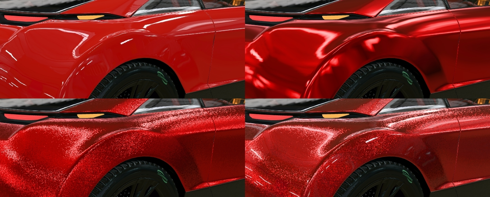
<br/>_Dielectric paint (top left), metallic paint with low roughness (top right), normal map with noise (bottom left), clearcoat top layer (bottom right)._

The red car paint uses a low-roughness metallic base layer for reflective contrast and colored reflections, a normal map containing per-pixel noise for the metallic flakes, nearest-neighbor texture filtering on the normal map to keep it sharp at close distances, and a clearcoat layer on top for smooth shiny reflections.

Image textures in glTF can use Sampling filters to customize how they are antialiased at render time. To assign "nearest-neighbor" filtering to the flakes normal map, the car asset was loaded in the [Babylon.js Sandbox](https://sandbox.babylonjs.com/) which allows filtering to be tested interactively on individual textures. The filter "Nearest & linear mip" worked well for the red metallic flake effect, so a GLB was exported, then opened in Visual Studio Code to get the filtering codes to use. 

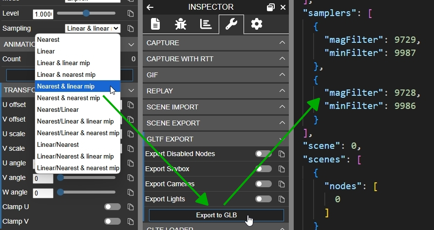
<br/>_Using the Babylon.js Sandbox to set the Sampling type, exporting it to GLB, and extracting the values in VS Code._


## Using the glTF Validator 

It is important to use the [glTF Validator](https://github.khronos.org/glTF-Validator/) to test glTF assets periodically throughout the creation process, and especially at the end. Well-formed glTF models will behave in a predictable manner when used across the ecosystem, in different viewers and renderers, as well as when importing into other tools for editing.

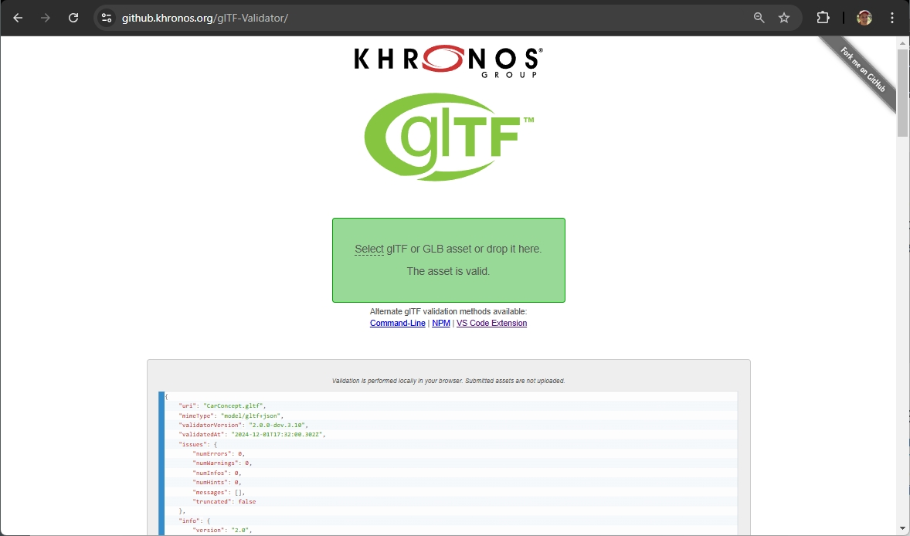
<br/>_The glTF Validator can catch many common problems with malformed glTF assets._


## Legal

&copy; 2024, Darmstadt Graphics Group GmbH. [CC BY 4.0 International](https://creativecommons.org/licenses/by/4.0/legalcode)

 - Eric Chadwick for Model and textures

&copy; 2015, Khronos Group. [Khronos Trademark or Logo]()

 - Non-copyrightable logo for Khronos logo

&copy; 2017, Khronos Group. [Khronos Trademark or Logo]()

 - Non-copyrightable logo for 3D Commerce logo

#### Assembled by modelmetadata