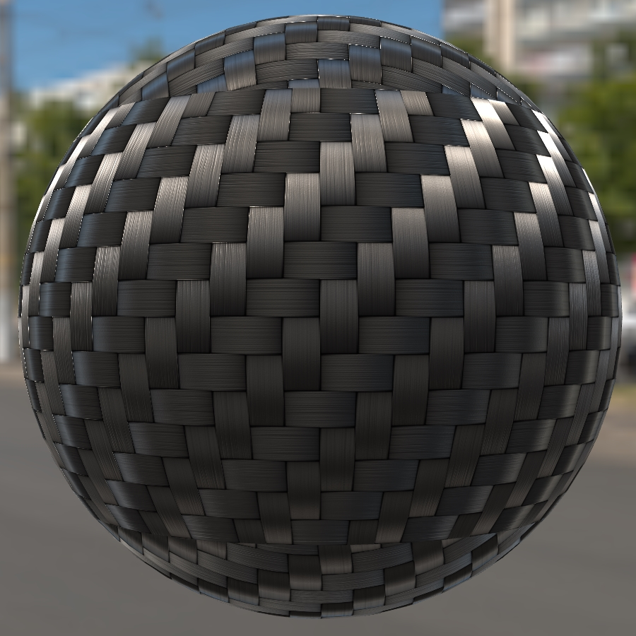
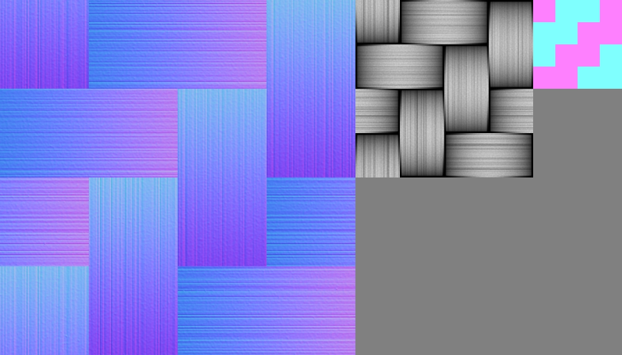

# Carbon Fibre Ball

## Tags

[extension](../../Models-extension.md)

## Extensions Used

* KHR_materials_anisotropy

## Summary

Example of anisotropy applied to a ball with a simulated carbon fiber surface.

## Operations

* [Display](https://github.khronos.org/glTF-Sample-Viewer-Release/?model=https://raw.GithubUserContent.com/KhronosGroup/glTF-Sample-Assets/main/./Models/CarbonFibre/glTF-Binary/CarbonFibre.glb) in SampleViewer
* [Download GLB](https://raw.GithubUserContent.com/KhronosGroup/glTF-Sample-Assets/main/./Models/CarbonFibre/glTF-Binary/CarbonFibre.glb)
* [Model Directory](./)

## Screenshot

Screenshot from the [glTF Sample Viewer](https://github.khronos.org/glTF-Sample-Viewer-Release/) with the Wide Street environment light.

## Description

This model is a sphere using the glTF extension [`KHR_materials_anisotropy`](https://github.com/KhronosGroup/glTF/tree/master/extensions/2.0/Khronos/KHR_materials_anisotropy) to create a carbon fibre material. 

The normalTexture is a higher resolution than the others to preserve more details in the shapes of individual fibres. The anisotropyTexture could in theory be only 4x4 pixels however that tends to introduce upscale artifacts. 

## Legal

&copy; 2023, Wayfair. [CC BY 4.0 International](https://creativecommons.org/licenses/by/4.0/legalcode)

 - Eric Chadwick for Models and Textures

#### Assembled by modelmetadata