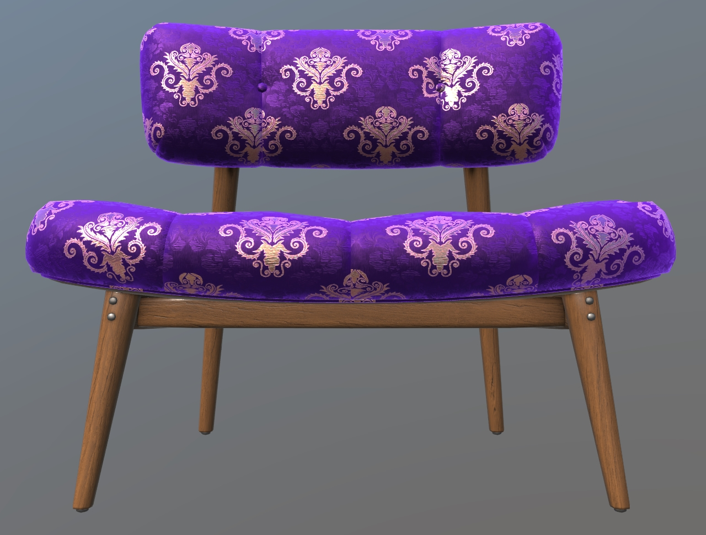

# Chair Damask Purplegold

## Tags

[extension](../../Models-extension.md)

## Extensions Used

* KHR_texture_transform
* KHR_materials_sheen
* KHR_materials_specular

## Summary

Use of sheen to create a high-end small seat (damask).

## Operations

* [Display](https://github.khronos.org/glTF-Sample-Viewer-Release/?model=https://raw.GithubUserContent.com/KhronosGroup/glTF-Sample-Assets/main/./Models/ChairDamaskPurplegold/glTF-Binary/ChairDamaskPurplegold.glb) in SampleViewer
* [Download GLB](https://raw.GithubUserContent.com/KhronosGroup/glTF-Sample-Assets/main/./Models/ChairDamaskPurplegold/glTF-Binary/ChairDamaskPurplegold.glb)
* [Model Directory](./)

## Screenshot

 _Screenshot from [glTF Sample Viewer](https://github.khronos.org/glTF-Sample-Viewer-Release/) with the environment Wide Street._

## Description

This represents a wood-framed chair with a fabric seat, tufted with fabric buttons. It does not represent a real Wayfair product. 

There are four materials: fabric, wood, metal, and label. 

The damask-patterned satin and velvet fabric has been textured to simulate human touches bending the velvet fibers, via noise patterns in the normal bump texture. The metalness texture is used to assign the gold threads as metal and the purple threads as non-metal. The KHR_materials_sheen extension provides velvet fresnel, while the KHR_materials_specular extension alters the specular color as seen in satin and velvet fabric samples. 

Real-world satin brocade example:
* https://www.moodfabrics.com/purple-and-metallic-gold-vestment-jacquard-318335

## Legal

&copy; 2021, Wayfair. [CC BY 4.0 International](https://creativecommons.org/licenses/by/4.0/legalcode)

 - Eric Chadwick for Models and Textures

#### Assembled by modelmetadata