## Screenshot

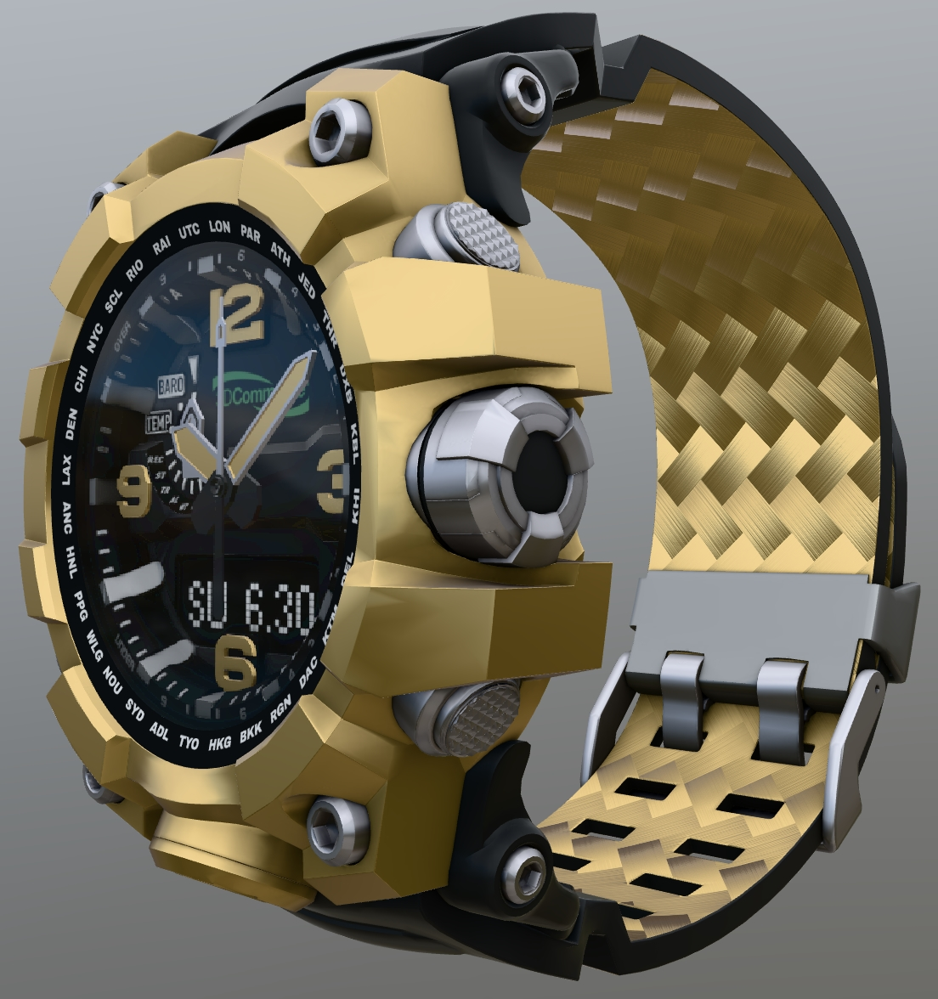
 _Screenshot from [glTF Sample Viewer](https://github.khronos.org/glTF-Sample-Viewer-Release/) with the environment Cannon Exterior._

## Description

This asset represents a wrist watch with animated second hand and material variants, including the 3D Commerce and Khronos Group and DGG logos. 

The asset was started from "Chronograph Watch Mudmaster" (https://skfb.ly/oAsPA) by graphiccompressor, licensed under Creative Commons Attribution (http://creativecommons.org/licenses/by/4.0/). 

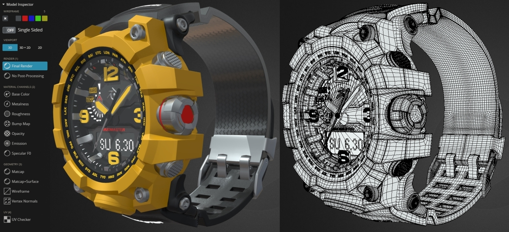
 _Screenshots from Sketchfab of the original asset, with 885k triangles._

It was then optimized and converted into a well-formed glTF asset, to showcase the potential for high graphical quality in glTF while maintaining a small download size, and to provide instructions on how to optimize and convert similar assets. 

## Model Cleanup

The source model is provided in FBX, glTF, and USDz formats. FBX is usually the best for editing because it preserves quads and polygons, which allows edge loop workflows during content authoring.

The source FBX file was imported into 3ds Max for initial editing and animation. 

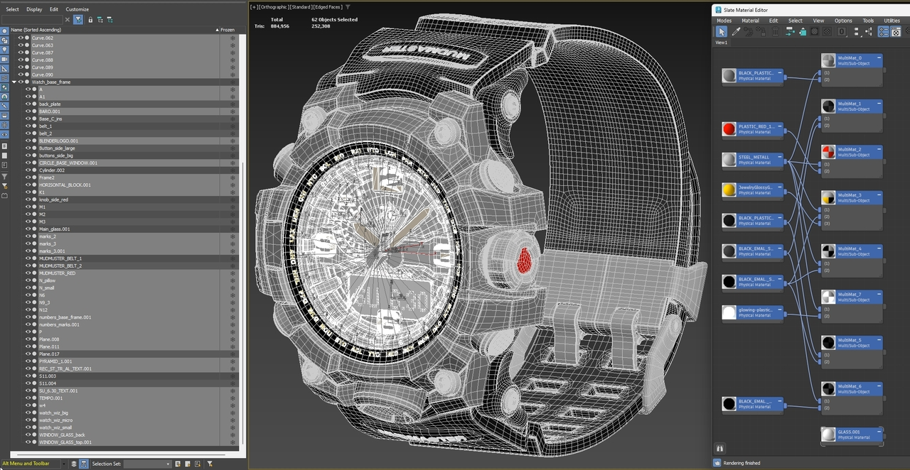
 _Screenshot from 3ds Max of the imported FBX, with object names, shaded wireframe, and materials._

Some of the meshes had non-uniform and/or negative transforms, and the origin was located inside the rear of the watch face. It is a good idea to export early and often, to check the status of an asset in the target rendering environment. In this case, when the model was exported into glTF, some parts like the wrist band were rendering misaligned.

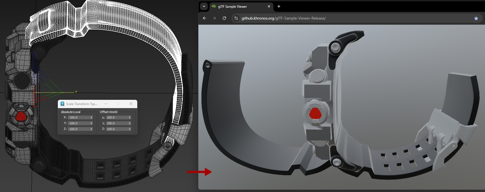
 _Screenshot from 3ds Max of the imported FBX with negative transforms (left), and a glTF exported and loaded into the glTF Sample Viewer (right)._

To fix this, the whole model was moved forward slightly such that the world origin would be where the top of a human wrist would be located, so the model could potentially be used in a virtual try-on setup with augmented reality. Then all the transforms were reset to their default values.

## Animation

Animation was created for the second hand at 24 frames per second. This will allow the model to be imported more easily into Blender later for optimization. 

To show the typical non-smooth "tick-tock" rotation between the second markings on the watch face, the hand was rotated using "Step" tangents which creates a binary motion, without any interpolation between keyframes. The second hand stays at the 12 position for 24 frames (frame 0 to frame 23) then suddenly jumps to the 1st second mark at frame 24.

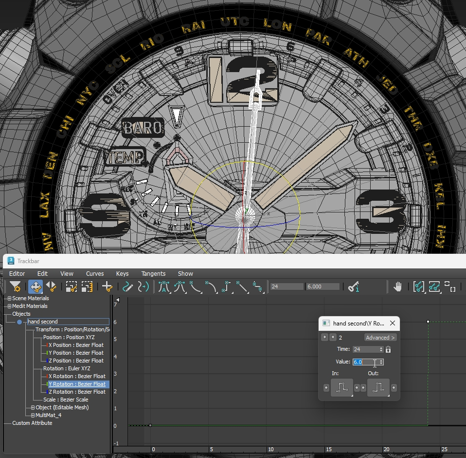
 _Screenshot from 3ds Max showing the Step tangents for the second hand._

The total rotation around the watch face is 360 degrees, so dividing this into 60 seconds meant the second hand needed to be rotated 6 degrees for each second. 

To repeat the second hand motion, the animation controller was set to use "Relative Repeat". This meant only two animation keyframes needed to be create, at zero and six degrees, and the controller would cause the binary rotation to repeat indefinitely. 

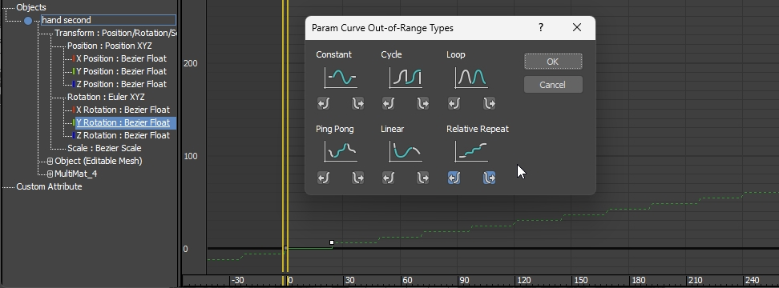
 _Screenshot from 3ds Max showing the Relative Repeat controller._

Then the total time range was set to 1440 frames, which is 24 frames per second x 60 seconds. This causes the second hand to complete a whole circuit of the watch face at frame 1440. 

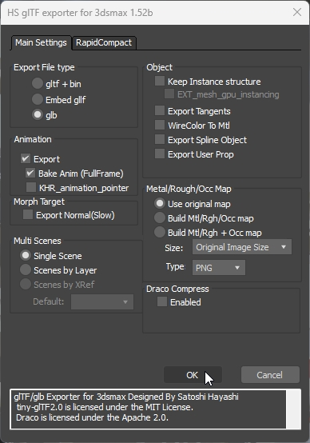
 _Screenshot from 3ds Max showing the glTF export settings._

The model was then exported out of 3ds Max in glTF format, using the [HS glTF Exporter](https://nu1963u.wixsite.com/custom3dsmax/gltfpluginfor3dsmax), and setting the option to `Bake Anim (FullFrame)` which converts the parametric animation of Relative Repeat into actual keyframes, insuring the full animation is preserved in the glTF file.

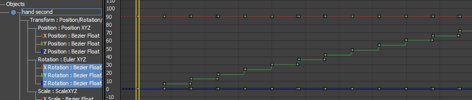
 _The baked keyframes._

## Materials

The Autodesk Standard Surface Materials from the FBX were converted into glTF Materials, and assigned appropriate values. 

The watch band was given a carbon fiber material, by reusing the normal map texture from another sample asset [CarbonFibre](https://github.com/KhronosGroup/glTF-Sample-Assets/tree/main/Models/CarbonFibre#screenshot). For this asset the glTF extension [KHR_materials_anisotropy](https://github.com/KhronosGroup/glTF/blob/main/extensions/2.0/Khronos/KHR_materials_anisotropy/README.md#khr_materials_anisotropy) was not needed. While this material is not strictly physically accurate, the normal map alone was considered good enough. Whenever possible, it is a good practice to use as few extensions as possible, since it's not always guaranteed that all renderers will support all extensions.

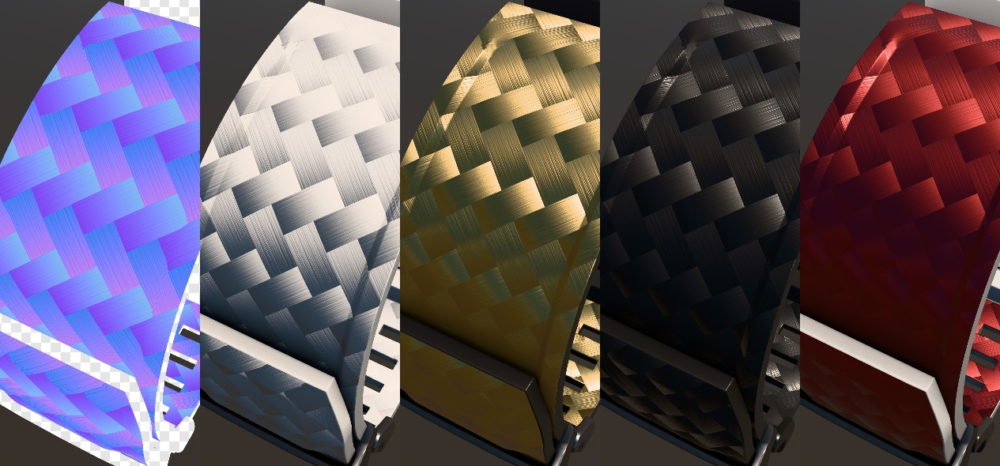
 _Carbon fiber normal map, and the resulting material variants._

To customize the watch for glTF use, the Blender and Mudmaster logo meshes were removed, then the Khronos Group and 3D Commerce and DGG logos were applied as textures. The 3D Commerce logo was set up to be baked along with the rest of the meshes comprising the watch face, into one cohesive texture set (see below for details about using the Remesher). 

The Khronos Group and DGG logos were created as cropped textures, which didn't strictly match the dimensions of the meshes. Instead, the UV was set to roughly fit the meshes, and the glTF texture Samplers were set to use the wrap mode `ClampToEdge`. This allows the texture to be applied to the whole surface, then to use [KHR_texture_transform](https://github.com/KhronosGroup/glTF/tree/main/extensions/2.0/Khronos/KHR_texture_transform#khr_texture_transform) for precise placement, and the colors of the edge pixels will simply repeat out to the edges of the material for a seamless decal. 

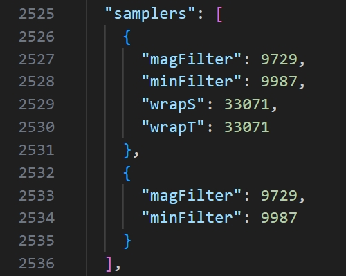
 _The texture samplers, showing the wrapS and wrapT values for `ClampToEdge`._

The values for the various wrap modes can be found online, for example [here on microsoft.com](https://learn.microsoft.com/en-us/dotnet/api/microsoft.mixedreality.toolkit.utilities.gltf.schema.gltfwrapmode).

Before adding the KHR_texture_transform extension, the logos simply filled the polygons they were applied to, as shown here:
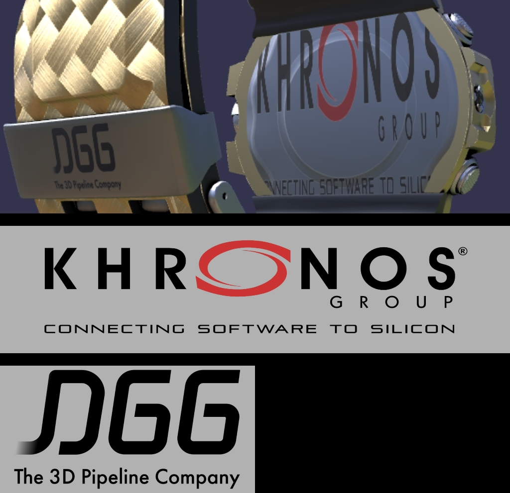
 _Logos applied without transforms, and the logo textures themselves._

After adding the texture transforms, the logos were scaled and moved into the correct locations on the meshes:
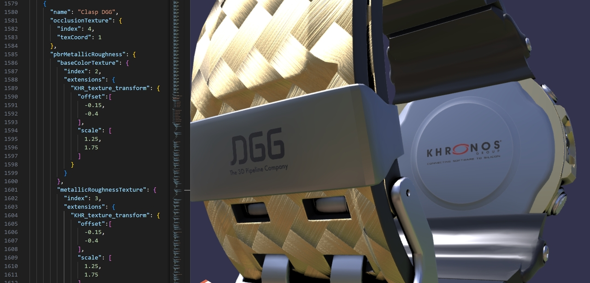
 _Texture transforms added for the logos._

## Optimization

The model was imported into Blender for optimization, amd the [RapidPipeline Blender Plugin](https://docs.rapidpipeline.com/docs/componentDocs/BlenderPlugin/blender-plugin-overview) was used to process different sets of meshes. The meshes were organized into Collections, to allow them to be processed using different optimization settings. 

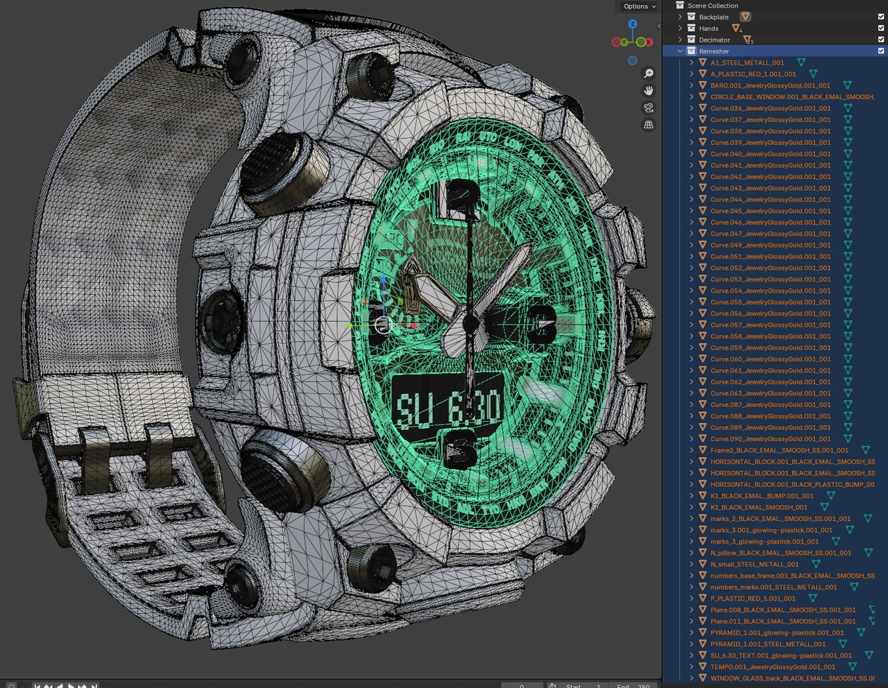
 _The meshes in Blender, organized into Collections. The meshes for the watch face are selected and highlighted in green._

The watch face under the glass was built out of 55 individual mesh parts; each letter is its own mesh part. Optimizing these with straightforward decimation would be counterproductive since there is no way to achieve significant savings without severely distorting the shapes. 

Instead to solve this it was decided to use a Remesher to shrinkwrap a new unified mesh overtop the existing meshes, then bake all the original mesh details into new textures. This allowed the shrinkwrapped mesh to be decimated significantly, while preserving all the fine detail from the original separated surfaces.

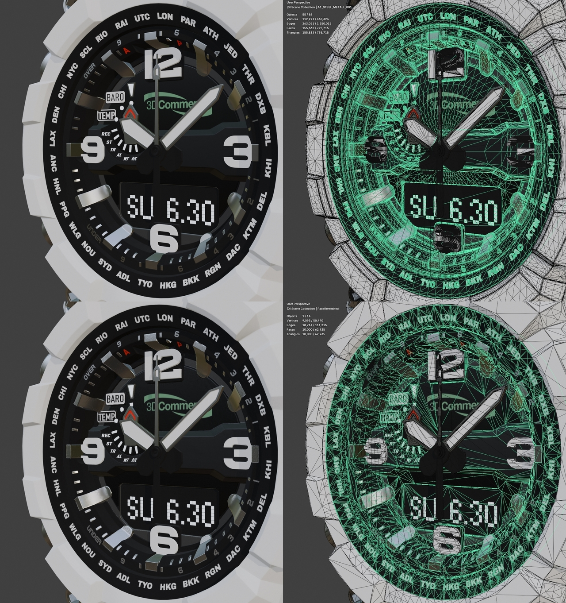
 _The source meshes (top) at 155,832 triangles, and the remeshed result (bottom) at 10,000 triangles._

The large numerals for 12/3/6/9 were kept separate from the watch face, to allow them to be recolored to match the outer watch frame.

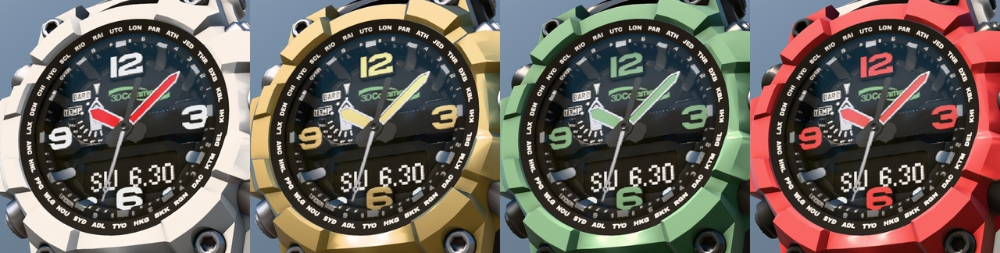
 _The four material variants, showing coloration of the large numerals._

Most of the rest of the asset was organized into a Collection for decimation. The tiling and localized transforms needed to be preserved for the carbon fiber texture and for the logos, and the meshes needed to be combined by material to reduce draw calls. So for example all the buttons should be combined into a single combined mesh with one material. 

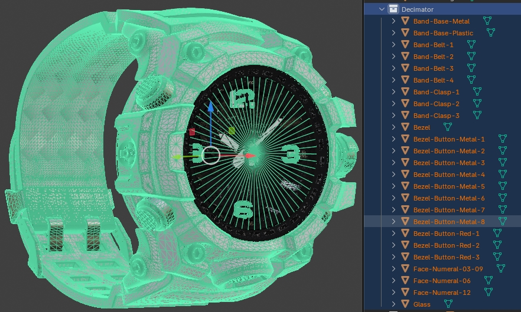
 _The meshes for decimation and UV preservation._

The RapidPipeline plugin was used to perform all these actions together, and to create a 2nd UV layout to bake ambient occlusion for all the meshes, which saved a significant amount of time and allowed iterations to be performed quickly to achieve the desired results.

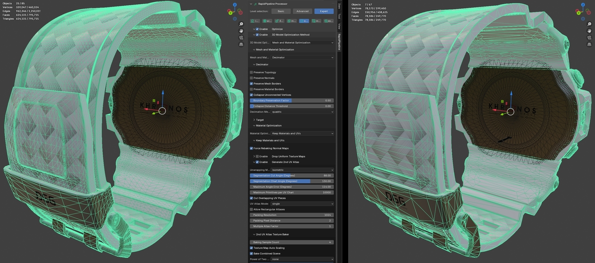
 _The meshes before and after decimation with UV preservation and AO baking._

The final asset has two AO textures, one for the remeshed watch face and the other for the rest of the asset. Ambient occlusion is a significant material ingredient for real-time physically based rendering, and should be added whenever possible to add realistic localized shading. This is best done in a pre-processing step, to minimize runtime rendering overhead.  

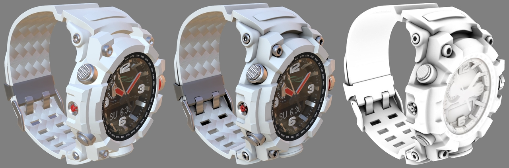
 _Without ambient occlusion (left), with AO (middle), and AO alone (right)._

The backplate for the watch is entirely metal and mostly flat with subtle curvature. Smooth metallic surfaces present a particular problem in real-time rendering as they stress most optimization techniques. For this asset the best approach is to not decimate the original geometry, and to not use normal mapping as shown below. 

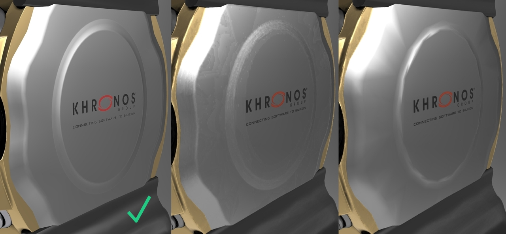
 _Geometry alone (left), decimated and normal mapped (middle), decimated alone (right)._

The original mesh for the backplate is already fairly optimized at only 2816 triangles (left). If the mesh is decimated it shows tesselation artifacts (far right). One common solution for low-resolution meshes (as shown in the middle) is to bake a normal map from the high-res surface. However smooth metallic surfaces expose the limitations of using an 8-bits-per-channel normal map, because there is not enough precision to represent subtle surface curvature. 

The best solution here was to accept a few more more triangles and to not use a normal map at all. This also ends up saving file size and video memory, since high-definition textures can be fairly expensive in memory.

## Material Variants

The materials for this asset were all authored using pure white values, then variants were created using the same methods as explained in the [readme for the CarConcept](https://github.com/KhronosGroup/glTF-Sample-Assets/blob/main/Models/CarConcept/README.md#material-variants) sample asset.

An additional trick employed here was to set the "gold" materials for the default variant. This was accomplished by first compiling a numbered list of all the materials in the glTF asset (shown at left), then changing the default materials in the "meshes" sections to match the desired material indices (as shown on the right):

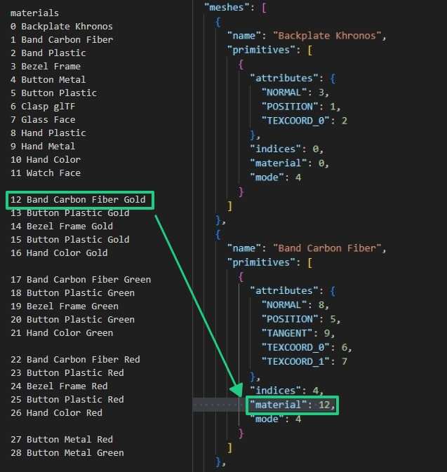
 _A manually-compiled list of the glTF materials (left) was used to edit the desired default materials for each mesh (right)._

## Using the glTF Validator

To create a well-formed glTF asset that will work reliably in multiple renderers, it is a good practice to load the asset into the [glTF Validator](https://github.khronos.org/glTF-Validator/) and take note of any issues reported.

Because this asset uses a normal map for the carbon fiber on the watch band, it needs the tangent space added to the mesh. [RapidPipeline 3D Processor](https://docs.rapidpipeline.com/docs/componentDocs/3dProcessor/3d-processor-overview) was used to make sure all issues reported by the validator were fixed, giving the asset a clean "bill of health".

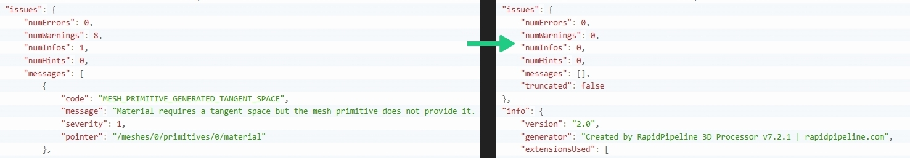
 _Issues with the glTF were resolved using the glTF Validator and RapidPipeline 3D Processor._

