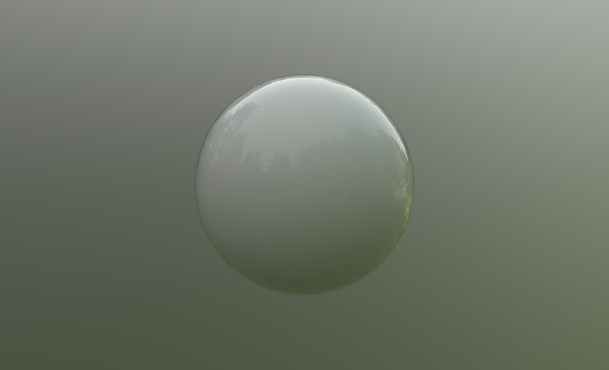

# Clearcoat Sphere

## Tags

[extension](../../Models-extension.md), [issues](../../Models-issues.md)

## Extensions

### Required

* KHR_materials_clearcoat

### Used

* KHR_materials_clearcoat
* KHR_materials_clearcoat

## Summary

Example of clearcoat applied to a sphere

## Operations

* [Display](https://github.khronos.org/glTF-Sample-Viewer-Release/?model=https://raw.GithubUserContent.com/KhronosGroup/glTF-Sample-Assets/main/./Models/ClearcoatSphere/glTF/ClearcoatSphere.gltf) in SampleViewer
* [Model Directory](./)

## Screenshot

## Descriptpion
_none provided_

## Legal

&copy; 2022, UX3D. [CC BY 4.0 International](https://creativecommons.org/licenses/by/4.0/legalcode)

 - UX3D for Everything

#### Assembled by modelmetadata