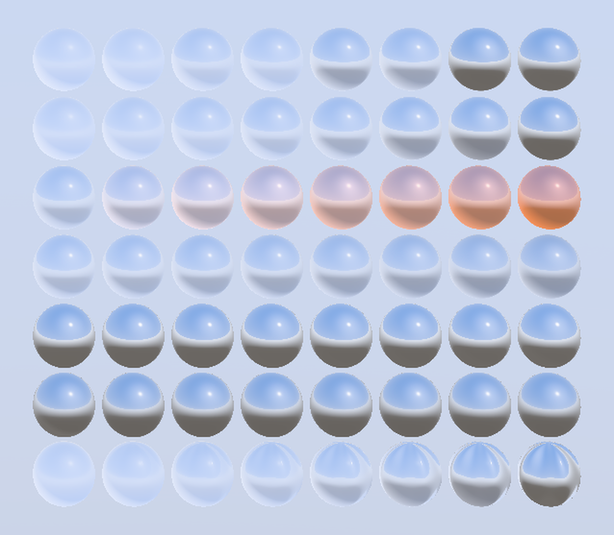

# Coat Parameter Sweep

<!-- This file is auto-generated by modelmetadata. Do not edit by hand. -->

## Tags

[testing](../Models-testing.md), [pbrtest](../Models-pbrtest.md), [extension](../Models-extension.md)

## Extensions Used

* KHR_materials_clearcoat
* KHR_materials_coat

## Summary

Parameter sweep for KHR_materials_coat, with a height-matched clearcoat-to-coat mapping control.

## Operations

* [Display](https://github.khronos.org/glTF-Sample-Viewer-Release/?model=https://raw.githubusercontent.com/KhronosGroup/glTF-Sample-Assets/main/./Models/CoatParameterSweep/glTF-Binary/CoatParameterSweep.glb) in SampleViewer
* [Download GLB](https://raw.githubusercontent.com/KhronosGroup/glTF-Sample-Assets/main/./Models/CoatParameterSweep/glTF-Binary/CoatParameterSweep.glb)
* [Model Directory](./)

## Screenshot

 _Rendered by the [DisplayXR Model Viewer](https://github.com/DisplayXR/displayxr-demo-modelviewer) under its procedural sky environment._

## Description

A parameter sweep for `KHR_materials_coat`. Seven rows of eight spheres over a
common base -- a neutral light-grey dielectric, `baseColorFactor` (0.78, 0.78,
0.80) at roughness 0.40 -- where each row varies exactly one coat property from
left to right, so a difference between two implementations localises to a single
property rather than to "the coat looks wrong".

## Row 0 is a conformance control, and it is the point of the asset

The coat specification states that the `KHR_materials_clearcoat` parameters are
"fully transferable to this extension, with no changes". Row 0 tests that claim
directly: **even columns carry `KHR_materials_clearcoat`, odd columns carry the
`KHR_materials_coat` material it is said to map to**, at four sweep values.

Each pair shares a row, and therefore a height and an environment. This matters
more than it looks. An earlier version of this asset placed the clearcoat control
and the coat sweep in *separate rows*; under any vertically varying environment
(which is to say, any realistic IBL) two identical mirror-ish materials at
different heights do not render identically, and the comparison silently stops
being a test. Pairs at equal height make "these must match" exact.

A conforming implementation should render each pair as two indistinguishable
spheres. Any visible difference within a pair is a defect in the clearcoat-to-coat
mapping.

One caveat, and it is the reason the asset pins the value rather than relying on
a default. The coat columns set `coatDarkeningFactor` to `0.0` explicitly, because
`KHR_materials_clearcoat` never modelled internal-reflection darkening and the
pair could not otherwise match. Were the extension's default of `1.0` to apply
here, the coat halves would render darker than their clearcoat partners and the
control would fail for a reason that has nothing to do with the mapping. Row 3
sweeps darkening on purpose, in isolation.

## The remaining rows

| Row | Property swept |
|---|---|
| 1 | `coatFactor`, 0 to 1 |
| 2 | `coatColorFactor`, white to amber, at `coatFactor` 0.5 |
| 3 | `coatDarkeningFactor`, 0 to 1, at `coatFactor` 0.5 |
| 4 | `coatIor`, 1.0 to 2.0 |
| 5 | `coatAnisotropyStrength`, 0 to 1, coat roughness 0.15 |
| 6 | `coatNormalTexture`, a ripple normal map, `coatFactor` 0 to 1 |

Two of these are deliberately subtle, for physical reasons rather than authoring
ones. **Darkening** is a one-bounce round trip with a reflectance around 0.04, so
the spec's own model yields only a few per cent across the row. **Anisotropy** on
the coat lobe is a direct-light effect, so its whole-sphere contribution under a
dominant environment light is small. Neither row should be expected to swing
hard, and an implementation is not wrong for rendering them gently.

The base material is deliberately smooth so that any ripple visible in row 6
belongs to the coat's own normal rather than to the base.

## A note on glTF-Validator output

This asset validates with no errors and no warnings, but it does report
`UNUSED_MESH_TANGENT` and `UNUSED_OBJECT` (for `TEXCOORD_0`) against every
primitive. Those are false positives and the attributes should not be stripped:
the validator does not yet support `KHR_materials_coat`, so it cannot see that
row 6 samples `coatNormalTexture`, and the extension additionally requires a
tangent space for row 5 -- "A mesh primitive using coat anisotropy **MUST** have
a defined tangent space". The attributes are carried uniformly across all rows so
that every sphere in the asset is the same geometry.

## Provenance

Generated procedurally rather than modelled, so it can be regenerated against a specification change in one command. The generator is [`make_khronos_conformance_assets.py`](https://github.com/DisplayXR/displayxr-demo-modelviewer/blob/main/scripts/make_khronos_conformance_assets.py) in the [DisplayXR model viewer](https://github.com/DisplayXR/displayxr-demo-modelviewer).

## Legal

&copy; 2026, Leia Inc.. [Creative Commons Zero v1.0 Universal](https://creativecommons.org/publicdomain/zero/1.0/legalcode)

 - DisplayXR for Entire Model

<!-- This file is auto-generated by modelmetadata. Do not edit by hand. -->
