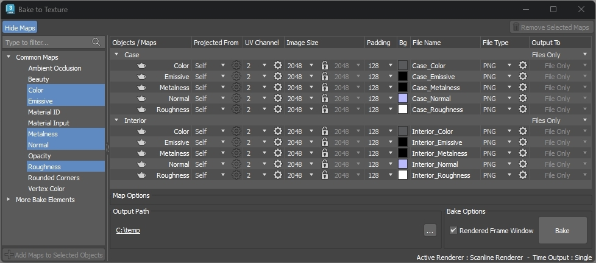

# Commercial Refrigerator

## Tags

[showcase](../Models-showcase.md), [extension](../Models-extension.md)

## Extensions

### Required

* KHR_materials_transmission

### Used

* KHR_materials_transmission
* KHR_materials_clearcoat
* KHR_materials_transmission

## Summary

Commercial refrigerator with glass condensation, champagne bottles, and door animation.

## Operations

* [Display](https://github.khronos.org/glTF-Sample-Viewer-Release/?model=https://raw.GithubUserContent.com/KhronosGroup/glTF-Sample-Assets/main/./Models/CommercialRefrigerator/glTF-Binary/CommercialRefrigerator.glb) in SampleViewer
* [Download GLB](https://raw.GithubUserContent.com/KhronosGroup/glTF-Sample-Assets/main/./Models/CommercialRefrigerator/glTF-Binary/CommercialRefrigerator.glb)
* [Model Directory](./)

## Screenshot

 _Screenshot from [glTF Sample Viewer](https://github.khronos.org/glTF-Sample-Viewer-Release/) with the environment Colorful Studio._

## Description

This asset represents a small glass-fronted commercial refrigerator of the type seen commonly in convenience stores. 

The asset was created to demonstrate a high quality model for e-commerce use, and to provide instructions on how to create similar assets using current industry-accepted 3D content creation techniques. 

## Source Asset

This work is based on "Commercial Fridge" (https://sketchfab.com/3d-models/commercial-fridge-2174e1e4f1f24f1a95aa110ee060f473) by Sean Thomas (https://sketchfab.com/foon.) licensed under CC-BY-4.0 (http://creativecommons.org/licenses/by/4.0/).

This asset looked good in Sketchfab, but it needed editing to work better with the glTF PBR material model.

## Model Cleanup

The source model is provided in FBX, glTF, and USDz formats. FBX is usually the best for editing because it preserves quads and polygons, which helps with modeling operations. However the FBX file did not have textures assigned to the materials, and the UVs did not match the bitmaps. 

 
_The source node names & hierarchy, and the triangulated meshes._

The model was re-imported using the provided glTF file. In a glTF the meshes are always triangulated. The triangles were then converted into quads using the 3ds Max _Quadrify All_ tool, then a few errant triangles and polygons needed to be fixed manually.

## Mesh Transforms

 
_Some of the source meshes had non-default transforms._

The refrigerator imported with the front facing the other way, along positive Y (3ds Max uses Z up world orientation). The whole asset needed to be rotated 180 degrees to face the front.

Then the meshes needed to have their transforms reset. This means the positions, rotations, and scales of the meshes were set to default values. Clean transforms are necessary for a well-formed 3D asset, as they allow renderers and editing tools to transform the parts accurately. 

## Chamfers for Shading

The source model had a few shading errors, where vertex normals were averaged or smoothed across right angles. These were fixed by adding chamfers... thin bevels along hard edges. 

 
_Chamfers were added for improved shading._

Then the shading was improved by using face-weighted normals.

 
_Bevels can be added, and vertex normals can be adjusted for clean shading._

Left to right in the image above:
1. Simple geometry with face-aligned vertex normals (flat shading).
2. Vertex normals averaged across neighboring faces (smooth shading). 
3. Bevels added.
4. Vertex normals weighted to align with the largest faces. 

With this technique, the transitions in smooth shading are confined to the beveled faces of the model, resulting in clean well-ordered shading with a minimal number of vertices.

This method avoids having to use a normal map to create the beveled edges, which helps reduce the download size of the finished asset. The vertices for the chamfers "cost less" in download size than a full normal map texture would. 

## Material Organization

The materials in the source mesh were arranged in a different way than what was desired for the new asset. 

 
_Source meshes selected by material._

The new model will have an interior with baked lighting, using an emissiveTexture. The emissive will also be used for the lighted signage. Combining them together will allow the asset to use only one emissve texture, and the combined lighting can be easily turned on and off by disabling the emissive.

  
_Meshes colored to represent the new material structure. Red for interior, green for exterior, white for glass._

The asset will have three main materials:
 1. Case for the exterior.
 2. Interior for lightmapping.
 3. Glass.

When creating glass for a real-time model, it is especially important to use a separate material from the rest of the model, for two reasons:
* Performance
* Render order

Performance: glass can use the glTF extension [KHR_materials_transmission](https://github.com/KhronosGroup/glTF/tree/main/extensions/2.0/Khronos/KHR_materials_transmission) to simulate refraction, reflection, absorption, and other realistic properties. However these effects rely on a multi-pass render technique which can cause real-time performance to drop, so it is best to use it on as few surfaces as possible. 

Render order: when transmissive surfaces are rendered in a real-time viewer, often only one layer of transmission can be rendered. Any transmissive surfaces behind the glass would be invisible. For this reason the wine bottles were set as opaque.

The asset [GlassVaseFlowers](https://github.com/KhronosGroup/glTF-Sample-Assets/tree/main/Models/GlassVaseFlowers) is a good demonstration of this limitation. When viewed from below, the transmissive base completely occludes the upper glass parts. 

  
_Real-time rasterizer (left) versus a non-real-time pathtracer, in the [three.js Editor](https://threejs.org/editor/). Notice how parts of the base are obscured in the real-time view._

Another way to add transparent surfaces behind transmission could be to use `alphaMode:Blend`. However this has limitations as well. Some real-time rasterizers will not render alpha blend behind transmission, while others will.

  
_Three.js (left) does not render alpha blend behind tranmission, but Babylon.js does._

## Texture Baking 

To redistribute the source textures into the new material structure, a 2nd UV was generated for each of the three intended materials: interior, exterior, and glass. 

  
_The UV layouts for the three materials._

Then the textures were "baked" from their original UV layouts into the new UVs, using _Bake To Texture_ in 3ds Max.

  
_Bake To Texture with render elements for the exterior case and for the interior._

The Arnold renderer was initially used to transfer the textures to the new UV layout. However some errors appeared in the bakes, where Arnold was mistakenly raycasting parts of nearby meshes. Switching to the V-Ray renderer avoided these artifacts.

  
_Bake To Texture errors in the ambient occlusion bake._

## Emissive Light Baking

The interior lighting in the source asset was done with a real-time light that casts shadows. While this works great in Sketchfab's renderer, shadow casting is not enabled in most web renderers. 

In a glTF material an `emissiveTexture` can be repurposed for baked lighting. Because Emissive is additive this can cause it to overpowers the baseColorTexture. Care must be taken to edit a baked lightmap to re-introduce parts of the baseColorTexture.

  
_The emissive lightmap, on versus off._

To create the lightmap for this asset, a _VRayLightMtl_ was added to the flourescent tube and _Bake To Texture_ was used to generate a _VRayLightingMap_ render element. Photoshop was then used to bias the lighting so it would be more evenly distributed in the interior.

  
_The raw VRayLIghtingMap bake, and the edited result._

The printed label in the top right interior was re-added on top of the lightmap, and the upper backlit signage was also composited on top. The lightmap was de-noised, then the empty areas were filled in between the UV shells. This prevented seams when textures were filtered during rendering to fix aliasing.

## Glass Material

The glass for the door is best done as a single-sided quad, with the glTF material setting `"doubleSided": true`. If an explicit backfacing quad was added, this would cause rendering artifacts in pathtracers, since they nearly always render with backface culling disabled, which would cause the front and back quads to be rendered on top of each other.

A texture of [rusty metal from PolyHaven](https://polyhaven.com/a/rusty_metal_03) was used for the condensation on the glass. The red channel was extracted, inverted, leveled, placed into the green channel, and assigned as a `metallicRoughnessTexture`. 

  
_A photo of rust was edited to create the roughness texture._

The roughnessFactor was adjusted to 0.75, using the [three.js Editor](https://threejs.org/editor/) web app to interactively determine which settings to use. Then [Microsoft Visual Studio Code](https://code.visualstudio.com) with the [Cesium glTF Tools Extension](https://marketplace.visualstudio.com/items?itemName=cesium.gltf-vscode) was used to edit the values into the .glTF file.

  
_The [three.js Editor](https://threejs.org/editor/) can be used to interactively fine-tune material settings._

The extension [KHR_material_clearcoat](https://github.com/KhronosGroup/glTF/tree/main/extensions/2.0/Khronos/KHR_materials_clearcoat) was added to increase the reflectivity of the glass. The rust photo in the `metallicRoughnessTexture` was great for blurring refractions, but it also blurred reflections. 

To restore sharp and bright reflections the `clearcoatFactor` was set to 1 and the `clearcoatRoughnessFactor` was set to 0. This created bright reflection on the outside, while keeping blurry refractions on the inside. 

  
_Clearcoat added (left) versus without._

## Naming and Hierarchy

Model parts were attached together into as few meshes as possible. This improved real-time rendering performance. Then models were renamed to use logical names. This will help keep the model organized, and make it easier for others to use the asset. 

Meshes were linked together into hierarchies and pivots were adjusted, so parts can be rotated for examination and to allow interactivity. This allows the refrigerator to be opened, and the glass moves along with it in a natural fashion.

## Animation

The door was animated to open and close using bezier ease curves. This creates a more natural motion if the rotation can start slowly, speed up in the middle, and ease into the end angle.

However in glTF there are no ease curves and animation keyframes are always linear. Here is a comparison of ease curves vs. linear rotation:

  
_Ease curve rotation (left) versus linear rotation._

The difference may appear subtle but linear rotation can look mechanical or robotic. Ease curves are preferrable for natural-looking animations.

To preserve ease curves in glTF, the animation curves can be resampled or "baked" to use linear keyframes, one for each frame of the animation. In 3ds Max this is done in the Motion Panel using the tool _Collapse Transform_.

  
_Before and after using Collapse Transform to resample the keyframes._

Resampling like this will preserve custom curve data but can increase file sizes dramatically. After exporting to glTF, it is best to optimize the animation to reduce the number of keyframes while still retaining the same motion. [RapidPipeline 3D Processor](https://docs.rapidpipeline.com/docs/componentDocs/3dProcessor/3d-processor-overview) was used to automatically optimize the animation curve data, removing redundant keyframes. 

  
_RapidPipeline 3D Processor settings for Animation Curve Simplification._

For this asset, setting the _Animation Curve Simplification_ to _Conservative_ removed redundant keyframes while preserving the intent of the original animation.

  
_Before and after using 3D Processor to optimize the keyframes._

## Optimization and Compression

[RapidPipeline 3D Processor](https://docs.rapidpipeline.com/docs/componentDocs/3dProcessor/3d-processor-overview) was also used to optimize and prepare the final glTF and GLB files.

  
_glTF export settings in RapidPipeline 3D Processor._

* _Preserve Texture File Names_ keeps the original names of the textures. These names are usually stripped out to reduce filesize, but they can be useful when debugging or editing. A .glTF file is in plain text which makes it easy to examine in any text editor.
* _Discard unused UVs_ is useful for removing unwanted and unused vertex data. 
* _Exclude Tangents_ is disabled to force the creation of tangents. Tangents are used by materials with normal maps to reproduce the same shading as seen by the artist when they were making the asset. 
* It's often useful to downsize `occlusionTexture` and `metallicRoughnessTexture` files because the decreased resolution is usually not noticeable, but can drastically reduce filesizes which can speed up download time for the user.
* _JPG Compression Quality_ is set to 75/100 because most textures can be compressed heavily without causing too many artifacts. 
* _JPG Compression Normal Quality_ uses a higher value because normal maps tend to cause more visible errors from compression artifacts than other textures.

With these settings, the final glTF asset was reduced from 36mb down to 10mb.

## glTF Validator

It is often helpful to examine glTF files with the [glTF Validator](https://github.khronos.org/glTF-Validator/) which can point out problems with the asset. A well-formed glTF file behaves predictably in multiple viewers and renderers, preserving the original intent of the artist.

  
_The asset report in glTF Validator._

In particular, the previously-mentioned setting _Discard unused UVs_ and the disabled setting _Exclude Tangents_ helped to remove Warnings from this asset. 

## Legal

&copy; 2025, Darmstadt Graphics Group GmbH. [CC BY 4.0 International](https://creativecommons.org/licenses/by/4.0/legalcode)

 - Eric Chadwick for Model and textures and all images in the README.md

&copy; 2025, Sean Thomas. [CC BY 4.0 International](https://creativecommons.org/licenses/by/4.0/legalcode)

 - Sean Thomas for This work is based on 'Commercial Fridge' (https://sketchfab.com/3d-models/commercial-fridge-2174e1e4f1f24f1a95aa110ee060f473) by Sean Thomas (https://sketchfab.com/foon.) licensed under CC-BY-4.0 (http://creativecommons.org/licenses/by/4.0/)

#### Assembled by modelmetadata