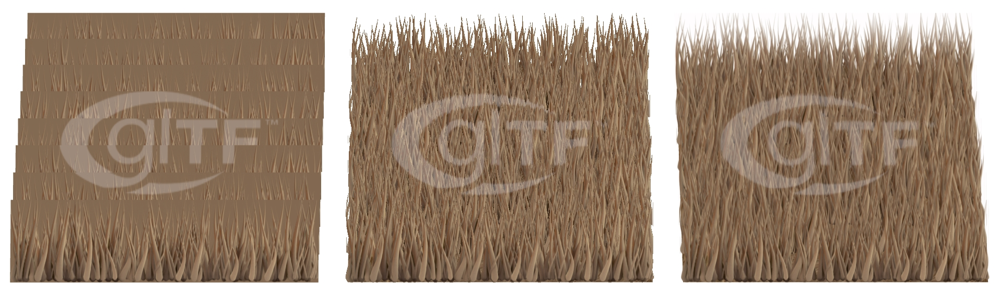

## Screenshot

 _Screenshot from [Babylon.js Sandbox](https://sandbox.babylonjs.com/)._

## Description

This model is used on the Khronos glTF PBR website to contrast the omission versus addition of a specific PBR feature; in this case Alpha Coverage. This asset shows the differences between three states: alphaMode:Opaque, alphaMode:Mask, and alphaMode:Blend.