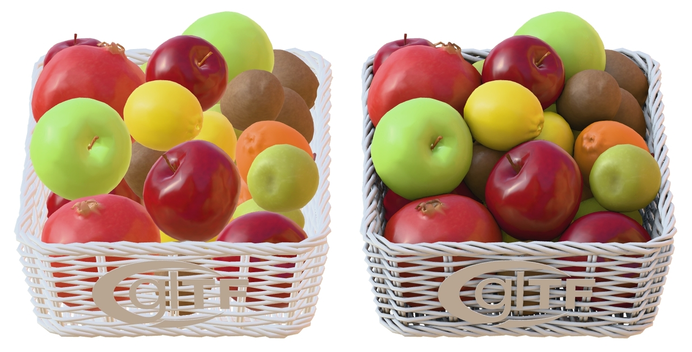

# Compare Ambient Occlusion

<!-- This file is auto-generated by modelmetadata. Do not edit by hand. -->

## Tags

[core](../Models-core.md), [testing](../Models-testing.md), [pbrtest](../Models-pbrtest.md)

## Summary

This model compares without occlusion versus with occlusion.

## Operations

* [Display](https://github.khronos.org/glTF-Sample-Viewer-Release/?model=https://raw.githubusercontent.com/KhronosGroup/glTF-Sample-Assets/main/./Models/CompareAmbientOcclusion/glTF-Binary/CompareAmbientOcclusion.glb) in SampleViewer
* [Download GLB](https://raw.githubusercontent.com/KhronosGroup/glTF-Sample-Assets/main/./Models/CompareAmbientOcclusion/glTF-Binary/CompareAmbientOcclusion.glb)
* [Model Directory](./)

## Screenshot

 _Screenshot from [Babylon.js Sandbox](https://sandbox.babylonjs.com/)._

## Description

This model is used on the Khronos glTF PBR website to contrast the omission versus addition of a specific PBR feature; in this case Ambient Occlusion.

## Legal

&copy; 2017, Khronos Group. [Khronos Trademark or Logo](../../LICENSES/LicenseRef-LegalMark-Khronos.txt)

 - Non-copyrightable logo for glTF logo

&copy; 2024, Public. [Creative Commons Zero v1.0 Universal](https://creativecommons.org/publicdomain/zero/1.0/legalcode)

 - Polyhaven for Models

&copy; 2024, Public. [Creative Commons Zero v1.0 Universal](https://creativecommons.org/publicdomain/zero/1.0/legalcode)

 - Eric Chadwick and DGG for Textures

<!-- This file is auto-generated by modelmetadata. Do not edit by hand. -->
