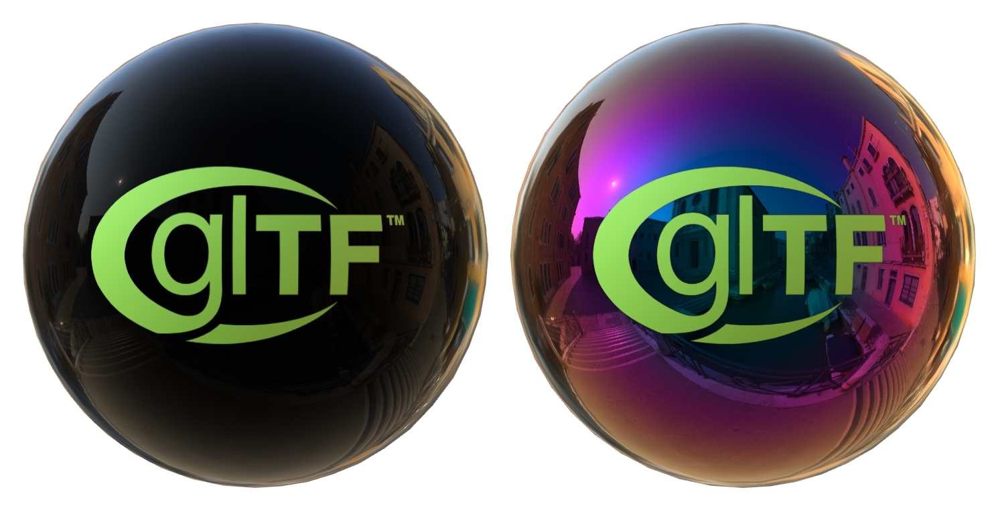

# Compare Iridescence

## Tags

[extension](../../Models-extension.md), [testing](../../Models-testing.md), pbrtest

## Extensions Used

* KHR_materials_iridescence

## Summary

This model compares iridescence methods.

## Operations

* [Display](https://github.khronos.org/glTF-Sample-Viewer-Release/?model=https://raw.GithubUserContent.com/KhronosGroup/glTF-Sample-Assets/main/./Models/CompareIridescence/glTF-Binary/CompareIridescence.glb) in SampleViewer
* [Download GLB](https://raw.GithubUserContent.com/KhronosGroup/glTF-Sample-Assets/main/./Models/CompareIridescence/glTF-Binary/CompareIridescence.glb)
* [Model Directory](./)

## Screenshot

 _Screenshot from [Babylon.js Sandbox](https://sandbox.babylonjs.com/)._

## Description

This model is used on the Khronos glTF PBR website to contrast the omission versus addition of a specific PBR feature; in this case Iridescence.

## Legal

&copy; 2017, Khronos Group. [Khronos Trademark or Logo]()

 - Non-copyrightable logo for glTF logo

&copy; 2024, Public. [CC0 1.0 Universal](https://creativecommons.org/publicdomain/zero/1.0/legalcode)

 - Eric Chadwick and DGG for Everything

#### Assembled by modelmetadata