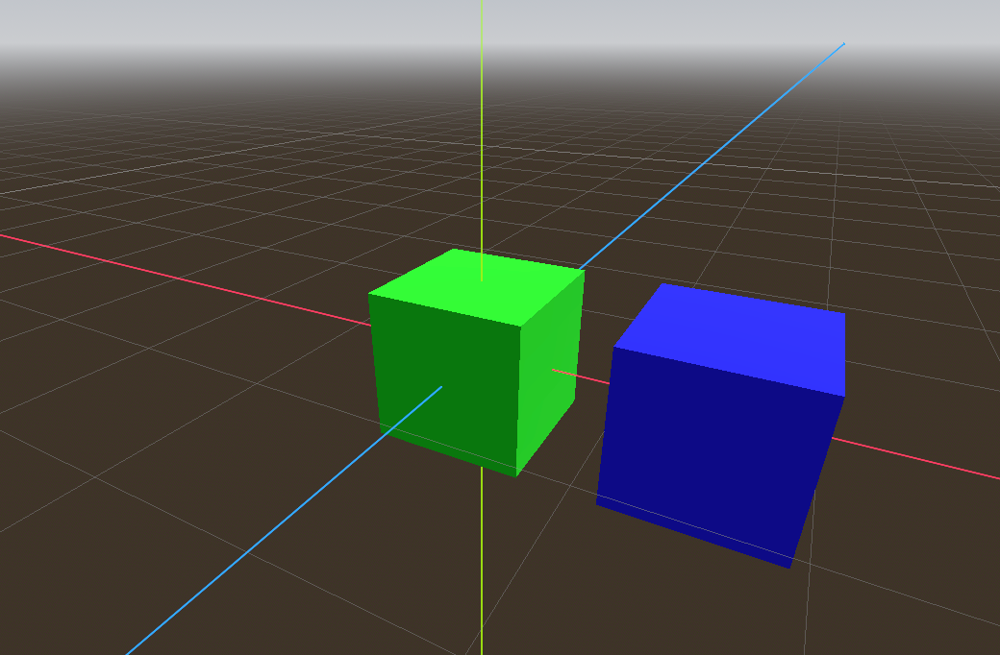

This model demonstrates the `KHR_node_visibility` extension and its interaction with `KHR_animation_pointer`.

- If your implementation shows either of the red cubes, it is not compliant with `KHR_node_visibility`.

- If your implementation does not have the blue cube hiding and showing every 0.5 seconds, either the animation is not playing, or it does not support using `KHR_animation_pointer` to animate the `KHR_node_visibility` visible property.

Animated screenshot of the test model in action:

