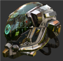

# Damaged Helmet

## Tags

[core](../../Models-core.md), [showcase](../../Models-showcase.md), [testing](../../Models-testing.md), [video](../../Models-video.md)

## Summary

Flight helmet with damage

## Operations

* [Display](https://github.khronos.org/glTF-Sample-Viewer-Release/?model=https://raw.GithubUserContent.com/KhronosGroup/glTF-Sample-Assets/main/./Models/DamagedHelmet/glTF-Binary/DamagedHelmet.glb) in SampleViewer
* [Download GLB](https://raw.GithubUserContent.com/KhronosGroup/glTF-Sample-Assets/main/./Models/DamagedHelmet/glTF-Binary/DamagedHelmet.glb)
* [Model Directory](./)

## Screenshot

## Description

A fictional helmet with textured damage.

## Modifications

The original model was built on an early draft of glTF 2.0 that did not become final.  This new model has been imported and re-exported from Blender to bring it into alignment with the final release glTF 2.0 specification.

## Legal

&copy; 2018, ctxwing. [CC BY 4.0 International](https://creativecommons.org/licenses/by/4.0/legalcode)

 - ctxwing for Rebuild and conversion to glTF

&copy; 2016, theblueturtle_. [CC BY-NC 4.0 International](https://creativecommons.org/licenses/by-nc/4.0/legalcode)

 - theblueturtle_ for Earlier version of model

#### Assembled by modelmetadata