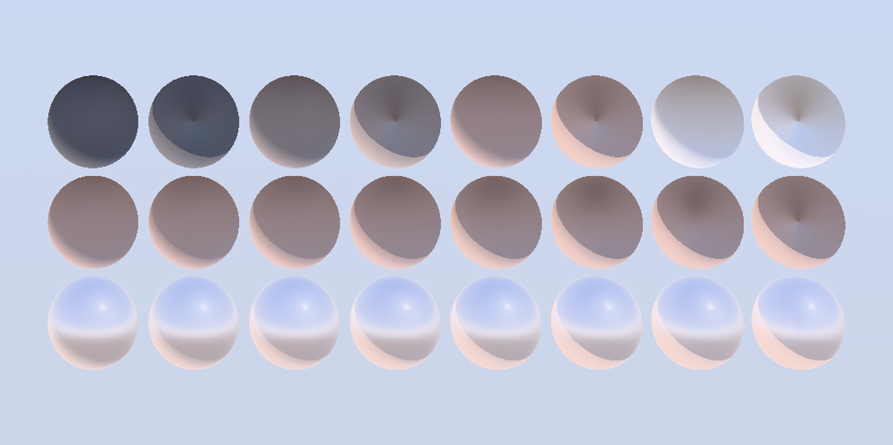

# Diffuse Roughness Parameter Sweep

<!-- This file is auto-generated by modelmetadata. Do not edit by hand. -->

## Tags

[testing](../Models-testing.md), [pbrtest](../Models-pbrtest.md), [extension](../Models-extension.md)

## Extensions Used

* KHR_materials_diffuse_roughness

## Summary

Parameter sweep for KHR_materials_diffuse_roughness over a matte and a glossy base.

## Operations

* [Display](https://github.khronos.org/glTF-Sample-Viewer-Release/?model=https://raw.githubusercontent.com/KhronosGroup/glTF-Sample-Assets/main/./Models/DiffuseRoughnessParameterSweep/glTF-Binary/DiffuseRoughnessParameterSweep.glb) in SampleViewer
* [Download GLB](https://raw.githubusercontent.com/KhronosGroup/glTF-Sample-Assets/main/./Models/DiffuseRoughnessParameterSweep/glTF-Binary/DiffuseRoughnessParameterSweep.glb)
* [Model Directory](./)

## Screenshot

 _Rendered by the [DisplayXR Model Viewer](https://github.com/DisplayXR/displayxr-demo-modelviewer) under its procedural sky environment._

## Description

A parameter sweep for `KHR_materials_diffuse_roughness`. Three rows of eight
spheres over a mid-tone clay base.

The extension replaces glTF's purely Lambertian diffuse with a view-dependent
one, flattening the falloff and lifting the terminator. It is a genuinely small
effect, and this asset is built around that fact rather than in spite of it.

## Row 0 is the control, and it is how to read this asset

A gradient across eight spheres is the wrong way to present a change of a few
levels -- nobody can see it. So row 0 places the two endpoints **side by side**:
**even columns carry no extension at all** (plain glTF 2.0 Lambertian diffuse),
and **odd columns are the same material with `diffuseRoughnessFactor` at 1.0**.
Each pair shares a row, so it shares a height and an environment, and the only
difference within a pair is the extension itself.

The four pairs use four different base albedos rather than four copies of one,
because the effect is albedo-dependent and a single albedo would say nothing
about that. What a conforming implementation must show is a visible difference
*inside* every pair, in the same direction -- the rough sphere is lighter -- with
the absolute difference growing from the darkest pair to the lightest.

This also gives the cheapest conformance check in the asset, and the first one to
run: at `diffuseRoughnessFactor` 0 the material must be **indistinguishable**
from an even column. If it is not, the parameter is being applied where it
should not be.

## Rows

| Row | Content |
|---|---|
| 0 | control pairs: extension absent, then `diffuseRoughnessFactor` 1.0, at four albedos |
| 1 | matte base, `diffuseRoughnessFactor` 0 to 1 |
| 2 | semi-gloss base, `diffuseRoughnessFactor` 0 to 1 |

Row 2 exists because the realistic authoring case has a specular lobe present.
`diffuse_roughness` must not touch the specular lobe -- if row 2 tracked row 1
exactly, the two roughnesses would be coupled, which is the one thing this
extension exists to separate. An implementation that applies the parameter to
the wrong term tends to look plausible on row 1 and wrong on row 2.

## Expect a small effect, and check it by measurement

Measured on our own implementation, as mean luma (Rec. 709, 0-255) of a patch at
each sphere's centre:

| Row 0 pair (base albedo) | extension absent | roughness 1.0 | delta | relative |
|---|---|---|---|---|
| 0.12 | 82.0 | 85.5 | **+3.6** | +4.4% |
| 0.28 | 112.6 | 117.9 | **+5.3** | +4.7% |
| 0.45 | 132.3 | 139.2 | **+6.9** | +5.2% |
| 0.72 | 181.1 | 190.5 | **+9.4** | +5.2% |

| Sweep row | leftmost | rightmost | change |
|---|---|---|---|
| 1, matte | 131.3 | 136.7 | **+5.4** |
| 2, semi-gloss | 215.9 | 212.5 | **-3.4** |

These are specific to our environment, exposure and tone curve, so do not match
them directly. Three things should reproduce. Every pair in row 0 differs in the
same direction, the rough sphere being the lighter one. The absolute difference
grows with base albedo, while the *relative* difference stays near 5% across the
whole range. And row 2 moves in the opposite direction to row 1, because the
diffuse lobe is a smaller share of a glossier material's response.

Note that we implement Fujii's energy-preserving qualitative Oren-Nayar rather
than EON, which the specification permits and which we state plainly; the two
models weight the interreflection term differently, so an EON implementation may
reasonably show a steeper albedo trend than the one tabulated here.

## What this asset can and cannot test

The **normative** part of this extension is the direct-light diffuse BRDF. How
the parameter affects image-based lighting is explicitly left to the
implementation -- the specification offers several options and notes that the
cheapest is also the least correct. A viewer whose lighting is dominated by an
environment map is therefore exercising implementation-defined behaviour more
than specified behaviour, and two conforming renderers may legitimately differ
on these spheres by more than they differ on a direct-lit scene. This asset
cannot resolve that on its own; it is worth knowing before treating any single
number here as a pass or fail.

## Provenance

Generated procedurally rather than modelled, so it can be regenerated against a specification change in one command. The generator is [`make_khronos_conformance_assets.py`](https://github.com/DisplayXR/displayxr-demo-modelviewer/blob/main/scripts/make_khronos_conformance_assets.py) in the [DisplayXR model viewer](https://github.com/DisplayXR/displayxr-demo-modelviewer).

## Legal

&copy; 2026, Leia Inc.. [Creative Commons Zero v1.0 Universal](https://creativecommons.org/publicdomain/zero/1.0/legalcode)

 - DisplayXR for Entire Model

<!-- This file is auto-generated by modelmetadata. Do not edit by hand. -->
