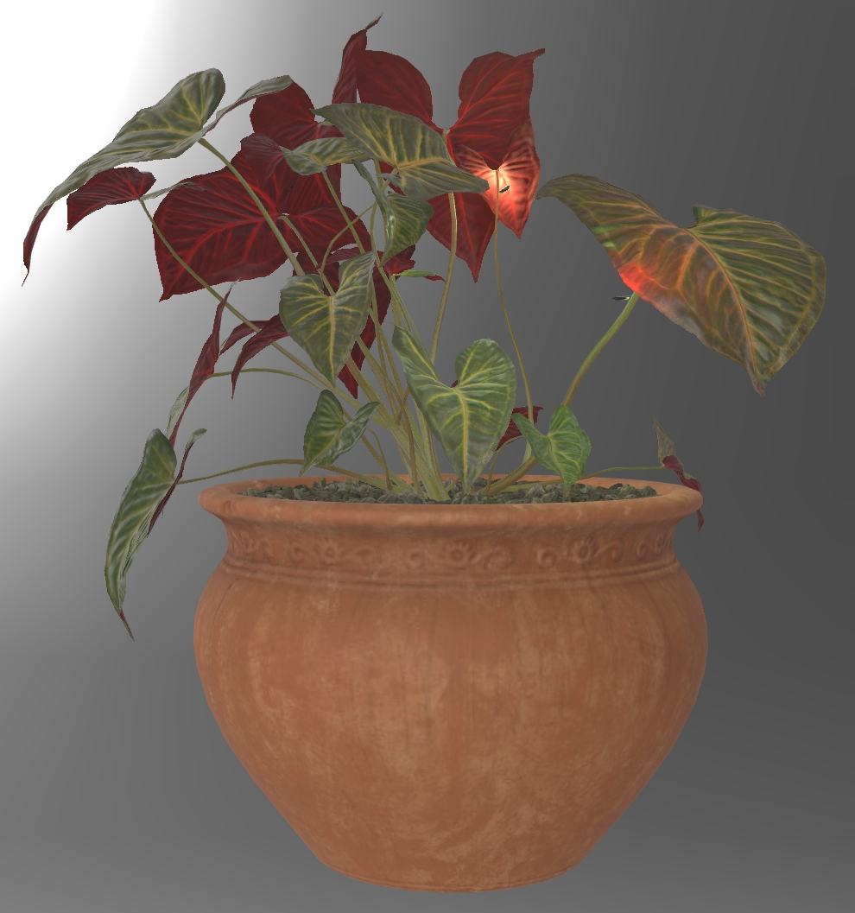

## Screenshot

 _Screenshot from [Babylon.js Sandbox](https://sandbox.babylonjs.com/)._

## Description

This asset demonstrates the use of KHR_materials_diffuse_transmission to represent thin-surface light transmission of green plant leaves with red backscatter. 

The original model is available from [Polyhaven](https://polyhaven.com/a/potted_plant_02). The model was edited with 3ds Max. The leaves were duplicated and flipped, then assigned a copy of the leaf material with a red color as a multiplier on the base color. Then the diffuse transmission extension was added, with a red color. The red leaf undersides help to justify the use of red backscatter, to show a reddish transmission when a light is being projected upwards from under the leaves. 

Fireflies were added, with point lights, and animated to follow a looping path. Chase cameras were added behind the fireflies. Stem intersections with obvious shading differences were adjusted so their vertices could be welded together. For optimal texture quality, lossless versions of the textures were re-downloaded from Polyhaven, then the asset was optimized with RapidCompact, and an ambient occlusion texture was baked for the pot and the dirt.