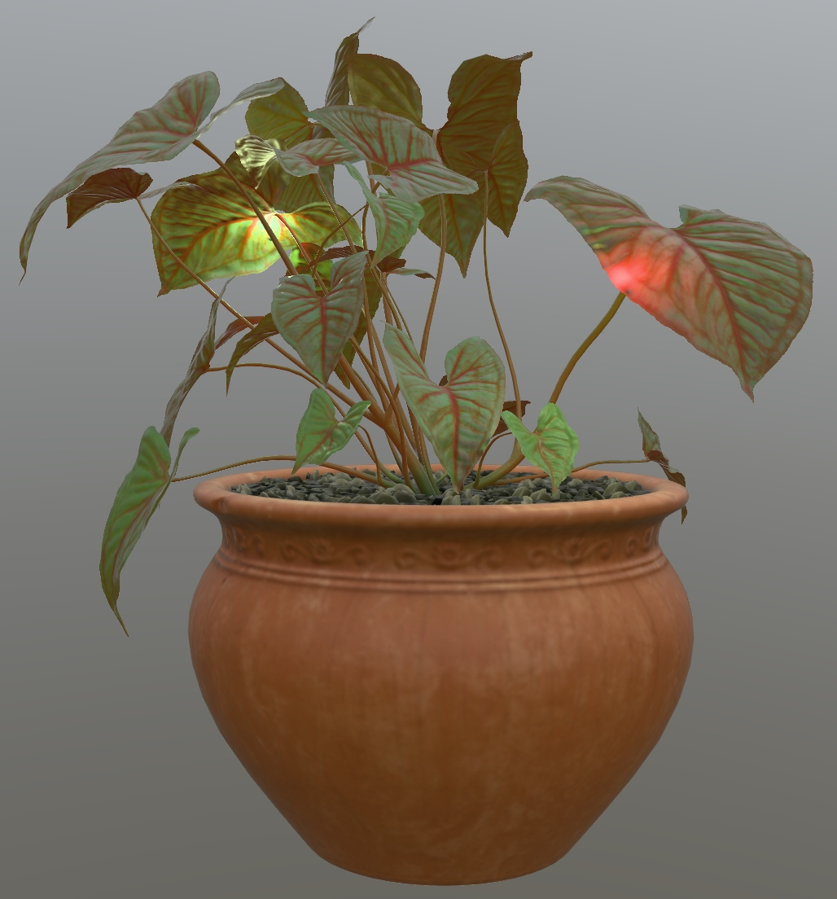
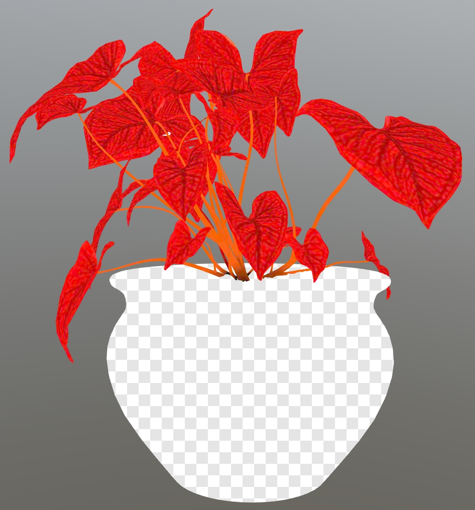

## Screenshot

 _Screenshot from [Babylon.js Sandbox](https://sandbox.babylonjs.com/)._

## Description

This asset demonstrates the use of [KHR_materials_diffuse_transmission](https://github.com/KhronosGroup/glTF/tree/main/extensions/2.0/Khronos/KHR_materials_diffuse_transmission) to represent thin-surface light transmission of green plant leaves with red backscatter. 

The original model is available from [Polyhaven](https://polyhaven.com/a/potted_plant_02). The model was edited with 3ds Max. The leaf textures were edited to show red veins, to help communicate the idea that the leaves are red inside, and thus would show red-colored diffuse transmission. 

Leaf backfaces were removed, and `doubleSided:true` used instead, to allow pathtracers to render this asset effectively. Previously the asset had explicit backfacing triangles with a red material, and was relying on backface culling to render properly, but this is not supported in most pathtracers which makes it impossible to check for ground truth.

The leaves are assigned the diffuse transmission extension with a red `diffuseTransmissionColorTexture` to control the transmission. The red veins are darker to emphasize the leaf textures, and the bases of the stem trunks are darker to help these parts blend into the rocks better. 

 _The diffuseTransmissionColorTexture isolated on the model._

Fireflies were added, with point lights, and animated to follow a looping path. Chase cameras were added behind the fireflies. 

To emphasize the effect of the point lights on diffuse transmission, the `diffuseTransmissionFactor` for the plant material was set to a low value of 0.1; this prevents the transmission color from overwhelming the baseColor.

Stem intersections with obvious shading differences were adjusted so their vertices could be welded together. 

For optimal texture quality, lossless versions of the textures were re-downloaded from Polyhaven, then the asset was optimized with RapidPipeline and an ambient occlusion texture was baked for the pot and the dirt.