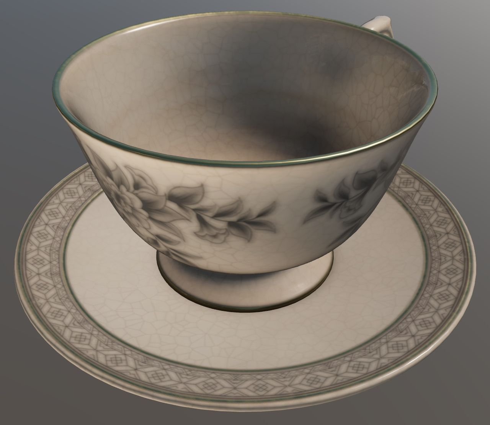
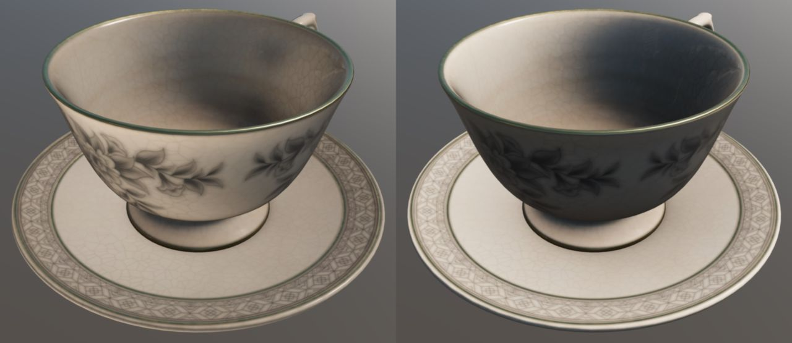
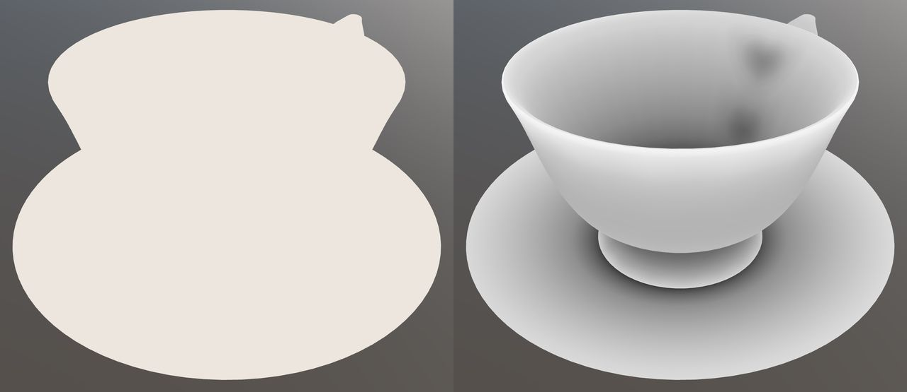

## Screenshot

 _Screenshot from [UX3D glTF Sample Viewer](http://gltf.ux3d.io/) with the environment Wide Street, environment rotation set to -Z, and the ACES (Hill) tonemapper._

## Description

This asset demonstrates the use of KHR_materials_diffuse_transmission to represent thin-surface transmission of light through a thin ceramic teacup and saucer. 

 _With the extension, versus without it._

 _The ingredients used for Diffuse Transmission: diffuseTransmissionColorFactor, and diffuseTransmissionFactor._