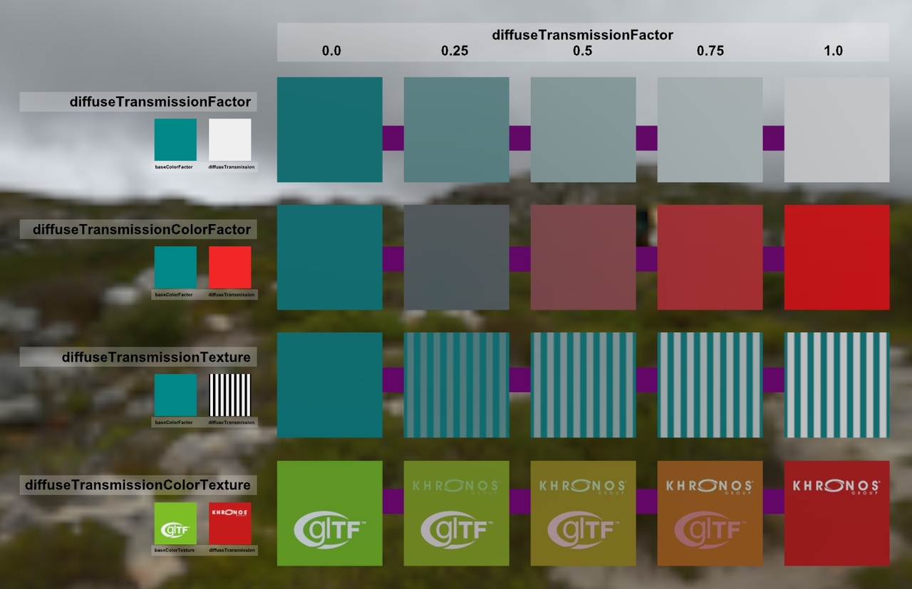
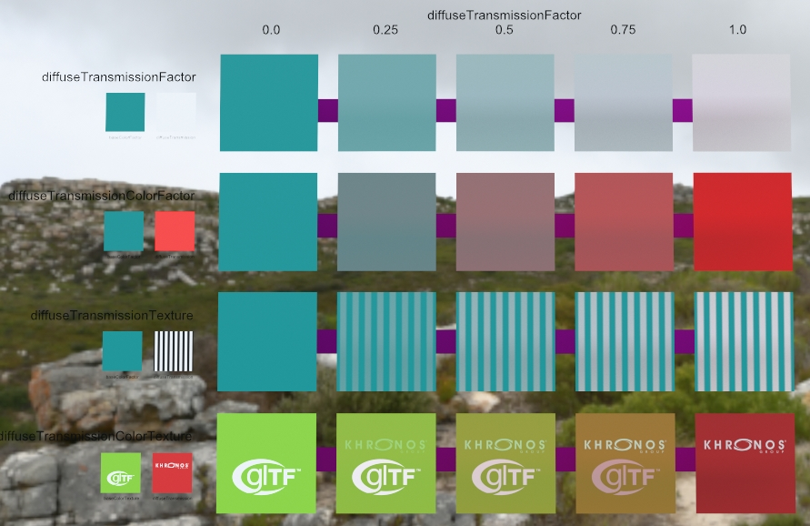

## Screenshot

 
_Screenshot from the [glTF Sample Viewer](https://github.khronos.org/glTF-Sample-Viewer-Release/) with the environment Cannon Exterior._

## Description

This model tests diffuse transmission inputs for [`KHR_materials_diffuse_transmission`](https://github.com/KhronosGroup/glTF/tree/main/extensions/2.0/Khronos/KHR_materials_diffuse_transmission#readme).

There is a single directional punctual light, facing the camera.

The smaller rectangles on the left side use Unlit materials to indicate color and texture inputs.

Behind each of the larger rectangles are dark pink rectangles, to emulate the layout as seen [in the extension readme here](https://github.com/KhronosGroup/glTF/tree/main/extensions/2.0/Khronos/KHR_materials_diffuse_transmission#diffusetransmissionfactor). However these may only affect the diffuse transmission in renderers using pathtracing.

 
_Path-traced render from Dassault Systèmes [Stellar Physically Correct](https://blog.3ds.com/brands/3dexcite/stellar-physically-correct/), using the PBR Neutral tonemapper._
