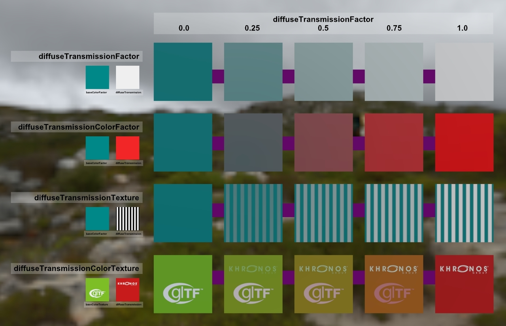
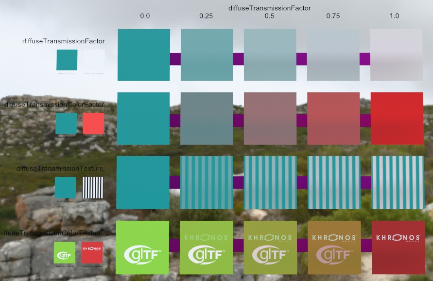

# DiffuseTransmissionTest

<!-- This file is auto-generated by modelmetadata. Do not edit by hand. -->

## Tags

[video](../Models-video.md), [written](../Models-written.md), [extension](../Models-extension.md)

## Extensions

### Required

* KHR_materials_unlit
* KHR_lights_punctual

### Used

* KHR_materials_diffuse_transmission
* KHR_materials_unlit
* KHR_lights_punctual

## Summary

Test model for KHR_materials_diffuse_transmission extension.

## Operations

* [Display](https://github.khronos.org/glTF-Sample-Viewer-Release/?model=https://raw.GithubUserContent.com/KhronosGroup/glTF-Sample-Assets/main/./Models/DiffuseTransmissionTest/glTF-Binary/DiffuseTransmissionTest.glb) in SampleViewer
* [Download GLB](https://raw.GithubUserContent.com/KhronosGroup/glTF-Sample-Assets/main/./Models/DiffuseTransmissionTest/glTF-Binary/DiffuseTransmissionTest.glb)
* [Model Directory](./)

## Screenshot

 
_Screenshot from the [glTF Sample Viewer](https://github.khronos.org/glTF-Sample-Viewer-Release/) with the environment Cannon Exterior._

## Description

This model tests diffuse transmission inputs for [`KHR_materials_diffuse_transmission`](https://github.com/KhronosGroup/glTF/tree/main/extensions/2.0/Khronos/KHR_materials_diffuse_transmission#readme). 

There is a single directional punctual light, facing the camera. 

The smaller rectangles on the left side use Unlit materials to indicate color and texture inputs.

Behind each of the larger rectangles are dark pink rectangles, to emulate the layout as seen [in the extension readme here](https://github.com/KhronosGroup/glTF/tree/main/extensions/2.0/Khronos/KHR_materials_diffuse_transmission#diffusetransmissionfactor). However these may only affect the diffuse transmission in renderers using pathtracing.

 
_Path-traced render from Dassault Systèmes [Stellar Physically Correct](https://blog.3ds.com/brands/3dexcite/stellar-physically-correct/), using the PBR Neutral tonemapper._

## Legal

&copy; 2025, Darmstadt Graphics Group GmbH. [CC BY 4.0 International](https://creativecommons.org/licenses/by/4.0/legalcode)

 - Eric Chadwick for Model and textures

&copy; 2015, Khronos Group. [Khronos Trademark or Logo](../../LICENSES/LicenseRef-LegalMark-Khronos.txt)

 - Non-copyrightable logo for Khronos logo

&copy; 2017, Khronos Group. [Khronos Trademark or Logo](../../LICENSES/LicenseRef-LegalMark-Khronos.txt)

 - Non-copyrightable logo for glTF logo

<!-- This file is auto-generated by modelmetadata. Do not edit by hand. -->
