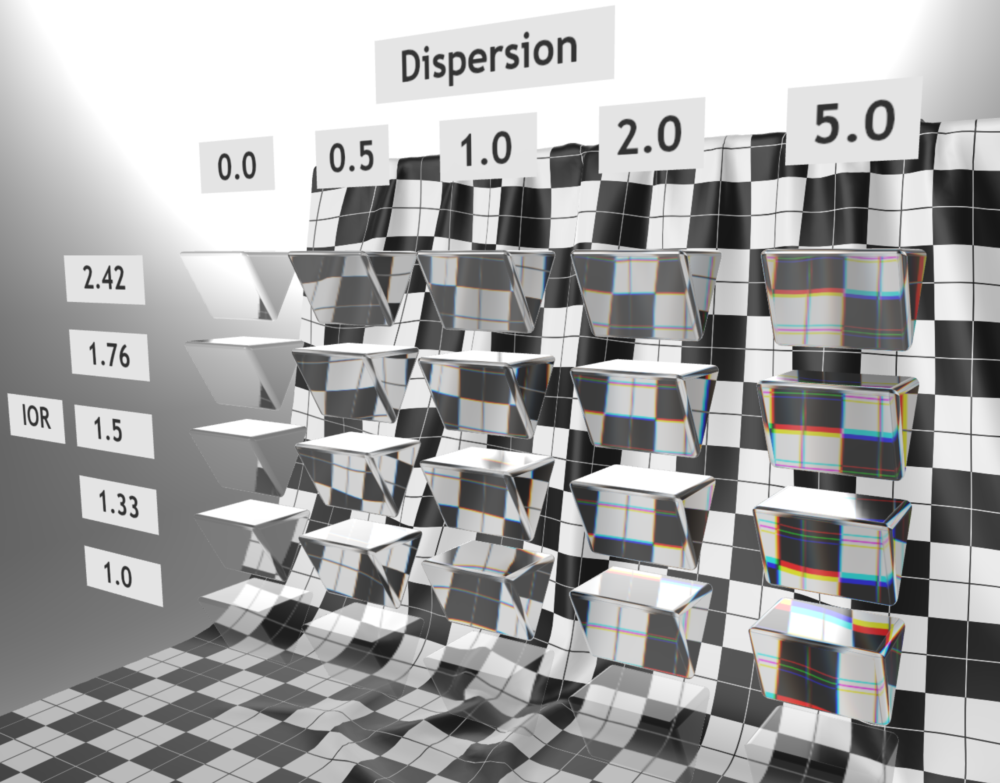

# Dispersion Test

## Tags

[extension](../../Models-extension.md), [testing](../../Models-testing.md)

## Extensions Used

* KHR_materials_transmission
* KHR_materials_volume
* KHR_materials_ior
* KHR_materials_dispersion

## Summary

This model tests the KHR_materials_dispersion extension.

## Operations

* [Display](https://github.khronos.org/glTF-Sample-Viewer-Release/?model=https://raw.GithubUserContent.com/KhronosGroup/glTF-Sample-Assets/main/./Models/DispersionTest/glTF-Binary/DispersionTest.glb) in SampleViewer
* [Download GLB](https://raw.GithubUserContent.com/KhronosGroup/glTF-Sample-Assets/main/./Models/DispersionTest/glTF-Binary/DispersionTest.glb)
* [Model Directory](./)

## Screenshot

## Description

This model tests the effects of the `KHR_materials_dispersion` extension.

Dispersion requires volumetric transmission (`KHR_materials_transmission` with `KHR_materials_volume`) and also scales with IOR (`KHR_materials_ior`). It changes the effective IOR values for different frequencies of light, producing an effect known as chromatic aberration. In the right-most column, the rainbow-like effect is most pronounced.

## Legal

&copy; 2023, AGI. [CC BY 4.0 International](https://creativecommons.org/licenses/by/4.0/legalcode)

 - Ed Mackey for Everything

#### Assembled by modelmetadata