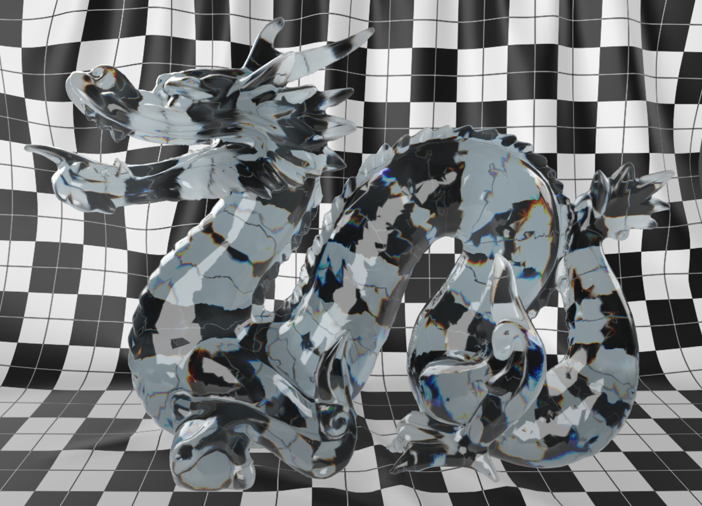
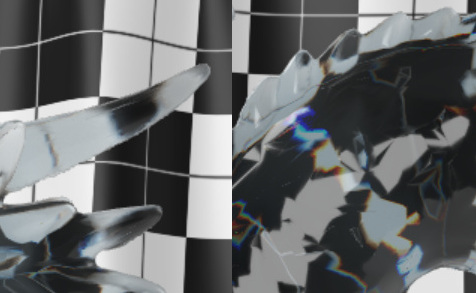

## Screenshot

Rendered with [Babylon Sandbox](https://sandbox.babylonjs.com/) using studio neutral lighting.

## Description

This model demonstrates the use of the `KHR_materials_dispersion` extension with the `KHR_materials_transmission` and `KHR_materials_volume` extensions to specify an object that appears to be made from colored glass with extra dispersion.

Note that on thin parts of the model, such as horns and claws (left, above), the effect of dispersion is less noticable.  On thicker parts like the body (right), the effect is more pronounced.  The influence of dispersion on the material's index of refraction is uniform throughout the model, however such changes to IOR have more pronounced effects when light travels through thicker portions.

## Attribution for the Dragon

The dragon model is based on the one from [Morgan McGuire's Computer Graphics Archive](https://casual-effects.com/data).  
Original dragon mesh data based on a [Stanford Scan](http://www.graphics.stanford.edu/data/3Dscanrep/)
&copy; 1996 Stanford University.

## Attribution for the Cloth Backdrop

  
To the extent possible under law, Adobe has waived all copyright and related or neighboring rights to this asset [the cloth backdrop].