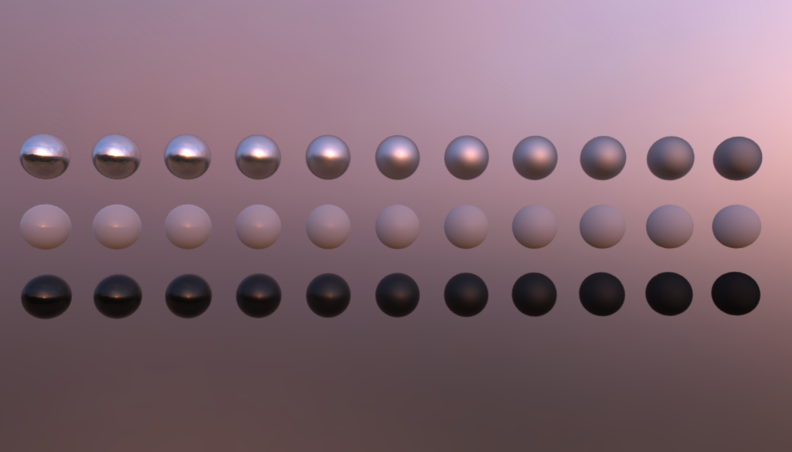

# Environment Test

## Tags

[testing](../../Models-testing.md), [extension](../../Models-extension.md)

## Summary

A simple scene with metal and dielectric spheres that range between 0 and 1 roughness. Useful for testing environment lighting.

## Operations

* [Display](https://github.khronos.org/glTF-Sample-Viewer-Release/?model=https://raw.GithubUserContent.com/KhronosGroup/glTF-Sample-Assets/main/./Models/EnvironmentTest/glTF/EnvironmentTest.gltf) in SampleViewer
* [Model Directory](./)

## Screenshot

## Description

Three rows of spheres with varying roughness. Top row is white metal, middle row is white dielectric, bottom row is black dielectric.

## Original Asset

https://stock.adobe.com/search/3d-assets?filters%5Bcontent_type%3A3d%5D=1&filters%5B3d_type_id%5D%5B%5D=2&order=relevance&safe_search=1&search_page=1&limit=100&acp=&aco=canyon&price%5B%24%5D=1&get_facets=1&asset_id=122687900

## Legal

&copy; 2017, Adobe. [Adobe Stock License](https://stock.adobe.com/license-terms?prev_url=detail&comparison-full#enhanced-license-terms)

 - Adobe for Everything

#### Assembled by modelmetadata