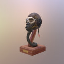

## Screenshot



## Description

USAAF A-11 Flying Helmet on a wooden stand with realistic high resolution textures.

## KTX2 BasisU Textures

The model in [glTF-KTX-BasisU](./glTF-KTX-BasisU) has been processed with [glTF-Transform](https://gltf-transform.dev/) v4.3.0 to convert the images from PNG to [KTX](https://www.khronos.org/ktx/) with Basis Universal texture compression and the extension [KHR_texture_basisu](https://github.com/KhronosGroup/glTF/blob/master/extensions/2.0/Khronos/KHR_texture_basisu/). The color textures are compressed using ETC1S and the non-color textures using UASTC, both with default settings.

```
gltf-transform etc1s FlightHelmet.gltf FlightHelmet.gltf --slots "baseColor"
gltf-transform uastc FlightHelmet.gltf FlightHelmet.gltf --slots "{normal,occlusion,metallicRoughness}"
```

### Texture Sizes

| Name                                |     Before  |      After  |       Delta  | Type  |
|:------------------------------------|------------:|------------:|-------------:|:------|
| GlassPlasticMat_BaseColor           |   `2.20 MB` | `304.42 KB` |   `-1.90 MB` | ETC1S |
| GlassPlasticMat_Normal              |   `2.53 MB` |   `2.63 MB` | `+107.07 KB` | UASTC |
| GlassPlasticMat_OcclusionRoughMetal |   `3.52 MB` |   `3.65 MB` | `+123.32 KB` | UASTC |
| LeatherPartsMat_BaseColor           |   `5.22 MB` | `481.57 KB` |   `-4.75 MB` | ETC1S |
| LeatherPartsMat_Normal              |   `5.41 MB` |   `3.64 MB` |   `-1.77 MB` | UASTC |
| LeatherPartsMat_OcclusionRoughMetal |   `4.17 MB` |   `3.97 MB` | `-212.72 KB` | UASTC |
| LensesMat_BaseColor                 | `679.98 KB` |  `91.23 KB` | `-588.75 KB` | ETC1S |
| LensesMat_Normal                    |   `5.44 KB` |   `1.65 KB` |   `-3.80 KB` | UASTC |
| LensesMat_OcclusionRoughMetal       | `587.50 KB` | `687.40 KB` |  `+99.90 KB` | UASTC |
| MetalPartsMat_BaseColor             |   `2.56 MB` | `463.22 KB` |   `-2.10 MB` | ETC1S |
| MetalPartsMat_Normal                |   `3.12 MB` |   `3.39 MB` | `+275.69 KB` | UASTC |
| MetalPartsMat_OcclusionRoughMetal   |   `2.84 MB` |   `2.97 MB` | `+130.76 KB` | UASTC |
| RubberWoodMat_BaseColor             |   `3.43 MB` | `431.19 KB` |   `-3.01 MB` | ETC1S |
| RubberWoodMat_Normal                |   `3.17 MB` |   `3.31 MB` | `+138.84 KB` | UASTC |
| RubberWoodMat_OcclusionRoughMetal   |   `3.63 MB` |   `3.35 MB` | `-294.65 KB` | UASTC |

### Texture Size Totals

|   Before   |    After   |      Delta  |
|-----------:|-----------:|------------:|
| `43.06 MB` | `29.29 MB` | `-13.76 MB` |