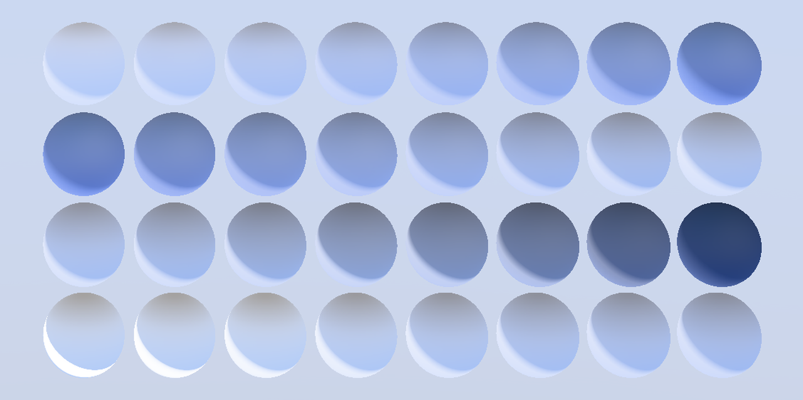

## Screenshot

 _Rendered by the [DisplayXR Model Viewer](https://github.com/DisplayXR/displayxr-demo-modelviewer) under its procedural sky environment._

## Description

A parameter sweep for `KHR_materials_fuzz`. Four rows of eight spheres over a
dark navy fabric base, chosen because fuzz is a fabric model and because a dark
base is where a fuzz lobe is most legible.

## Row 0 is a reference, not an equality control

Row 0 carries `KHR_materials_sheen`, the extension fuzz is intended to supersede,
sweeping `sheenColorFactor` from white to black. Row 2 sweeps `fuzzColorFactor`
across the same range.

These two rows are **expected to differ**, and that difference is the reason the
extension exists: a black sheen colour disables the sheen layer entirely, so row 0
fades out, while fuzz keeps `fuzzFactor` as an independent weight, so row 2 goes
sooty instead of vanishing. An implementation that renders rows 0 and 2 alike has
almost certainly routed fuzz through its sheen path.

Unlike the paired control in the coat asset, this is a qualitative claim rather
than a pixel-equality one, so the two rows are not height-matched.

## Rows

| Row | Property swept |
|---|---|
| 0 | `KHR_materials_sheen` reference: `sheenColorFactor` white to black |
| 1 | `fuzzFactor`, 0 to 1, white fuzz |
| 2 | `fuzzColorFactor`, white to black, at full weight |
| 3 | `fuzzRoughnessFactor`, 0.05 to 1 |

Row 3 is worth checking against the schema rather than the prose: at the time of
writing the README parameter table gives `fuzzRoughnessFactor` a default of `0.5`
and the schema gives `0.0`. This asset sets the value explicitly in every column,
so it renders identically either way and does not depend on the resolution.

## Provenance

Generated procedurally rather than modelled, so it can be regenerated against a specification change in one command. The generator is [`make_khronos_conformance_assets.py`](https://github.com/DisplayXR/displayxr-demo-modelviewer/blob/main/scripts/make_khronos_conformance_assets.py) in the [DisplayXR model viewer](https://github.com/DisplayXR/displayxr-demo-modelviewer).
