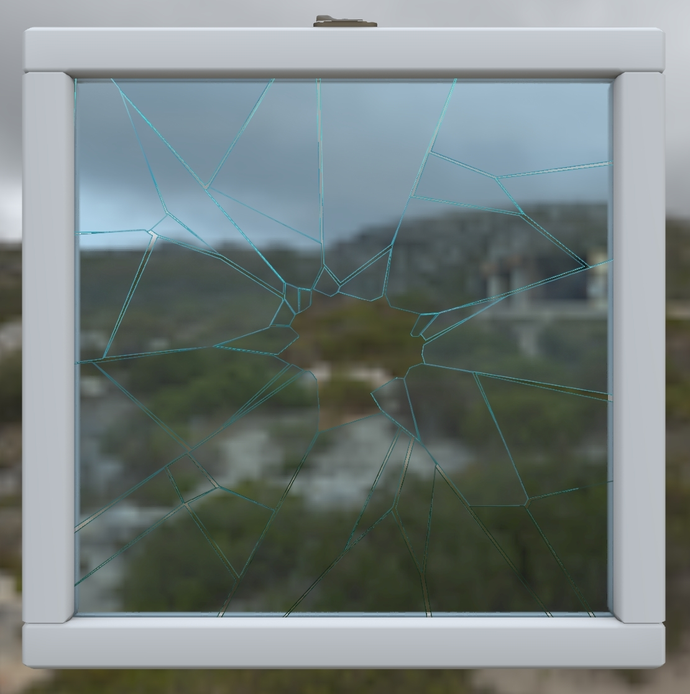

# Glass Broken Window

## Tags

[video](../../Models-video.md), [extension](../../Models-extension.md)

## Summary

This asset demonstrates the combination of two transparency methods in glTF: KHR_materials_transmission for glass and alphaMode:'MASK' for holes in the broken glass.

## Operations

* [Display](https://github.khronos.org/glTF-Sample-Viewer-Release/?model=https://raw.GithubUserContent.com/KhronosGroup/glTF-Sample-Assets/main/./Models/GlassBrokenWindow/glTF-Binary/GlassBrokenWindow.glb) in SampleViewer
* [Download GLB](https://raw.GithubUserContent.com/KhronosGroup/glTF-Sample-Assets/main/./Models/GlassBrokenWindow/glTF-Binary/GlassBrokenWindow.glb)
* [Model Directory](./)

## Screenshot

Screenshot from the [glTF Sample Viewer](https://github.khronos.org/glTF-Sample-Viewer-Release/) using the Cannon Exterior lighting environment.

## Description

This asset demonstrates the combination of two transparency methods in glTF: [KHR_materials_transmission](https://github.com/KhronosGroup/glTF/tree/main/extensions/2.0/Khronos/KHR_materials_transmission#readme) for glass and [alphaMode:"MASK"](https://registry.khronos.org/glTF/specs/2.0/glTF-2.0.html#_material_alphamode) for holes in the broken glass. 

`alphaMode:"MASK"` is designed to represent the visibility of a glTF material which works well for the missing pieces of glass and the cracks between the shards.

`KHR_materials_transmission` is the recommended method for reproducing refractive materials such as glass or water. This extension allows light to transmit through a surface in a physically-plausible manner. 

The material uses a Metallic texture to simulate the strong refractions usually seen along the edges of broken window glass. While this is not physically accurate it does help compensate for the lack of true geometry. Colored edges in the baseColorTexture also help to colorize the broken edges.

## Legal

&copy; 2023, Wayfair. [CC BY 4.0 International](https://creativecommons.org/licenses/by/4.0/legalcode)

 - Eric Chadwick for Entire asset

#### Assembled by modelmetadata