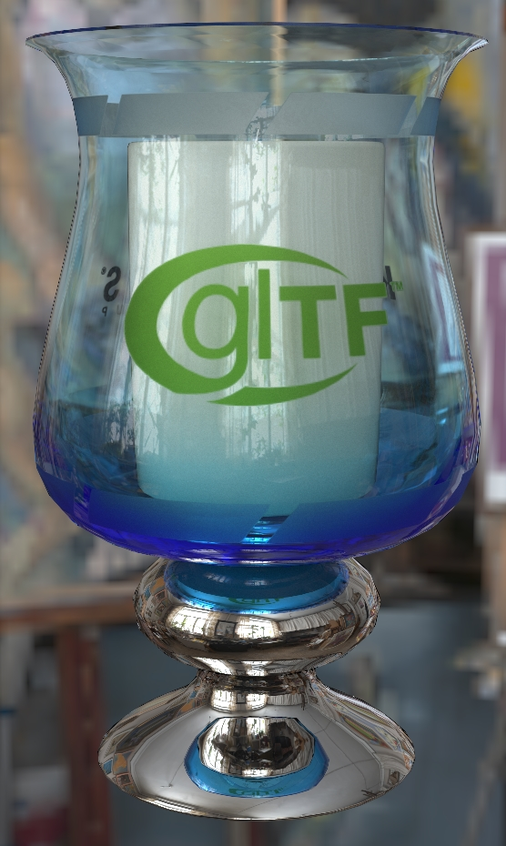

## Screenshot

(above) Path-traced render via [Dassault Systèmes Enterprise PBR](https://dassaultsystemes-technology.github.io/dspbr-pt/) with the [Artist Workshop](https://polyhaven.com/a/artist_workshop) environment light.

## Description

This model is a hurricane lamp candle holder using the glTF extensions [`KHR_materials_transmission`](https://github.com/KhronosGroup/glTF/tree/master/extensions/2.0/Khronos/KHR_materials_transmission) and [`KHR_materials_volume`](https://github.com/KhronosGroup/glTF/tree/master/extensions/2.0/Khronos/KHR_materials_volume) to create colored glass. 

The color of the glass comes from the `attenuationColor` and `attenuationDistance` properties in `KHR_materials_volume`, along with the `thicknessTexture` which can be used by non-raytraced renderers to simulate surfaces with varying thickness. Pathtracers can ignore this texture and instead use the geometric thickness from the model for more accurate results.

An earlier version of this model was used in the glTF tutorial [Adding Material Extensions to glTF Models](https://github.com/KhronosGroup/glTF-Tutorials/blob/master/AddingMaterialExtensions/README.md#adding-material-extensions-to-gltf-models). The current version has been improved to demonstrate transmission affected by the colors in `baseColorTexture` and roughness in `metallicRoughnessTexture`. 

(above) The model viewed in four renderers, from left to right: [Microsoft Babylon.js](https://github.com/BabylonJS/Babylon.js#babylonjs), [Google Filament](https://github.com/BabylonJS/Babylon.js#babylonjs), [three.js](https://github.com/mrdoob/three.js#threejs), and [Dassault Systèmes Enterprise PBR](https://github.com/DassaultSystemes-Technology/EnterprisePBRShadingModel#enterprise-pbr-shading-model). The first three were rendered within Visual Studio Code using the glTF Tools extension.
