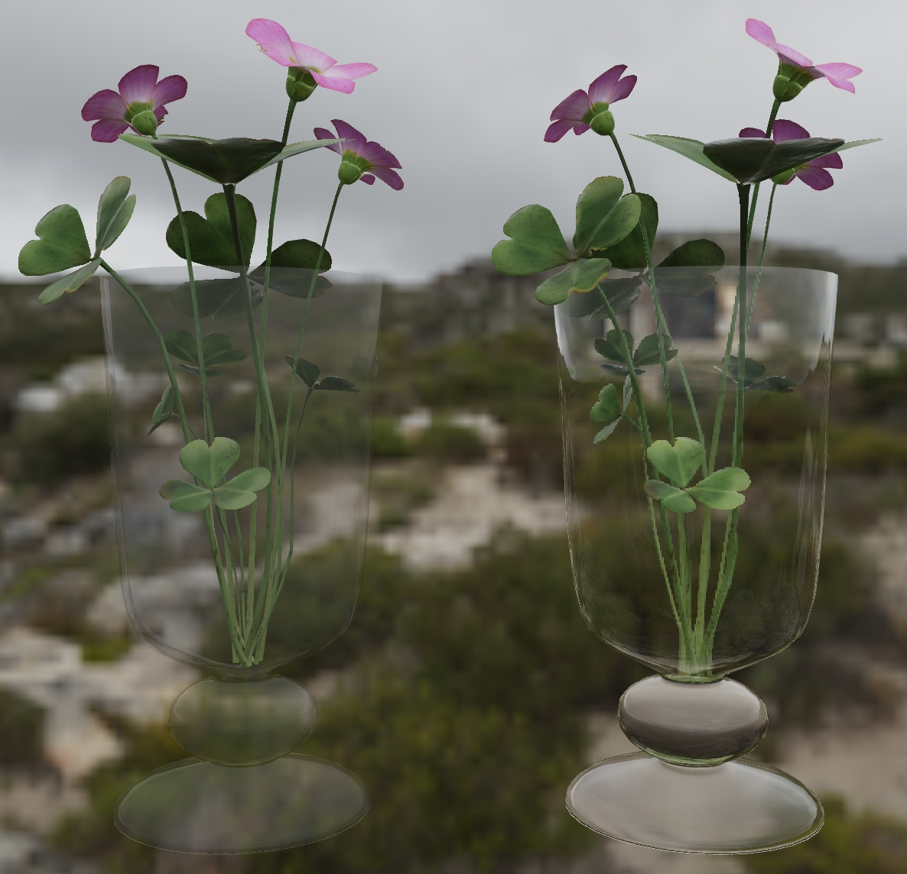

# Glass Vase with Flowers

## Tags

[video](../../Models-video.md), [extension](../../Models-extension.md)

## Summary

This model compares transparency methods for representing glass in glTF: alphaMode:'BLEND' (left) versus the extensions KHR_materials_transmission and KHR_materials_volume (right).

## Operations

* [Display](https://github.khronos.org/glTF-Sample-Viewer-Release/?model=https://raw.GithubUserContent.com/KhronosGroup/glTF-Sample-Assets/main/./Models/GlassVaseFlowers/glTF-Binary/GlassVaseFlowers.glb) in SampleViewer
* [Download GLB](https://raw.GithubUserContent.com/KhronosGroup/glTF-Sample-Assets/main/./Models/GlassVaseFlowers/glTF-Binary/GlassVaseFlowers.glb)
* [Model Directory](./)

## Screenshot

Screenshot from the [glTF Sample Viewer](https://github.khronos.org/glTF-Sample-Viewer-Release/) using the Cannon Exterior environment and the ACES tone mapper.

## Description

This model compares transparency methods for representing glass in glTF: [alphaMode:"BLEND"](https://registry.khronos.org/glTF/specs/2.0/glTF-2.0.html#_material_alphamode) (left) versus the extensions [KHR_materials_transmission](https://github.com/KhronosGroup/glTF/tree/main/extensions/2.0/Khronos/KHR_materials_transmission#readme) and [KHR_materials_volume](https://github.com/KhronosGroup/glTF/tree/main/extensions/2.0/Khronos/KHR_materials_volume#readme) (right). 

## Comparing Alpha Blending with Transmission

Before these extensions became available, alpha blending with a low alpha value in the `baseColorFactor` was often used to represent refractive materials such as water or glass. 

However, alpha blending is designed to represent the visibility of a material not refraction. Alpha with a texture is a good choice to reproduce the visibility of surfaces with small gaps (burlap or gauze) or complex edges (foliage) which can't reasonably be represented with triangles alone. These materials often work best with alphaMode:Mask since this avoids depth-sorting issues, and a texture with predominantly pure white or black values and gray used only for anti-aliasing.

When alpha blending is used with partial values the surface shows more of what is behind, but in turn specular reflections are reduced. Alpha blending does not simulate refraction, fresnel reflections, diffusion, nor attenuation. Alpha blending can also cause depth-sorting errors in real-time renderers, with further surfaces rendered incorrectly in front of nearer surfaces. Because of these limitations it is not recommended to use alpha blending for refractive materials.

Transmission and Volume are the recommended methods for reproducing refractive materials such as glass or water. These extensions allow light to transmit through a surface in a physically-plausible manner, reproducing effects like the bending of light through thick glass, fresnel reflections on oblique surfaces, colored transmission as in stained glass, color attenuation that can occur where surfaces become thicker, and the dispersion or blurring that can occur with roughened surfaces. 

## Legal

&copy; 2023, Public. [CC0 1.0 Universal](https://creativecommons.org/publicdomain/zero/1.0/legalcode)

 - Eric Chadwick for Glass vase

&copy; 2023, Public. [CC0 1.0 Universal](https://creativecommons.org/publicdomain/zero/1.0/legalcode)

 - Rico Cilliers for Flowers

#### Assembled by modelmetadata