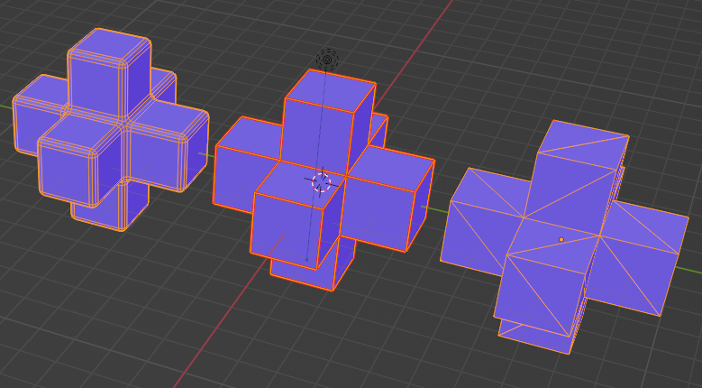

# HexaCube

## Summary

3 versions of the hexacube(basic, triangulated, beveled)

## Operations

* [Model Directory](./)

## Screenshot

## Description

glb, gltf, blender files for 3 versions of the hexacube(basic, triangulated, beveled) made in Blender

## How to

[Step by step instructions for how to create the HexaCube in blender](hexacube.md)

#### Assembled by Hyerin Seok
