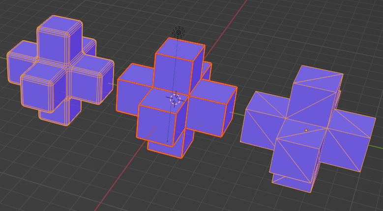
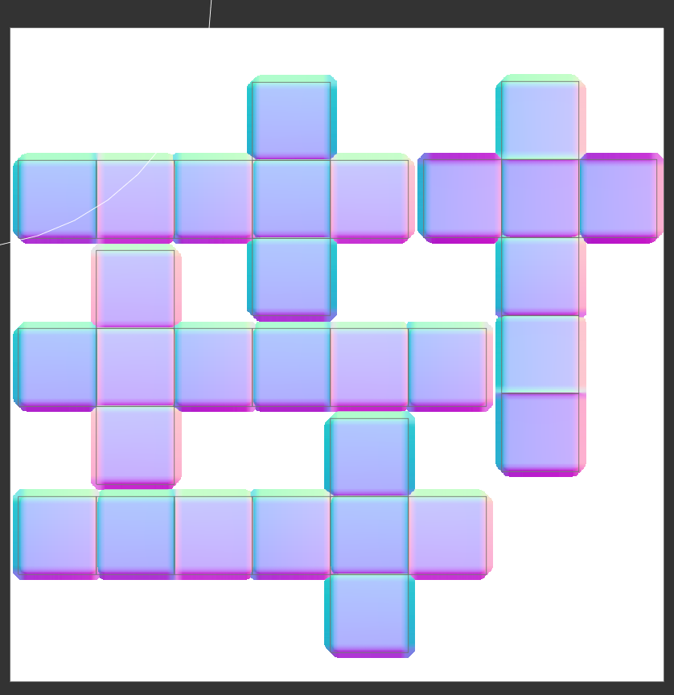

# Creating the HexaCube in Blender

## Steps

1. Creating the hexa-cube:
    1. In Modeling mode : Add -> Mesh -> Cube object
    2. Select "Vertex" mode : Select -> All
    3. Press delete key on keyboard : Delete "Only Faces" to keep skeleton of cube
    4. Select 4 vertices of a side to create new shapes
    5. Right click extrude edges (hold ctrl to snap) -> Click to confirm length
    6. Right click and select "New Edge/Face from Vertices"
    7. Repeat 4-6 for all faces
    8. For missing faces, Select 4 vertices of missing face -> Right click "New Edge/Face from Vertices"

2. Triangulate
    blender doesn’t have automatic triangulation, so must do it manually :
    Select 2 diagnoal vertices of a face and right click connect vertex pairs

3. Normalize
    1. Select "Face" mode : Select -> All
    2. Press shift N to recalculate normals

    *before Normalization :*

    

    *after Normalization :*

    

5. Bevel
    1. Select "Edge" mode : Select -> All
    2. Right click, select bevel edges
    3. Click to confirm bevel size

6. Averaged normals
    For the high poly beveled object, the edges should be using averaged normals, instead of split normals. Averaged normals is called Smooth Shading in Blender. It changes the way the shading is calculated across the surfaces, to give the illusion of a smooth surface. (https://docs.blender.org/manual/en/2.80/modeling/meshes/editing/normals.html)
    1. Select "Object" mode: Select object
    2. Right click, select "Shade Smooth". For opposite effects select "Shade Flat".

7. UV layout / mapping
    
    
    UV mapping is the process of generating a 2D representation of a 3D object. This 2D representation is constructed from UV coordinates, which are commonly known as texture coordinates. U represents the horizontal axis and V represents ​the vertical axis.
    1. Go to "UV Editing"
    2. Select object to UV map (If objects are overlapping, it is easy to hide unused objects while working)
    3. Select Vertices and right click to select "Mark seam" or "Clear Seam" to unwrap UV
    
    4. Select -> All : UV -> Unwrap
    5. Repeat 3, 4 to ensure your map has consistent texel size, no overlaps, and have space between UV shells/islands where ever there are hard edges(split vertex normals)
    For the hexacube object low-poly, since the edges of each square are supposed to be hard, we split the UVs for each hard edge. This would allow proper texture filtering for the drastically different colors on each side of each hard edge. So each quad ends up being it's own UV island / shell.

8. Normal map baking
    
    
    
    
    A normal map is a texture map that can give hte appearance of additional geotmetry or detail on flat surfaces. They can be used to make a low-poly mesh appear high-poly. Baking is the process of "saving" the results of a previous render. so we can reuse the result late. Baking is efficient when prts of a full render will always look the same. (https://www.youtube.com/watch?v=5MLD1ZQHXUs)
    1. Go to "Shading"
    2. select first the high poly object, and second low poly object
    3. hit da bake button in Render properties.

    use averaged-ray projection : Blender doesn't exactly have "averaged-ray projection", but you can tweak different settings(Extrusion, Max Ray Distance) to create a bake that suits your purpose. Margin is another setting you should tinker with, especially when you want to create a smoother look, as the texture may bleed into neighboring UV islands or gradate out of the current UV island.
    
    Using the baked normal map
    YOu want to use it as a texture on a material for the object.
    

9. Export
    1. Choose file -> export -> glTF 2.0 (.glb/.gltf)
    2. Right side : Format, Choose appropriate filetype
    3. In Geometry select "Normals"
    4. Set Name and select Export glTF 2.0

10. Missing buffer targets.
    
    1. get the gltf tools extionsion for visual studio code.
    2. Hover over warnings, select "Quick fix", and select "Add all needed targets for all bufferViews in this file"
    3. Save : convert glb to gltf

Tips : use sandbox.babylonjs.com(https://sandbox.babylonjs.com/) to review your 3d object.

#### Assembled by Hyerin Seok
