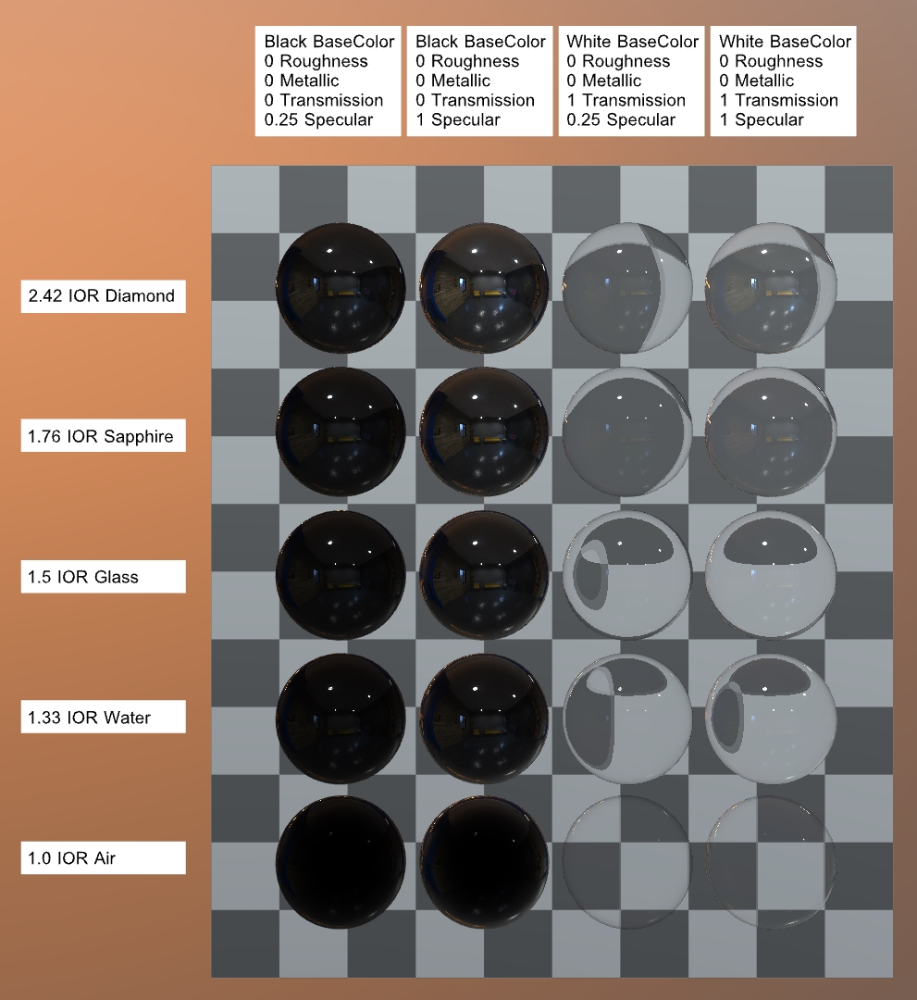

# IORTestGrid

## Tags

[showcase](../../Models-showcase.md), [extension](../../Models-extension.md)

## Extensions Used

* KHR_materials_transmission
* KHR_materials_volume
* KHR_materials_specular
* KHR_materials_ior

## Summary

Grid of spheres over a checkered backdrop to test IOR rendering.

## Operations

* [Display](https://github.khronos.org/glTF-Sample-Viewer-Release/?model=https://raw.GithubUserContent.com/KhronosGroup/glTF-Sample-Assets/main/./Models/IORTestGrid/glTF-Binary/IORTestGrid.glb) in SampleViewer
* [Download GLB](https://raw.GithubUserContent.com/KhronosGroup/glTF-Sample-Assets/main/./Models/IORTestGrid/glTF-Binary/IORTestGrid.glb)
* [Model Directory](./)

## Screenshot

 _Screenshot from [glTF Sample Viewer](https://github.khronos.org/glTF-Sample-Viewer-Release/) using the Environment "Colorful Studio"._

## Description

This model tests interactions between [KHR_materials_ior](https://github.com/KhronosGroup/glTF/tree/main/extensions/2.0/Khronos/KHR_materials_ior) and the related extensions [KHR_materials_specular](https://github.com/KhronosGroup/glTF/tree/main/extensions/2.0/Khronos/KHR_materials_specular), [KHR_materials_transmission](https://github.com/KhronosGroup/glTF/tree/main/extensions/2.0/Khronos/KHR_materials_transmission), and [KHR_materials_volume](https://github.com/KhronosGroup/glTF/tree/main/extensions/2.0/Khronos/KHR_materials_volume).

## Legal

&copy; 2023, Public. [CC0 1.0 Universal](https://creativecommons.org/publicdomain/zero/1.0/legalcode)

 - Eric Chadwick for Everything

#### Assembled by modelmetadata