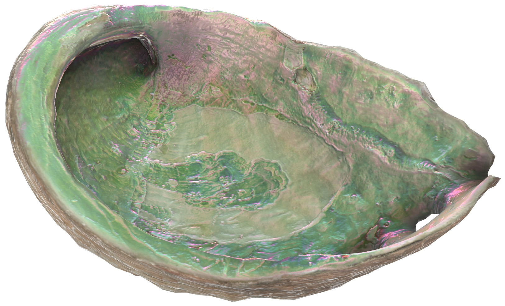
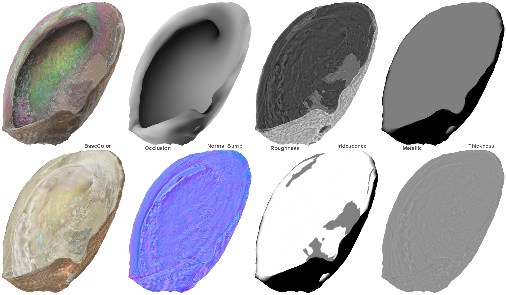

# IridescenceAbalone

## Tags

[extension](../../Models-extension.md)

## Extensions Used

* KHR_materials_iridescence

## Summary

A model of an abalone shell with highly iridescent interior.

## Operations

* [Display](https://github.khronos.org/glTF-Sample-Viewer-Release/?model=https://raw.GithubUserContent.com/KhronosGroup/glTF-Sample-Assets/main/./Models/IridescenceAbalone/glTF-Binary/IridescenceAbalone.glb) in SampleViewer
* [Download GLB](https://raw.GithubUserContent.com/KhronosGroup/glTF-Sample-Assets/main/./Models/IridescenceAbalone/glTF-Binary/IridescenceAbalone.glb)
* [Model Directory](./)

## Screenshot

(above) [glTF Sample Viewer](https://github.khronos.org/glTF-Sample-Viewer-Release/) screenshot.

## Description

This model is a photogrammetry scan of an abalone shell, with material and textures adjusted to add [KHR_materials_iridescence](https://github.com/KhronosGroup/glTF/tree/master/extensions/2.0/Khronos/KHR_materials_iridescence) for the smooth interior of the shell.

## Material

The material uses four textures: baseColorTexture, Occlusion/Roughness/Metallic, normalTexture, and iridescenceTexture/iridescenceThicknessTexture. The BaseColor, Occlusion, and Normal textures were baked from the high-resolution source model. The Roughness and Thickness were created via quick edits of the BaseColor texture. 

The iridescenceTexture and iridescenceThicknessTexture were packed into the red and green channels of a single bitmap to reduce texture fetches, since the extension uses these two channels by default. The Occlusion, Roughness, and metallic were also packed into a single bitmap. 

The interior of the shell uses partial metalness to increase the iridescent effect. This is not strictly accurate since shells are not made of metal, but the iridescent effect is more pronounced on metallic surfaces.

While the textures are powers-of-two they are not square; a resolution of 2048 by 1024 is a better aspect ratio for the shape of the model. 

## Legal

&copy; 2015, Abby Crawford. [CC BY 4.0 International](https://creativecommons.org/licenses/by/4.0/legalcode)

 - Abby Crawford for Everything

&copy; 2023, Eric Chadwick. [CC BY 4.0 International](https://creativecommons.org/licenses/by/4.0/legalcode)

 - Eric Chadwick for Materials

#### Assembled by modelmetadata