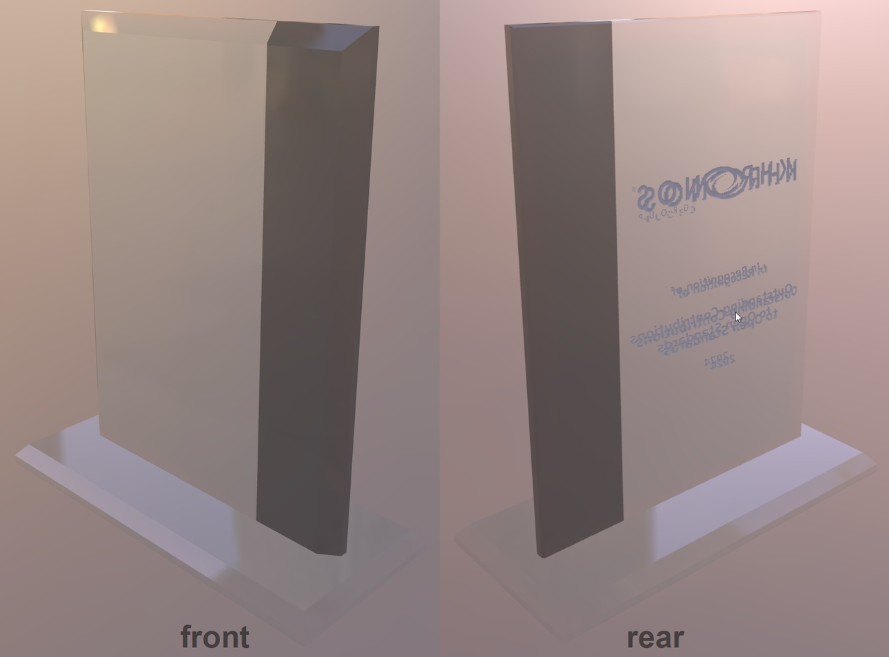

## Screenshot

 _Screenshot from [Babylon.js Sandbox](https://sandbox.babylonjs.com/)._

## Description

This asset represents a Khronie Award, a real-world object made of glass. It uses the extensions KHR_materials_dispersion, KHR_materials_transmission, and KHR_materials_volume. 

 _A photograph of a real Khronie Award, showing pronounced dispersion on the beveled edges._

## Dispersion in Rasterizers vs. Raytracers

Rasterized renderers usually take shortcuts when rendering materials in real-time, because they are optimized for fast rendering performance. Accurate rendering of dispersion is difficult without calculating true depth of objects behind refractive surfaces. Raytracers however can afford to calculate accurate dispersion. 

 _Rendering in a raytracer, V-Ray._

 _Rendering in a rasterizer, Babylon.js._

## Text Materials

The text on the real object is etched into the rear surface of the glass. To create better rendering in rasterizers the text on the glTF model has been applied to separate meshes behind the glass. The front-facing text uses alphaMode:Mask _without_ Transmission so rasterizers will render it into the Transmission of the glass, while the rear-facing text uses alphaMode:Mask _with_ Transmission to prevent it from being re-rendered as part of the Transmission in the glass.

 _glTF material settings for the two text surfaces._

If the front-facing text is set to use Transmission, it disappears behind the main glass surface (see below), because most rasterizers only render a single layer of Transmission for faster rendering performance. 

If the rear-facing text is NOT set to use Transmission, then it appears doubled, because most rasterizers include non-Transmissive surfaces in the rendering of the Transmissive surfaces... the text is rendered once as itself, then the glass behind it renders the text again as part of its own Transmission effect. 

For these reasons, the front-facing and rear-facing text materials are assigned specific workaround materials, to force rasterizers to produce a more plausible result for the text on both sides of the glass.

 _Text rendering errors in rasterizers when non-optimal material settings are used._