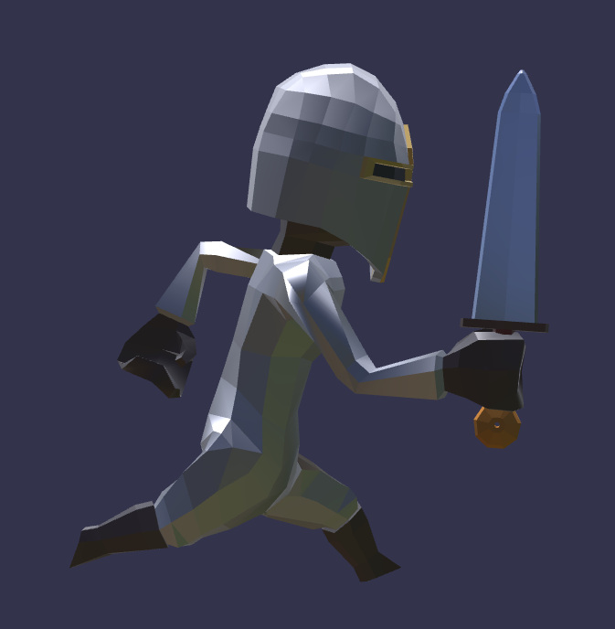

## Screenshot

## Description

This is a version of [Knight by @Quaternius](https://quaternius.com/packs/knightcharacter.html) that has been modified to use child nodes with meshes parented to joints.  The Knight character's body is a skinned mesh, but the helmet and the optional sword are separate meshes.  The helmet is parented to a joint in the head, and the sword (which only appears in some of the available animations) is parented to a bone in the right hand.

If the helmet is missing or appears out of place, it may indicate the client implementation has not processed the parent/child hierarchy correctly including the set of joints in the parent.
