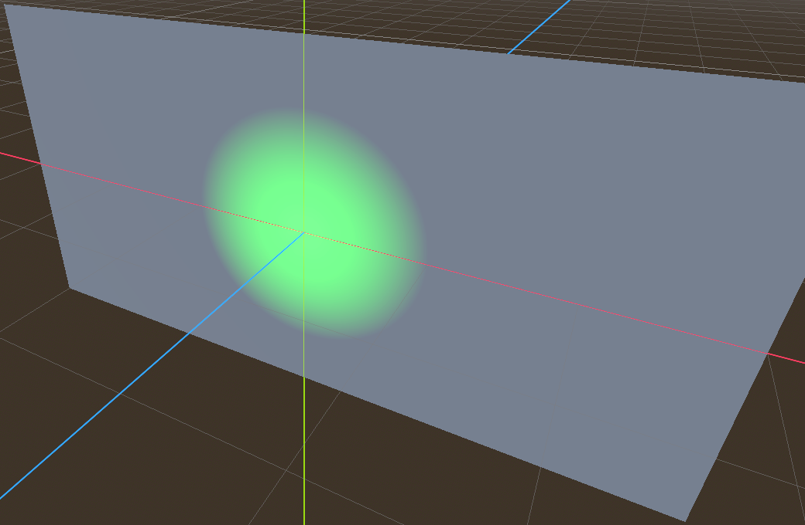

# Light Visiblity test for KHR_node_visibility

## Tags

[testing](../Models-testing.md)

## Extensions

### Required

* KHR_lights_punctual
* KHR_node_visibility

### Used

* KHR_animation_pointer
* KHR_lights_punctual
* KHR_node_visibility

## Summary

This model demonstrates the `KHR_node_visibility` extension and its interaction with `KHR_animation_pointer`.

## Operations

* [Display](https://github.khronos.org/glTF-Sample-Viewer-Release/?model=https://raw.GithubUserContent.com/KhronosGroup/glTF-Sample-Assets/main/./Models/LightVisibility/glTF-Binary/LightVisibility.glb) in SampleViewer
* [Download GLB](https://raw.GithubUserContent.com/KhronosGroup/glTF-Sample-Assets/main/./Models/LightVisibility/glTF-Binary/LightVisibility.glb)
* [Model Directory](./)

This model demonstrates the `KHR_node_visibility` extension and its interaction with `KHR_animation_pointer`.

- If your implementation shows either of the red spotlights, it is not compliant with `KHR_node_visibility`.

- If your implementation does not have the blue spotlight hiding and showing every 0.5 seconds, either the animation is not playing, or it does not support using `KHR_animation_pointer` to animate the `KHR_node_visibility` visible property.

Animated screenshot of the test model in action:

## Legal

&copy; 2025, Khronos Group. [CC0 1.0 Universal](https://creativecommons.org/publicdomain/zero/1.0/legalcode)

 - Aaron Franke for Everything

#### Assembled by modelmetadata