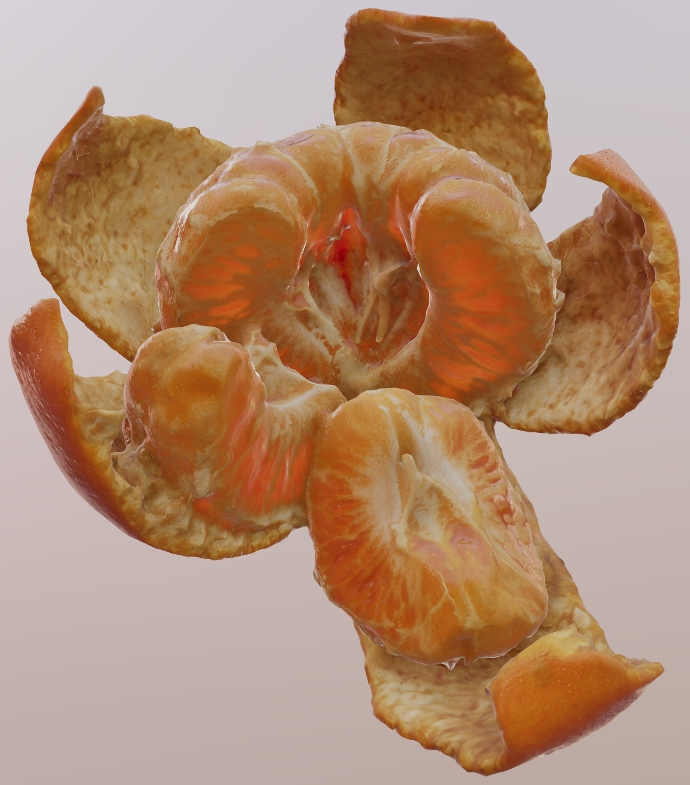
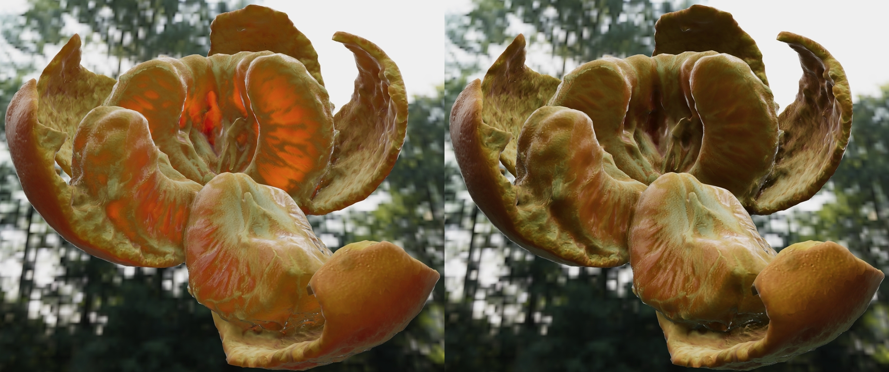
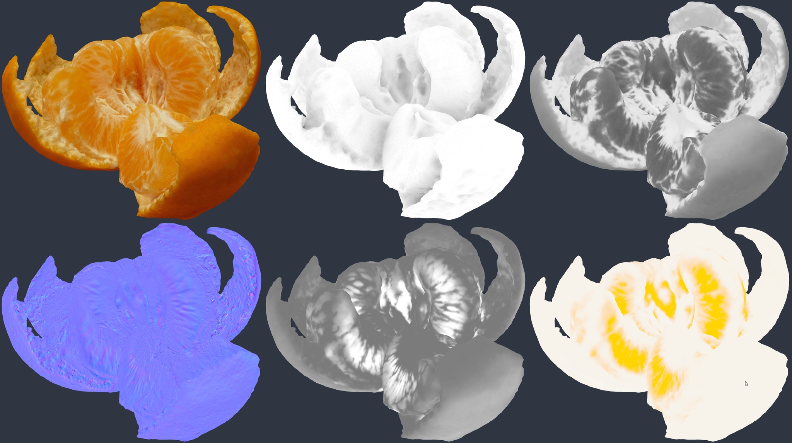

# MandarinOrange

## Tags

[extension](../../Models-extension.md), [testing](../../Models-testing.md)

## Extensions Used

* KHR_materials_diffuse_transmission

## Summary

Scattering of light through the tangerine using the glTF diffuse transmission extension is shown in this test.

## Operations

* [Display](https://github.khronos.org/glTF-Sample-Viewer-Release/?model=https://raw.GithubUserContent.com/KhronosGroup/glTF-Sample-Assets/main/./Models/MandarinOrange/glTF/MandarinOrange.gltf) in SampleViewer
* [Model Directory](./)

## Screenshot

_Screenshot from the development version of the [glTF Sample Viewer](https://gltf.ux3d.io/) which supports KHR_materials_diffuse_transmission._

## Description

This asset is a test of the glTF extension [`KHR_materials_diffuse_transmission`](https://github.com/KhronosGroup/glTF/pull/1825) to demonstrate the scattering of light through the fruit of the orange. 

_Two screenshots, with KHR_materials_diffuse_transmission (left) versus without._

_The textures. Top row from left: base color, occlusion, roughness. Bottom row from left: normal, diffuse transmission factor, diffuse transmission color._

The [original model](https://sketchfab.com/3d-models/orange-774bc66d11c24855bf722e35249fddf7) on Sketchfab from zandreamer is a photogrammetry asset which only contains a base color texture. All the additional textures were created by processing the base color through a series of filters in various art tools.

## Legal

&copy; 2015, zamdreamer. [CC BY 4.0 International](https://creativecommons.org/licenses/by/4.0/legalcode)

 - zamdreamer for Initial creation

&copy; 2023, Wayfair. [CC BY 4.0 International](https://creativecommons.org/licenses/by/4.0/legalcode)

 - Eric Chadwick for glTF PBR material

#### Assembled by modelmetadata