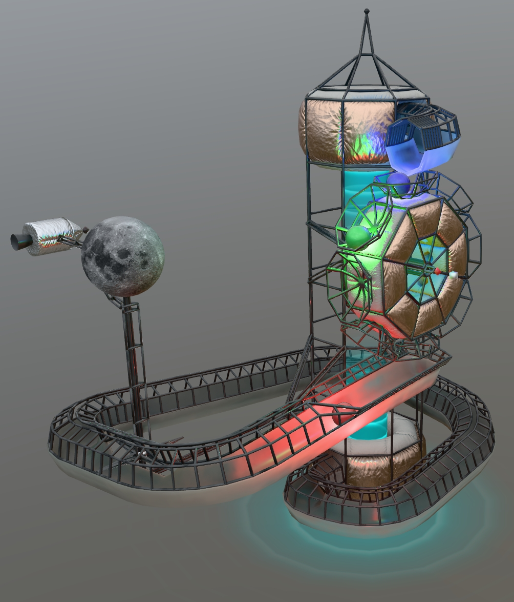

## Screenshot


<br/>_Screenshot from [glTF_Physics_Babylon Viewer](https://eoineoineoin.github.io/glTF_Physics_Babylon/packages/demo/dist/#sceneIndex=6)._

## Description

This asset demonstrates the use of rigid body physics in glTF, to represent a marble-run where marbles tumble down a track and are lifted upwards to continue endlessly.

This asset uses the glTF extensions [KHR_physics_rigid_bodies](https://github.com/eoineoineoin/glTF_Physics/tree/master/extensions/2.0/Khronos/KHR_physics_rigid_bodies) and [KHR_implicit_shapes](https://github.com/eoineoineoin/glTF_Physics/tree/master/extensions/2.0/Khronos/KHR_implicit_shapes), along with a variety of glTF material and animation extensions. 


```
  "extensionsUsed": [
    "KHR_materials_clearcoat",
    "KHR_materials_transmission",
    "KHR_materials_emissive_strength",
    "KHR_materials_sheen",
    "KHR_physics_rigid_bodies",
    "KHR_implicit_shapes",
    "KHR_lights_punctual",
    "KHR_texture_transform",
    "KHR_materials_volume",
    "KHR_animation_pointer"
  ],
```

## Modeling and Materials

Models and materials were generated in Autodesk 3ds Max. More information will be provided later about this process. The intent is to provide instructions on how to create similar assets using these new extensions. 

## Physics and Animation

Physics and animation were set up in Blender 4.3.2 using the [Blender glTF Physics toolset](https://github.com/eoineoineoin/glTF_Physics_Blender_Exporter). More information will be provided later about this process.

## Viewing and Interacting

To run the physics simulation, drag and drop this glTF asset into the [glTF_Physics_Babylon Viewer](https://eoineoineoin.github.io/glTF_Physics_Babylon/packages/demo/dist/#sceneIndex=6).

* Click and drag to rotate the camera.
* W/S/A/D/Q/E to move the camera.
* Hover over an object and hold space to grab a physics object, which will turn yellow.
   * Moving the mouse will apply a force to the object.
   * Object can be reeled in or out using the mouse wheel.

## To Do's and Challenges

As of December 2025, there is minimal support available for content creators using the new physics extensions. Developing this kind of content requires a lot of trial and error. 

However, this asset seems to be in a state where it works well enough that other people could contribute their own expertise to help resolve these issues.

1. The large wheel and the moon-gear are too stiff and resist rotation when they are pushed by the colored balls. These should rotate more freely, and show a little bit of damping.

2. The wheel and moon-gear shake oddly when a mouse + spacebar is used to interact with them. They should rotate smoothly.

3. The textures need to be optimized, duplicates should be removed and textures should be compressed.

4. The [glTF Validator](https://github.khronos.org/glTF-Validator/) reports several unused mesh tangents, which should ideally be removed.