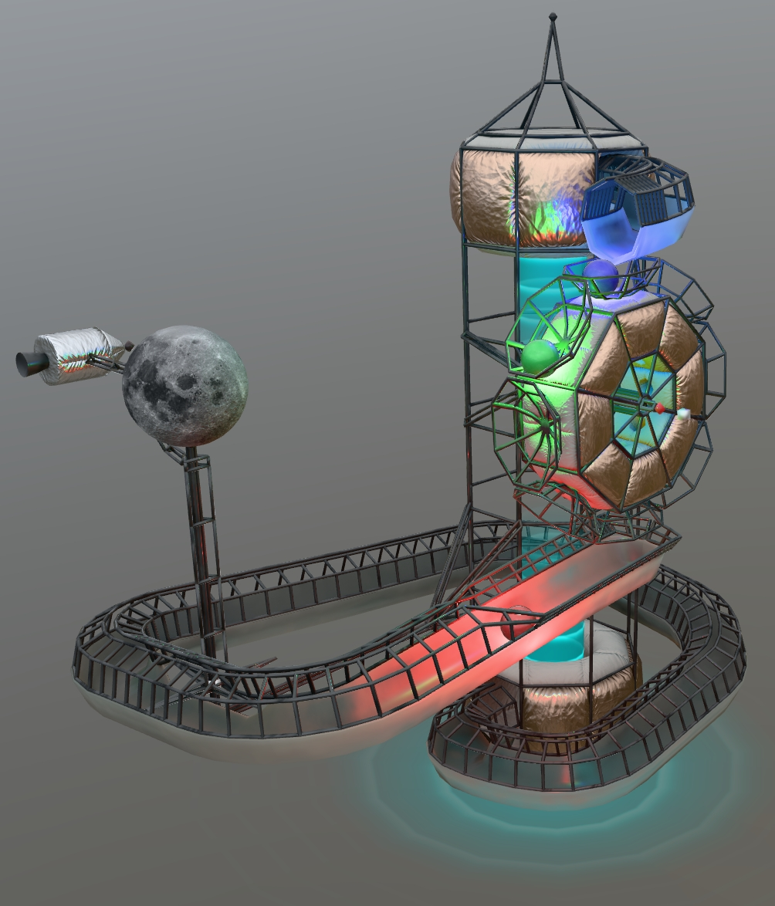
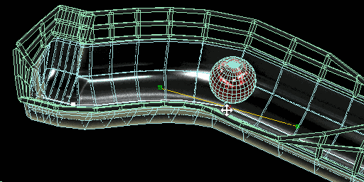
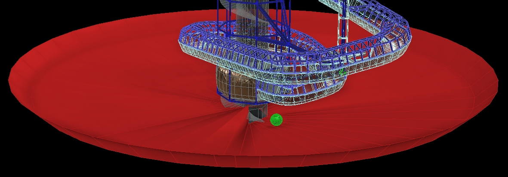
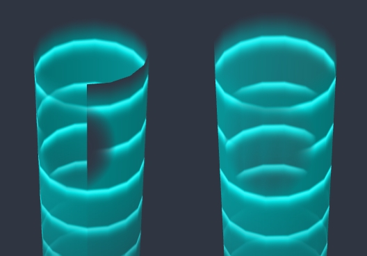
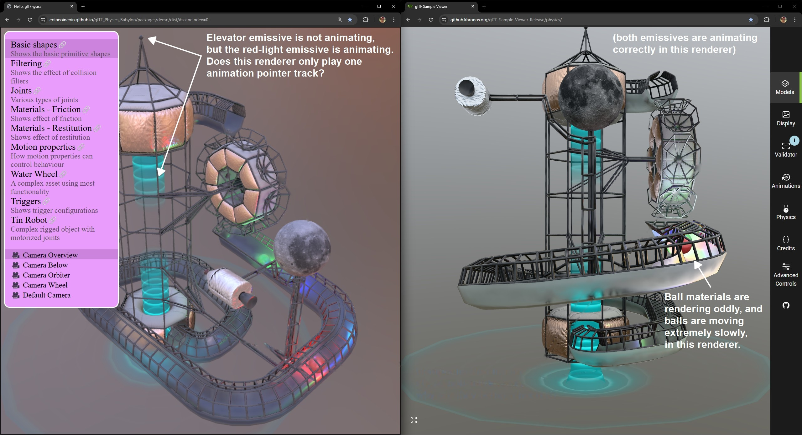

## Screenshot


<br/>_Screenshot from [glTF Sample Viewer physics development version](https://github.khronos.org/glTF-Sample-Viewer-Release/physics/)._

## Description

This asset demonstrates the use of rigid body physics in glTF, to represent marbles tumbling down a track, and lifted upwards to continue endlessly.

This asset is primarily a demonstration of the glTF extensions [KHR_physics_rigid_bodies](https://github.com/eoineoineoin/glTF_Physics/tree/master/extensions/2.0/Khronos/KHR_physics_rigid_bodies) and [KHR_implicit_shapes](https://github.com/eoineoineoin/glTF_Physics/tree/master/extensions/2.0/Khronos/KHR_implicit_shapes). In addition there are a variety of glTF material and animation extensions in use. 


```
  "extensionsUsed": [
    "KHR_materials_clearcoat",
    "KHR_materials_transmission",
    "KHR_materials_emissive_strength",
    "KHR_materials_sheen",
    "KHR_physics_rigid_bodies",
    "KHR_implicit_shapes",
    "KHR_lights_punctual",
    "KHR_texture_transform",
    "KHR_materials_volume",
    "KHR_animation_pointer"
  ],
```

## Modeling and Materials

Models and materials were initially generated in 3ds Max, exported with the HS glTF Exporter, then physics settings were added and exported from Blender. 


<br/>_Editing the track shape with a spline, which controls the mesh shapes._

The glass track and metallic grid cover were modeled using Loft Compound objects, which allowed easy edits of the track incline, by adjusting the underlying spline. This made it easier to fix areas where the balls either got stuck or were moving too fast or too slow.

A metallic grid was added above the glass track to reduce the possibility of fast-moving balls bouncing themselves out of the track. However some balls still managed to exit the ramp. 

To catch errant balls, a large invisible floor was added below the entire structure. This was modeled to funnel any fallen balls back towards an opening in the center shaft, where they would be picked up to be delivered back to the top.


<br/>_The floor funnel (shown here in red) was shaped to catch errant balls._

## Physics Setup

Physics shapes and behavior were set up in Blender using the [Blender glTF Physics toolset](https://github.com/eoineoineoin/glTF_Physics_Blender_Exporter).

Although there is some [documentation for the exporter](https://github.com/eoineoineoin/glTF_Physics_Blender_Exporter/blob/main/README.md), overall there is minimal support available for content creators using the new physics extensions. Developing this kind of content requires a bit of trial and error. 

It was extremely helpful to have access to the [WaterWheel sample asset](https://github.com/eoineoineoin/glTF_Physics/tree/master/samples/WaterWheel) as this has many similar physics behaviors.

To recover the balls at the bottom, an invisible elevator shaft mesh was created with holes at the bottom and top. An Archimedes Screw mesh was added inside to pull the balls up this central shaft and deposit them at the top of the track. The screw is driven by the KHR_physics_rigid_bodies extension using an Angular Velocity to rotate it about the up axis. 

Editing the physics parameters involved a lot of fine-tuning. Some physics parameters can be previewed in Blender just by pressing the Play Animation button. However, many functions like Angular Velocity and Damping can't be shown in Blender, so this required frequent exporting to glTF, and loading the result into web viewers which were modified to support these new physics extensions.

## Punctual Lights

Each of the three balls has a point light, using the [KHR_lights_punctual](https://github.com/KhronosGroup/glTF/blob/main/extensions/2.0/Khronos/KHR_lights_punctual/README.md) extension. The lights are linked to each ball as a child, so they should follow the balls wherever they go. Each light is also colored to match the ball material.

## Animation Pointer

A visual indicator of the elevator-rising effect was added using a transparent shaft with an animated emissive texture. This uses the extension [KHR_animation_pointer](https://github.com/KhronosGroup/glTF/blob/main/extensions/2.0/Khronos/KHR_animation_pointer/README.md) to animate scrolling UVs for the emissive texture. The baseColorTexture with an alpha channel was used to fade out the emissive effect, and it stays in place so only the emissive "rings" are animated.

Animated flashing red lights were added using the same technique, scrolling the UVs of an emissive texture. This approach allows both effects to reuse the same scrolling texture, just with different emissive colors. 

## Alpha Sorting Fix

Alpha blending was used to display the effect on the inside of the elevator as well as on the outside. Usually, the glTF property `doubleSided:true` is used to create a double-sided mesh. However, with `alphaMode:Blend` this can cause alpha sorting errors. 

To prevent alpha sorting problems, the inner surface of the elevator effect was modeled first, then the triangles were duplicated and flipped to create the outside surface, and the material was set to use `doubleSided:false`. This setting prevents backfaces from being automatically generated by the renderer. This kind of manual triangle ordering can be used to force renderers to render the inside alpha-blended surface *before* the outside alpha-blended surface.


<br/>_The elevator effect showing sorting errors (left), and after fixing (right)._


## glTF Physics Viewers

To date, there are only two glTF renderers with support for these new physics extensions.

To run the physics simulation, drag and drop this glTF asset into the [glTF_Physics_Babylon Viewer](https://eoineoineoin.github.io/glTF_Physics_Babylon/packages/demo/dist/#sceneIndex=6) or into the [glTF Sample Viewer physics development version](https://github.khronos.org/glTF-Sample-Viewer-Release/physics/).

Controls for the glTF_Physics_Babylon Viewer:
* Click and drag to rotate the camera.
* W/S/A/D/Q/E to move the camera.
* Hover over an object and hold space to grab a physics object, which will turn yellow.
   * Moving the mouse will apply a force to the object.
   * Object can be reeled in or out using the mouse wheel.

Custom controls for the [glTF Sample Viewer physics development version](https://github.khronos.org/glTF-Sample-Viewer-Release/physics/) are available in the Physics tab. 


## To Do's and Challenges in March 2026
A few issues remain to be solved:



1. In the glTF Sample Viewer, the ball materials are rendering with odd reflections, and the balls are moving very very slowly. Oddly, the Babylon Viewer doesn't exhibit these two issues.

1. In the Babylonjs Viewer, the elevator emissive is not animating. However, the red lights are animating properly. Both the elevator and the lights use the KHR_animation_pointer extension to animate their textures via UV position animation. Oddly, the glTF Sample Viewer plays both animations properly.