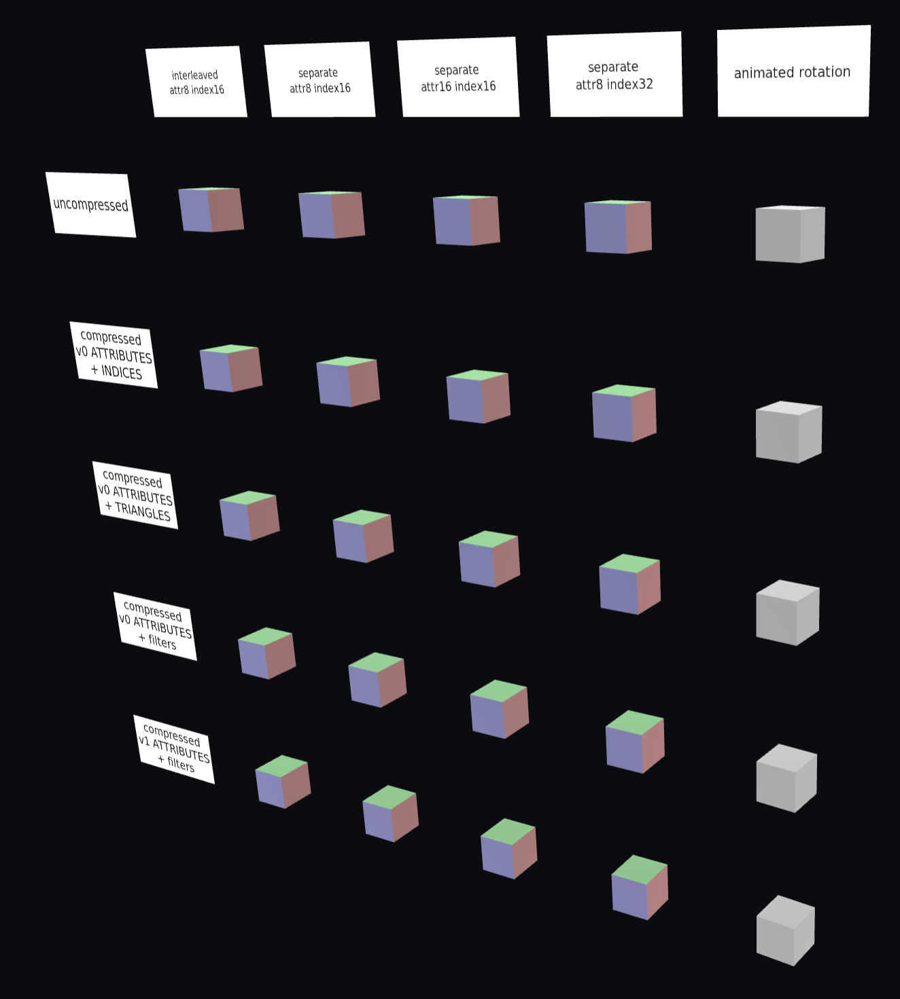

# Meshopt Cube Test

## Tags

[extension](../Models-extension.md), [testing](../Models-testing.md)

## Extensions

### Required

* KHR_mesh_quantization

### Used

* KHR_mesh_quantization
* KHR_meshopt_compression

## Summary

This model tests the KHR_meshopt_compression extension.

## Operations

* [Display](https://github.khronos.org/glTF-Sample-Viewer-Release/?model=https://raw.GithubUserContent.com/KhronosGroup/glTF-Sample-Assets/main/./Models/MeshoptCubeTest/glTF/MeshoptCubeTest.gltf) in SampleViewer
* [Model Directory](./)

## Screenshot

## Description

This model tests the usage of the `KHR_meshopt_compression` extension.

The model contains a grid of cubes; each column uses the same layout of vertex/index data as follows:

1. Positions, normals and colors are interleaved, stored using 3 float32 values, followed by 4 8-bit values (normal) and 4 8-bit values (color).
2. Vertex attributes are separate (deinterleaved). Positions are stored using float32 values; normals and colors are stored using normalized 8-bit values; indices are using 16-bit integers.
3. Vertex attributes are separate (deinterleaved). Positions are stored using float32 values; normals and colors are stored using normalized 16-bit values; indices are using 16-bit integers.
4. Vertex attributes are separate (deinterleaved). Positions are stored using float32 values; normals and colors are stored using normalized 16-bit values; indices are using 32-bit integers.
5. Positions and normals are stored in separate streams using 3 float32 values (without compression); indices are using 16-bit integers.

The cubes in the last columns have animated rotation, using 16-bit normalized storage for quaternion values.

Each row uses different techniques to compress the data. Note that not all compression methods here are optimal and in general the asset is created to test various combinations permitted by the extension, even if these combinations are not relevant in practice. For guidance on compressing the data refer to the extension specification. The geometry for the animated cube remains uncompressed in all rows.

1. All buffer views used by the cubes are uncompressed.
2. All vertex buffer views use ATTRIBUTES mode with version 0; all index buffer views use INDICES mode. Animation data is uncompressed.
3. All vertex buffer views use ATTRIBUTES mode with version 0; all index buffer views use TRIANGLES mode. Animation data is uncompressed.
4. All vertex buffer views use ATTRIBUTES mode with version 0, with filters; all index buffer views use TRIANGLES mode. Animation output is compressed using ATTRIBUTES mode with version 0 and quaternion filter.
5. All vertex buffer views use ATTRIBUTES mode with version 1, with filters; all index buffer views use TRIANGLES mode. Animation output is compressed using ATTRIBUTES mode with version 1 and quaternion filter.

When filters are enabled (rows 4 and 5), they are applied as follows:

- Interleaved cube (first row) is not using filters, as the vertex is encoded using a mix of floating point and integer data.
- Positions in non-interleaved vertices are using EXPONENTIAL filter.
- Normals in non-interleaved vertices are using OCTAHEDRAL filter, with 8 or 16 bit data.
- Colors in non-interleaved vertices are using COLOR filter, with 8 or 16 bit data.

Two versions of the model are provided. The model in `glTF/` folder uses `KHR_meshopt_compression` as an optional extension; an uncompressed version of all buffer views is provided in a separate glTF buffer. Viewers that don't support the extension will still be able to render the model; viewers that do support the extension optimally should not need to load the fallback buffer. A second variant, in `glTF-Meshopt/` folder, requires the extension to be supported and omits the fallback data; viewers that don't support the extension won't be able to load the data. The rendering in all three cases (`glTF` folder for viewers that don't support the extension; `glTF` folder for viewers that support the extension; `glTF-Meshopt` folder for viewers that support the extension) is expected to match.

Note that in both variants, buffer 0 (`MeshoptCubeTest.bin`) contains a mix of compressed buffer data (with uncompressed fallbacks stored in `MeshoptCubeTestFallback.bin` for first variant), and buffer data that is never compressed. This mix is typical to see in real-world uses of the extension, and allows distributing the required portions of the asset as a GLB file (with an optional separate fallback binary file).

## Legal

&copy; 2025, Public. [CC0 1.0 Universal](https://creativecommons.org/publicdomain/zero/1.0/legalcode)

 - Arseny Kapoulkine for Everything

#### Assembled by modelmetadata