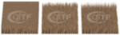
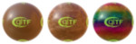
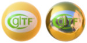
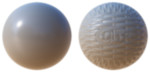
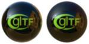
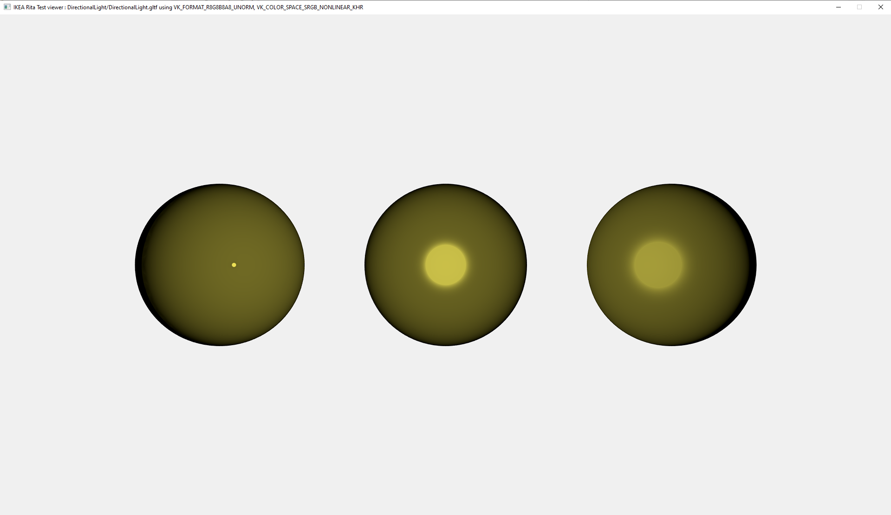
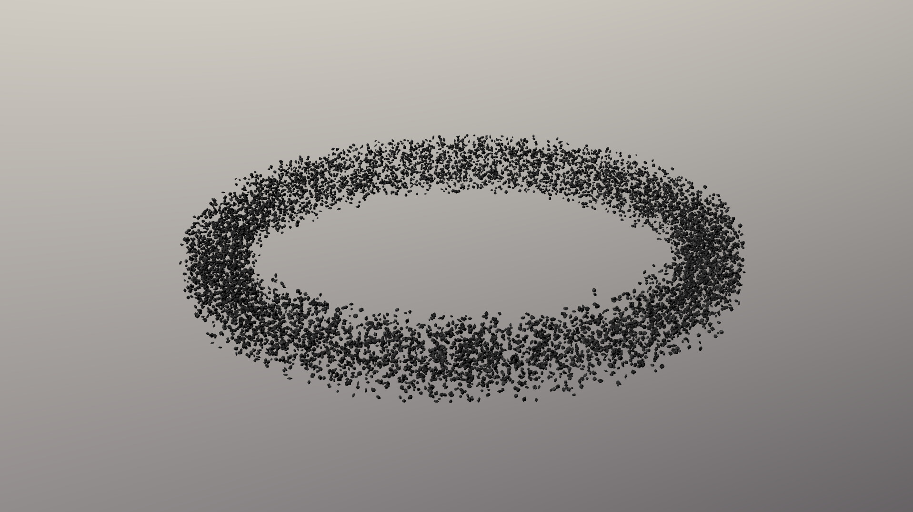
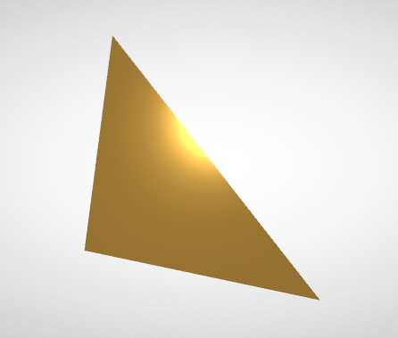

# glTF 2.0 Sample Assets

## Models tagged with **core**

Models that only use the core glTF V2.0 features and capabilities.

## Other Tagged Listings

* [#all](Models.md) - All models listed alphabetically.
* [#core](Models-core.md) - Models that only use the core glTF V2.0 features and capabilities.
* [#extension](Models-extension.md) - Models that use one or more extensions.
* [#issues](Models-issues.md) - Models with one or more issues with respect to ownership, license, or markings.
* [#showcase](Models-showcase.md) - Models that are featured in some glTF/Khronos publicity.
* [#testing](Models-testing.md) - Models that are used for testing various features or capabilities of importers, viewers, or converters.
* [#video](Models-video.md) - Models used in any glTF video tutorial.
* [#written](Models-written.md) - Models used in any written glTF tutorial or guide.

| Model   | Description |
|---------|-------------|
| [Alpha Blend Mode Test](AlphaBlendModeTest/README.md)  [Show](https://github.khronos.org/glTF-Sample-Viewer-Release/?model=https://raw.GithubUserContent.com/KhronosGroup/glTF-Sample-Assets/main/./Models/AlphaBlendModeTest/glTF-Binary/AlphaBlendModeTest.glb) -- [Download GLB](https://raw.GithubUserContent.com/KhronosGroup/glTF-Sample-Assets/main/./Models/AlphaBlendModeTest/glTF-Binary/AlphaBlendModeTest.glb) | Tests alpha modes and settings. Credit: &copy; 2018, Analytical Graphics, Inc.. [CC BY 4.0 International](https://creativecommons.org/licenses/by/4.0/legalcode)  - Ed Mackey for Everything |
| [Animated Cube](AnimatedCube/README.md)  [Show](https://github.khronos.org/glTF-Sample-Viewer-Release/?model=https://raw.GithubUserContent.com/KhronosGroup/glTF-Sample-Assets/main/./Models/AnimatedCube/glTF/AnimatedCube.gltf) | Same as 'Cube', but having a linear rotation animation. Credit: &copy; 2017, UX3D. [CC0 1.0 Universal](https://creativecommons.org/publicdomain/zero/1.0/legalcode)  - Norbert Nopper for Everything |
| [Animated Morph Cube](AnimatedMorphCube/README.md)  [Show](https://github.khronos.org/glTF-Sample-Viewer-Release/?model=https://raw.GithubUserContent.com/KhronosGroup/glTF-Sample-Assets/main/./Models/AnimatedMorphCube/glTF-Binary/AnimatedMorphCube.glb) -- [Download GLB](https://raw.GithubUserContent.com/KhronosGroup/glTF-Sample-Assets/main/./Models/AnimatedMorphCube/glTF-Binary/AnimatedMorphCube.glb) | Demonstrates a simple cube with two simple morph targets and an animation that transitions between them both. Credit: &copy; 2017, Public. [CC0 1.0 Universal](https://creativecommons.org/publicdomain/zero/1.0/legalcode)  - Microsoft for Everything |
| [Animated Triangle](AnimatedTriangle/README.md)  [Show](https://github.khronos.org/glTF-Sample-Viewer-Release/?model=https://raw.GithubUserContent.com/KhronosGroup/glTF-Sample-Assets/main/./Models/AnimatedTriangle/glTF/AnimatedTriangle.gltf) | This sample is similar to the Triangle, but the node has a rotation property that is modified with a simple animation Credit: &copy; 2017, Public. [CC0 1.0 Universal](https://creativecommons.org/publicdomain/zero/1.0/legalcode)  - javagl for Everything |
| [Antique Camera](AntiqueCamera/README.md)  [Show](https://github.khronos.org/glTF-Sample-Viewer-Release/?model=https://raw.GithubUserContent.com/KhronosGroup/glTF-Sample-Assets/main/./Models/AntiqueCamera/glTF-Binary/AntiqueCamera.glb) -- [Download GLB](https://raw.GithubUserContent.com/KhronosGroup/glTF-Sample-Assets/main/./Models/AntiqueCamera/glTF-Binary/AntiqueCamera.glb) | Static model of old camera on a tripod. [Issues: non-Khronos mark] Credit: &copy; 2018, UX3D. [CC0 1.0 Universal](https://creativecommons.org/publicdomain/zero/1.0/legalcode)  - Maximillan Kamps for Everything &copy; 2017, UX3D. [UX3D Trademark or Logo]()  - Non-copyrightable logo for UX3D logo |
| [Avocado](Avocado/README.md)  [Show](https://github.khronos.org/glTF-Sample-Viewer-Release/?model=https://raw.GithubUserContent.com/KhronosGroup/glTF-Sample-Assets/main/./Models/Avocado/glTF-Binary/Avocado.glb) -- [Download GLB](https://raw.GithubUserContent.com/KhronosGroup/glTF-Sample-Assets/main/./Models/Avocado/glTF-Binary/Avocado.glb) | A natural object created with Core glTF 2.0 Credit: &copy; 2017, Public. [CC0 1.0 Universal](https://creativecommons.org/publicdomain/zero/1.0/legalcode)  - Microsoft for Everything |
| [Barramundi Fish](BarramundiFish/README.md)  [Show](https://github.khronos.org/glTF-Sample-Viewer-Release/?model=https://raw.GithubUserContent.com/KhronosGroup/glTF-Sample-Assets/main/./Models/BarramundiFish/glTF-Binary/BarramundiFish.glb) -- [Download GLB](https://raw.GithubUserContent.com/KhronosGroup/glTF-Sample-Assets/main/./Models/BarramundiFish/glTF-Binary/BarramundiFish.glb) | A fish created with Core glTF 2.0 Credit: &copy; 2017, Public. [CC0 1.0 Universal](https://creativecommons.org/publicdomain/zero/1.0/legalcode)  - Microsoft for Everything |
| [Boom Box](BoomBox/README.md)  [Show](https://github.khronos.org/glTF-Sample-Viewer-Release/?model=https://raw.GithubUserContent.com/KhronosGroup/glTF-Sample-Assets/main/./Models/BoomBox/glTF-Binary/BoomBox.glb) -- [Download GLB](https://raw.GithubUserContent.com/KhronosGroup/glTF-Sample-Assets/main/./Models/BoomBox/glTF-Binary/BoomBox.glb) | A common object with glowing front panel created with Core glTF 2.0. Credit: &copy; 2017, Public. [CC0 1.0 Universal](https://creativecommons.org/publicdomain/zero/1.0/legalcode)  - Microsoft for Everything |
| [Boom Box with Axes](BoomBoxWithAxes/README.md)  [Show](https://github.khronos.org/glTF-Sample-Viewer-Release/?model=https://raw.GithubUserContent.com/KhronosGroup/glTF-Sample-Assets/main/./Models/BoomBoxWithAxes/glTF/BoomBoxWithAxes.gltf) | Shows X, Y, and Z axis default orientations. Credit: &copy; 2018, Public. [CC0 1.0 Universal](https://creativecommons.org/publicdomain/zero/1.0/legalcode)  - Microsoft for Everything |
| [Box](Box/README.md)  [Show](https://github.khronos.org/glTF-Sample-Viewer-Release/?model=https://raw.GithubUserContent.com/KhronosGroup/glTF-Sample-Assets/main/./Models/Box/glTF-Binary/Box.glb) -- [Download GLB](https://raw.GithubUserContent.com/KhronosGroup/glTF-Sample-Assets/main/./Models/Box/glTF-Binary/Box.glb) | One mesh and one material. Start with this. Credit: &copy; 2017, Cesium. [CC BY 4.0 International](https://creativecommons.org/licenses/by/4.0/legalcode)  - Cesium for Everything |
| [Box With Spaces](Box With Spaces/README.md)  [Show](https://github.khronos.org/glTF-Sample-Viewer-Release/?model=https://raw.GithubUserContent.com/KhronosGroup/glTF-Sample-Assets/main/./Models/Box%20With%20Spaces/glTF/Box%20With%20Spaces.gltf) | Box with URI-encoded spaces in the texture names used by a simple PBR material. Credit: &copy; 2017, Analytical Graphics, Inc.. [CC0 1.0 Universal](https://creativecommons.org/publicdomain/zero/1.0/legalcode)  - Ed Mackey for Everything &copy; 2017, Khronos Group. [Khronos Trademark or Logo]()  - Non-copyrightable logo for glTF logo |
| [Box Animated](BoxAnimated/README.md)  [Show](https://github.khronos.org/glTF-Sample-Viewer-Release/?model=https://raw.GithubUserContent.com/KhronosGroup/glTF-Sample-Assets/main/./Models/BoxAnimated/glTF-Binary/BoxAnimated.glb) -- [Download GLB](https://raw.GithubUserContent.com/KhronosGroup/glTF-Sample-Assets/main/./Models/BoxAnimated/glTF-Binary/BoxAnimated.glb) | Rotation and Translation Animations. Start with this to test animations. Credit: &copy; 2017, Cesium. [CC BY 4.0 International](https://creativecommons.org/licenses/by/4.0/legalcode)  - Cesium for Everything |
| [Box with interleaved position and normal attributes](BoxInterleaved/README.md)  [Show](https://github.khronos.org/glTF-Sample-Viewer-Release/?model=https://raw.GithubUserContent.com/KhronosGroup/glTF-Sample-Assets/main/./Models/BoxInterleaved/glTF-Binary/BoxInterleaved.glb) -- [Download GLB](https://raw.GithubUserContent.com/KhronosGroup/glTF-Sample-Assets/main/./Models/BoxInterleaved/glTF-Binary/BoxInterleaved.glb) | Box example with interleaved position and normal attributes. Credit: &copy; 2017, Cesium. [CC BY 4.0 International](https://creativecommons.org/licenses/by/4.0/legalcode)  - Cesium for Everything |
| [Box Textured](BoxTextured/README.md)  [Show](https://github.khronos.org/glTF-Sample-Viewer-Release/?model=https://raw.GithubUserContent.com/KhronosGroup/glTF-Sample-Assets/main/./Models/BoxTextured/glTF-Binary/BoxTextured.glb) -- [Download GLB](https://raw.GithubUserContent.com/KhronosGroup/glTF-Sample-Assets/main/./Models/BoxTextured/glTF-Binary/BoxTextured.glb) | Box with a power-of-2 texture. [Issues: non-Khronos mark] Credit: &copy; 2017, Cesium. [CC-BY 4.0 International with Trademark Limitations]()  - Cesium for Everything &copy; 2015, Cesium. [Cesium Trademark or Logo]()  - Non-copyrightable logo for Cesium logo |
| [Box Textured not 2^N](BoxTexturedNonPowerOfTwo/README.md)  [Show](https://github.khronos.org/glTF-Sample-Viewer-Release/?model=https://raw.GithubUserContent.com/KhronosGroup/glTF-Sample-Assets/main/./Models/BoxTexturedNonPowerOfTwo/glTF-Binary/BoxTexturedNonPowerOfTwo.glb) -- [Download GLB](https://raw.GithubUserContent.com/KhronosGroup/glTF-Sample-Assets/main/./Models/BoxTexturedNonPowerOfTwo/glTF-Binary/BoxTexturedNonPowerOfTwo.glb) | Box with a non-power-of-2 (NPOT) texture. Not all implementations support NPOT textures. [Issues: non-Khronos mark] Credit: &copy; 2017, Cesium. [CC-BY 4.0 International with Trademark Limitations]()  - Cesium for Everything &copy; 2015, Cesium. [Cesium Trademark or Logo]()  - Non-copyrightable logo for Cesium logo |
| [Box Vertex Colors](BoxVertexColors/README.md)  [Show](https://github.khronos.org/glTF-Sample-Viewer-Release/?model=https://raw.GithubUserContent.com/KhronosGroup/glTF-Sample-Assets/main/./Models/BoxVertexColors/glTF-Binary/BoxVertexColors.glb) -- [Download GLB](https://raw.GithubUserContent.com/KhronosGroup/glTF-Sample-Assets/main/./Models/BoxVertexColors/glTF-Binary/BoxVertexColors.glb) | A simple unit cube that uses vertex colors, stored in the `COLORS_0` attribute.  Credit: &copy; 2023, Public. [CC0 1.0 Universal](https://creativecommons.org/publicdomain/zero/1.0/legalcode)  - Marco Hutter for Everything |
| [BrainStem](BrainStem/README.md)  [Show](https://github.khronos.org/glTF-Sample-Viewer-Release/?model=https://raw.GithubUserContent.com/KhronosGroup/glTF-Sample-Assets/main/./Models/BrainStem/glTF-Binary/BrainStem.glb) -- [Download GLB](https://raw.GithubUserContent.com/KhronosGroup/glTF-Sample-Assets/main/./Models/BrainStem/glTF-Binary/BrainStem.glb) | Animations. Skins. Credit: &copy; 2017, Smith Micro Software, Inc.. [Poser EULA](https://archive.org/stream/poser-pro-2014-reference-manual/Poser_Pro_2014_reference_manual_djvu.txt)  - Keith Hunter for Everything |
| [Cameras](Cameras/README.md)  [Show](https://github.khronos.org/glTF-Sample-Viewer-Release/?model=https://raw.GithubUserContent.com/KhronosGroup/glTF-Sample-Assets/main/./Models/Cameras/glTF/Cameras.gltf) | A sample with two different camera objects Credit: &copy; 2017, Public. [CC0 1.0 Universal](https://creativecommons.org/publicdomain/zero/1.0/legalcode)  - javagl for Everything |
| [Cesium Man](CesiumMan/README.md)  [Show](https://github.khronos.org/glTF-Sample-Viewer-Release/?model=https://raw.GithubUserContent.com/KhronosGroup/glTF-Sample-Assets/main/./Models/CesiumMan/glTF-Binary/CesiumMan.glb) -- [Download GLB](https://raw.GithubUserContent.com/KhronosGroup/glTF-Sample-Assets/main/./Models/CesiumMan/glTF-Binary/CesiumMan.glb) | Textured. Animations. Skins. [Issues: non-Khronos mark] Credit: &copy; 2017, Cesium. [CC-BY 4.0 International with Trademark Limitations]()  - Cesium for Everything &copy; 2015, Cesium. [Cesium Trademark or Logo]()  - Non-copyrightable logo for Cesium logo |
| [Cesium Milk Truck](CesiumMilkTruck/README.md)  [Show](https://github.khronos.org/glTF-Sample-Viewer-Release/?model=https://raw.GithubUserContent.com/KhronosGroup/glTF-Sample-Assets/main/./Models/CesiumMilkTruck/glTF-Binary/CesiumMilkTruck.glb) -- [Download GLB](https://raw.GithubUserContent.com/KhronosGroup/glTF-Sample-Assets/main/./Models/CesiumMilkTruck/glTF-Binary/CesiumMilkTruck.glb) | Textured. Multiple nodes/meshes. Animations. [Issues: non-Khronos mark] Credit: &copy; 2017, Cesium. [CC-BY 4.0 International with Trademark Limitations]()  - Cesium for Everything &copy; 2015, Cesium. [Cesium Trademark or Logo]()  - Non-copyrightable logo for Cesium logo |
| [Compare Alpha Coverage](CompareAlphaCoverage/README.md)  [Show](https://github.khronos.org/glTF-Sample-Viewer-Release/?model=https://raw.GithubUserContent.com/KhronosGroup/glTF-Sample-Assets/main/./Models/CompareAlphaCoverage/glTF-Binary/CompareAlphaCoverage.glb) -- [Download GLB](https://raw.GithubUserContent.com/KhronosGroup/glTF-Sample-Assets/main/./Models/CompareAlphaCoverage/glTF-Binary/CompareAlphaCoverage.glb) | This model compares alpha coverage methods. Credit: &copy; 2017, Khronos Group. [Khronos Trademark or Logo]()  - Non-copyrightable logo for glTF logo &copy; 2024, Public. [CC0 1.0 Universal](https://creativecommons.org/publicdomain/zero/1.0/legalcode)  - Eric Chadwick and DGG for Everything |
| [Compare Ambient Occlusion](CompareAmbientOcclusion/README.md)  [Show](https://github.khronos.org/glTF-Sample-Viewer-Release/?model=https://raw.GithubUserContent.com/KhronosGroup/glTF-Sample-Assets/main/./Models/CompareAmbientOcclusion/glTF-Binary/CompareAmbientOcclusion.glb) -- [Download GLB](https://raw.GithubUserContent.com/KhronosGroup/glTF-Sample-Assets/main/./Models/CompareAmbientOcclusion/glTF-Binary/CompareAmbientOcclusion.glb) | This model compares without occlusion versus with occlusion. Credit: &copy; 2017, Khronos Group. [Khronos Trademark or Logo]()  - Non-copyrightable logo for glTF logo &copy; 2024, Public. [CC0 1.0 Universal](https://creativecommons.org/publicdomain/zero/1.0/legalcode)  - Polyhaven for Models &copy; 2024, Public. [CC0 1.0 Universal](https://creativecommons.org/publicdomain/zero/1.0/legalcode)  - Eric Chadwick and DGG for Textures |
| [Compare Base Color](CompareBaseColor/README.md)  [Show](https://github.khronos.org/glTF-Sample-Viewer-Release/?model=https://raw.GithubUserContent.com/KhronosGroup/glTF-Sample-Assets/main/./Models/CompareBaseColor/glTF/CompareBaseColor.gltf) | This model compares base color methods. Credit: &copy; 2017, Khronos Group. [Khronos Trademark or Logo]()  - Non-copyrightable logo for glTF logo &copy; 2024, Public. [CC0 1.0 Universal](https://creativecommons.org/publicdomain/zero/1.0/legalcode)  - Eric Chadwick and DGG for Everything |
| [Compare Metallic](CompareMetallic/README.md)  [Show](https://github.khronos.org/glTF-Sample-Viewer-Release/?model=https://raw.GithubUserContent.com/KhronosGroup/glTF-Sample-Assets/main/./Models/CompareMetallic/glTF-Binary/CompareMetallic.glb) -- [Download GLB](https://raw.GithubUserContent.com/KhronosGroup/glTF-Sample-Assets/main/./Models/CompareMetallic/glTF-Binary/CompareMetallic.glb) | This model compares metallic methods. Credit: &copy; 2017, Khronos Group. [Khronos Trademark or Logo]()  - Non-copyrightable logo for glTF logo &copy; 2024, Public. [CC0 1.0 Universal](https://creativecommons.org/publicdomain/zero/1.0/legalcode)  - Eric Chadwick and DGG for Everything |
| [Compare Normal](CompareNormal/README.md)  [Show](https://github.khronos.org/glTF-Sample-Viewer-Release/?model=https://raw.GithubUserContent.com/KhronosGroup/glTF-Sample-Assets/main/./Models/CompareNormal/glTF-Binary/CompareNormal.glb) -- [Download GLB](https://raw.GithubUserContent.com/KhronosGroup/glTF-Sample-Assets/main/./Models/CompareNormal/glTF-Binary/CompareNormal.glb) | This model compares normal methods. Credit: &copy; 2017, Khronos Group. [Khronos Trademark or Logo]()  - Non-copyrightable logo for glTF logo &copy; 2024, Public. [CC0 1.0 Universal](https://creativecommons.org/publicdomain/zero/1.0/legalcode)  - Eric Chadwick and DGG for Everything |
| [Compare Roughness](CompareRoughness/README.md)  [Show](https://github.khronos.org/glTF-Sample-Viewer-Release/?model=https://raw.GithubUserContent.com/KhronosGroup/glTF-Sample-Assets/main/./Models/CompareRoughness/glTF-Binary/CompareRoughness.glb) -- [Download GLB](https://raw.GithubUserContent.com/KhronosGroup/glTF-Sample-Assets/main/./Models/CompareRoughness/glTF-Binary/CompareRoughness.glb) | This model compares roughness methods. Credit: &copy; 2017, Khronos Group. [Khronos Trademark or Logo]()  - Non-copyrightable logo for glTF logo &copy; 2024, Public. [CC0 1.0 Universal](https://creativecommons.org/publicdomain/zero/1.0/legalcode)  - Eric Chadwick and DGG for Everything |
| [Corset](Corset/README.md)  [Show](https://github.khronos.org/glTF-Sample-Viewer-Release/?model=https://raw.GithubUserContent.com/KhronosGroup/glTF-Sample-Assets/main/./Models/Corset/glTF-Binary/Corset.glb) -- [Download GLB](https://raw.GithubUserContent.com/KhronosGroup/glTF-Sample-Assets/main/./Models/Corset/glTF-Binary/Corset.glb) |   Credit: &copy; 2017, UX3D. [CC0 1.0 Universal](https://creativecommons.org/publicdomain/zero/1.0/legalcode)  - Microsoft for Everything |
| [Cube](Cube/README.md)  [Show](https://github.khronos.org/glTF-Sample-Viewer-Release/?model=https://raw.GithubUserContent.com/KhronosGroup/glTF-Sample-Assets/main/./Models/Cube/glTF/Cube.gltf) | A cube with non-smoothed faces. Credit: &copy; 2017, UX3D. [CC0 1.0 Universal](https://creativecommons.org/publicdomain/zero/1.0/legalcode)  - Norbert Nopper for Everything |
| [Damaged Helmet](DamagedHelmet/README.md)  [Show](https://github.khronos.org/glTF-Sample-Viewer-Release/?model=https://raw.GithubUserContent.com/KhronosGroup/glTF-Sample-Assets/main/./Models/DamagedHelmet/glTF-Binary/DamagedHelmet.glb) -- [Download GLB](https://raw.GithubUserContent.com/KhronosGroup/glTF-Sample-Assets/main/./Models/DamagedHelmet/glTF-Binary/DamagedHelmet.glb) | Flight helmet with damage Credit: &copy; 2018, ctxwing. [CC BY 4.0 International](https://creativecommons.org/licenses/by/4.0/legalcode)  - ctxwing for Rebuild and conversion to glTF &copy; 2016, theblueturtle_. [CC BY-NC 4.0 International](https://creativecommons.org/licenses/by-nc/4.0/legalcode)  - theblueturtle_ for Earlier version of model |
| [Directional Light](DirectionalLight/README.md)  [Show](https://github.khronos.org/glTF-Sample-Viewer-Release/?model=https://raw.GithubUserContent.com/KhronosGroup/glTF-Sample-Assets/main/./Models/DirectionalLight/glTF-Binary/DirectionalLight.glb) -- [Download GLB](https://raw.GithubUserContent.com/KhronosGroup/glTF-Sample-Assets/main/./Models/DirectionalLight/glTF-Binary/DirectionalLight.glb) | Verification of light calculations Credit: &copy; 2020, Public. [CC0 1.0 Universal](https://creativecommons.org/publicdomain/zero/1.0/legalcode)  - Rickard Sahlin for Everything |
| [Duck](Duck/README.md)  [Show](https://github.khronos.org/glTF-Sample-Viewer-Release/?model=https://raw.GithubUserContent.com/KhronosGroup/glTF-Sample-Assets/main/./Models/Duck/glTF-Binary/Duck.glb) -- [Download GLB](https://raw.GithubUserContent.com/KhronosGroup/glTF-Sample-Assets/main/./Models/Duck/glTF-Binary/Duck.glb) | The COLLADA duck. One texture. Credit: &copy; 2006, Sony. [SCEA Shared Source License, Version 1.0](https://spdx.org/licenses/SCEA.html)  - Sony for Everything |
| [Flight Helmet](FlightHelmet/README.md)  [Show](https://github.khronos.org/glTF-Sample-Viewer-Release/?model=https://raw.GithubUserContent.com/KhronosGroup/glTF-Sample-Assets/main/./Models/FlightHelmet/glTF/FlightHelmet.gltf) | Displayed flight helmet on a wooden stand. Credit: &copy; 2018, Public. [CC0 1.0 Universal](https://creativecommons.org/publicdomain/zero/1.0/legalcode)  - Gary Hsu for Conversion from Maya |
| [Fox](Fox/README.md)  [Show](https://github.khronos.org/glTF-Sample-Viewer-Release/?model=https://raw.GithubUserContent.com/KhronosGroup/glTF-Sample-Assets/main/./Models/Fox/glTF-Binary/Fox.glb) -- [Download GLB](https://raw.GithubUserContent.com/KhronosGroup/glTF-Sample-Assets/main/./Models/Fox/glTF-Binary/Fox.glb) | Multiple animations cycles: Survey, Walk, Run. Credit: &copy; 2014, Public. [CC0 1.0 Universal](https://creativecommons.org/publicdomain/zero/1.0/legalcode)  - PixelMannen for Model &copy; 2014, tomkranis. [CC BY 4.0 International](https://creativecommons.org/licenses/by/4.0/legalcode)  - tomkranis for Rigging & Animation &copy; 2017, @AsoboStudio and @scurest. [CC BY 4.0 International](https://creativecommons.org/licenses/by/4.0/legalcode)  - @AsoboStudio and @scurest for Conversion to glTF |
| [Interpolation Test](InterpolationTest/README.md)  [Show](https://github.khronos.org/glTF-Sample-Viewer-Release/?model=https://raw.GithubUserContent.com/KhronosGroup/glTF-Sample-Assets/main/./Models/InterpolationTest/glTF-Binary/InterpolationTest.glb) -- [Download GLB](https://raw.GithubUserContent.com/KhronosGroup/glTF-Sample-Assets/main/./Models/InterpolationTest/glTF-Binary/InterpolationTest.glb) | A sample with three different animation interpolations Credit: &copy; 2017, Public. [CC0 1.0 Universal](https://creativecommons.org/publicdomain/zero/1.0/legalcode)  - Khronos for Everything |
| [Lantern](Lantern/README.md)  [Show](https://github.khronos.org/glTF-Sample-Viewer-Release/?model=https://raw.GithubUserContent.com/KhronosGroup/glTF-Sample-Assets/main/./Models/Lantern/glTF-Binary/Lantern.glb) -- [Download GLB](https://raw.GithubUserContent.com/KhronosGroup/glTF-Sample-Assets/main/./Models/Lantern/glTF-Binary/Lantern.glb) | Old wooden street light. Credit: &copy; 2017, Microsoft. [CC0 1.0 Universal](https://creativecommons.org/publicdomain/zero/1.0/legalcode)  - sbtron for Initial version &copy; 2018, Frank Galligan. [CC0 1.0 Universal](https://creativecommons.org/publicdomain/zero/1.0/legalcode)  - Frank Galligan for Draco compression |
| [Metal-Rough Spheres](MetalRoughSpheres/README.md)  [Show](https://github.khronos.org/glTF-Sample-Viewer-Release/?model=https://raw.GithubUserContent.com/KhronosGroup/glTF-Sample-Assets/main/./Models/MetalRoughSpheres/glTF-Binary/MetalRoughSpheres.glb) -- [Download GLB](https://raw.GithubUserContent.com/KhronosGroup/glTF-Sample-Assets/main/./Models/MetalRoughSpheres/glTF-Binary/MetalRoughSpheres.glb) | Tests various metal and roughness values (texture mapped). Credit: &copy; 2017, Analytical Graphics, Inc.. [CC BY 4.0 International](https://creativecommons.org/licenses/by/4.0/legalcode)  - Ed Mackey for Everything |
| [Metal-Rough Spheres (textureless)](MetalRoughSpheresNoTextures/README.md)  [Show](https://github.khronos.org/glTF-Sample-Viewer-Release/?model=https://raw.GithubUserContent.com/KhronosGroup/glTF-Sample-Assets/main/./Models/MetalRoughSpheresNoTextures/glTF-Binary/MetalRoughSpheresNoTextures.glb) -- [Download GLB](https://raw.GithubUserContent.com/KhronosGroup/glTF-Sample-Assets/main/./Models/MetalRoughSpheresNoTextures/glTF-Binary/MetalRoughSpheresNoTextures.glb) | Tests various metal and roughness values (textureless). Credit: &copy; 2019, Public. [CC0 1.0 Universal](https://creativecommons.org/publicdomain/zero/1.0/legalcode)  - Krill Gavrilov for Everything &copy; 2019, Public. [CC0 1.0 Universal](https://creativecommons.org/publicdomain/zero/1.0/legalcode)  - CAD Model generated by Draw Harness script using Open CASCADE Technology for Everything |
| [Morph-Primitives Test](MorphPrimitivesTest/README.md)  [Show](https://github.khronos.org/glTF-Sample-Viewer-Release/?model=https://raw.GithubUserContent.com/KhronosGroup/glTF-Sample-Assets/main/./Models/MorphPrimitivesTest/glTF-Binary/MorphPrimitivesTest.glb) -- [Download GLB](https://raw.GithubUserContent.com/KhronosGroup/glTF-Sample-Assets/main/./Models/MorphPrimitivesTest/glTF-Binary/MorphPrimitivesTest.glb) | Tests a morph target on multiple primitives. Credit: &copy; 2018, ft-lab. [CC BY 4.0 International](https://creativecommons.org/licenses/by/4.0/legalcode)  - ft-lab for Everything &copy; 2020, Frank Galligan. [CC BY 4.0 International](https://creativecommons.org/licenses/by/4.0/legalcode)  - Frank Galligan for DRACO compression |
| [Morph Stress Test](MorphStressTest/README.md)  [Show](https://github.khronos.org/glTF-Sample-Viewer-Release/?model=https://raw.GithubUserContent.com/KhronosGroup/glTF-Sample-Assets/main/./Models/MorphStressTest/glTF-Binary/MorphStressTest.glb) -- [Download GLB](https://raw.GithubUserContent.com/KhronosGroup/glTF-Sample-Assets/main/./Models/MorphStressTest/glTF-Binary/MorphStressTest.glb) | Tests up to 8 morph targets. Credit: &copy; 2021, Analytical Graphics, Inc.. [CC BY 4.0 International](https://creativecommons.org/licenses/by/4.0/legalcode)  - Ed Mackey for Everything |
| [MultiUV Test](MultiUVTest/README.md)  [Show](https://github.khronos.org/glTF-Sample-Viewer-Release/?model=https://raw.GithubUserContent.com/KhronosGroup/glTF-Sample-Assets/main/./Models/MultiUVTest/glTF-Binary/MultiUVTest.glb) -- [Download GLB](https://raw.GithubUserContent.com/KhronosGroup/glTF-Sample-Assets/main/./Models/MultiUVTest/glTF-Binary/MultiUVTest.glb) | This model has two uv texture coordinates and tests a second set of texture coordinates. Credit: &copy; 2017, Hilo 3D. [CC BY 4.0 International](https://creativecommons.org/licenses/by/4.0/legalcode)  - Hilo 3D for Everything &copy; 2017, Khronos Group. [Khronos Trademark or Logo]()  - Non-copyrightable logo for glTF logo |
| [Multiple Scenes](MultipleScenes/README.md)  [Show](https://github.khronos.org/glTF-Sample-Viewer-Release/?model=https://raw.GithubUserContent.com/KhronosGroup/glTF-Sample-Assets/main/./Models/MultipleScenes/glTF/MultipleScenes.gltf) | A simple glTF asset with two scenes. Each scene consists of one node with one mesh.  Credit: &copy; 2017, Public. [CC0 1.0 Universal](https://creativecommons.org/publicdomain/zero/1.0/legalcode)  - Public for Everthing |
| [Negative Scale Test](NegativeScaleTest/README.md)  [Show](https://github.khronos.org/glTF-Sample-Viewer-Release/?model=https://raw.GithubUserContent.com/KhronosGroup/glTF-Sample-Assets/main/./Models/NegativeScaleTest/glTF-Binary/NegativeScaleTest.glb) -- [Download GLB](https://raw.GithubUserContent.com/KhronosGroup/glTF-Sample-Assets/main/./Models/NegativeScaleTest/glTF-Binary/NegativeScaleTest.glb) | This model tests what happens when a glTF node has negative scaling. Credit: &copy; 2023, Analytical Graphics, Inc.. [CC BY 4.0 International](https://creativecommons.org/licenses/by/4.0/legalcode)  - Ed Mackey for Everthing |
| [NodePerformanceTest](NodePerformanceTest/README.md)  [Show](https://github.khronos.org/glTF-Sample-Viewer-Release/?model=https://raw.GithubUserContent.com/KhronosGroup/glTF-Sample-Assets/main/./Models/NodePerformanceTest/glTF-Binary/NodePerformanceTest.glb) -- [Download GLB](https://raw.GithubUserContent.com/KhronosGroup/glTF-Sample-Assets/main/./Models/NodePerformanceTest/glTF-Binary/NodePerformanceTest.glb) | Node, mesh, primitive and texture count performance test Credit: &copy; 2024, Public. [CC0 1.0 Universal](https://creativecommons.org/publicdomain/zero/1.0/legalcode)  - Jon Aspeheim for Everything |
| [Normal-Tangent Mirror Test](NormalTangentMirrorTest/README.md)  [Show](https://github.khronos.org/glTF-Sample-Viewer-Release/?model=https://raw.GithubUserContent.com/KhronosGroup/glTF-Sample-Assets/main/./Models/NormalTangentMirrorTest/glTF-Binary/NormalTangentMirrorTest.glb) -- [Download GLB](https://raw.GithubUserContent.com/KhronosGroup/glTF-Sample-Assets/main/./Models/NormalTangentMirrorTest/glTF-Binary/NormalTangentMirrorTest.glb) | Tests an engine's ability to load supplied tangent vectors for a normal map. Credit: &copy; 2018, Analytical Graphics, Inc.. [CC BY 4.0 International](https://creativecommons.org/licenses/by/4.0/legalcode)  - Ed Mackey for Everything |
| [Normal-Tangent Test](NormalTangentTest/README.md)  [Show](https://github.khronos.org/glTF-Sample-Viewer-Release/?model=https://raw.GithubUserContent.com/KhronosGroup/glTF-Sample-Assets/main/./Models/NormalTangentTest/glTF-Binary/NormalTangentTest.glb) -- [Download GLB](https://raw.GithubUserContent.com/KhronosGroup/glTF-Sample-Assets/main/./Models/NormalTangentTest/glTF-Binary/NormalTangentTest.glb) | Tests an engine's ability to automatically generate tangent vectors for a normal map. Credit: &copy; 2018, Analytical Graphics, Inc.. [CC0 1.0 Universal](https://creativecommons.org/publicdomain/zero/1.0/legalcode)  - Ed Mackey for Everything |
| [Orientation Test](OrientationTest/README.md)  [Show](https://github.khronos.org/glTF-Sample-Viewer-Release/?model=https://raw.GithubUserContent.com/KhronosGroup/glTF-Sample-Assets/main/./Models/OrientationTest/glTF-Binary/OrientationTest.glb) -- [Download GLB](https://raw.GithubUserContent.com/KhronosGroup/glTF-Sample-Assets/main/./Models/OrientationTest/glTF-Binary/OrientationTest.glb) | Tests node translations and rotations. Credit: &copy; 2017, Unknown. [CC BY 4.0 International](https://creativecommons.org/licenses/by/4.0/legalcode)  - Khronos for Everything |
| [Primitive Mode Normals Test](PrimitiveModeNormalsTest/README.md)  [Show](https://github.khronos.org/glTF-Sample-Viewer-Release/?model=https://raw.GithubUserContent.com/KhronosGroup/glTF-Sample-Assets/main/./Models/PrimitiveModeNormalsTest/glTF/PrimitiveModeNormalsTest.gltf) | Tests rendering of points, lines, and triangles with and without normals. Credit: &copy; 2020, public. [CC0 1.0 Universal](https://creativecommons.org/publicdomain/zero/1.0/legalcode)  - Unknown for Everything |
| [Recursive Skeletons](RecursiveSkeletons/README.md)  [Show](https://github.khronos.org/glTF-Sample-Viewer-Release/?model=https://raw.GithubUserContent.com/KhronosGroup/glTF-Sample-Assets/main/./Models/RecursiveSkeletons/glTF-Binary/RecursiveSkeletons.glb) -- [Download GLB](https://raw.GithubUserContent.com/KhronosGroup/glTF-Sample-Assets/main/./Models/RecursiveSkeletons/glTF-Binary/RecursiveSkeletons.glb) | Tests unusual skinning cases with reused meshes and recursive skeletons. Credit: &copy; 2017, Cesium. [CC BY 4.0 International](https://creativecommons.org/licenses/by/4.0/legalcode)  - Cesium for Everything |
| [Rigged Figure](RiggedFigure/README.md)  [Show](https://github.khronos.org/glTF-Sample-Viewer-Release/?model=https://raw.GithubUserContent.com/KhronosGroup/glTF-Sample-Assets/main/./Models/RiggedFigure/glTF-Binary/RiggedFigure.glb) -- [Download GLB](https://raw.GithubUserContent.com/KhronosGroup/glTF-Sample-Assets/main/./Models/RiggedFigure/glTF-Binary/RiggedFigure.glb) | Animations. Skins. Credit: &copy; 2017, Cesium. [CC BY 4.0 International](https://creativecommons.org/licenses/by/4.0/legalcode)  - Cesium for Everything |
| [Rigged Simple](RiggedSimple/README.md)  [Show](https://github.khronos.org/glTF-Sample-Viewer-Release/?model=https://raw.GithubUserContent.com/KhronosGroup/glTF-Sample-Assets/main/./Models/RiggedSimple/glTF-Binary/RiggedSimple.glb) -- [Download GLB](https://raw.GithubUserContent.com/KhronosGroup/glTF-Sample-Assets/main/./Models/RiggedSimple/glTF-Binary/RiggedSimple.glb) | Animations. Skins. Start with this to test skinning. Credit: &copy; 2017, Cesium. [CC BY 4.0 International](https://creativecommons.org/licenses/by/4.0/legalcode)  - Cesium for Everything |
| [SciFi Helmet](SciFiHelmet/README.md)  [Show](https://github.khronos.org/glTF-Sample-Viewer-Release/?model=https://raw.GithubUserContent.com/KhronosGroup/glTF-Sample-Assets/main/./Models/SciFiHelmet/glTF/SciFiHelmet.gltf) | Futuristic helmet Credit: &copy; 2017, Public. [CC0 1.0 Universal](https://creativecommons.org/publicdomain/zero/1.0/legalcode)  - Michael Pavlovic for Everything &copy; 2017, Public. [CC0 1.0 Universal](https://creativecommons.org/publicdomain/zero/1.0/legalcode)  - Norbert Nopper for Conversion to glTF |
| [Simple Material](SimpleMaterial/README.md)  [Show](https://github.khronos.org/glTF-Sample-Viewer-Release/?model=https://raw.GithubUserContent.com/KhronosGroup/glTF-Sample-Assets/main/./Models/SimpleMaterial/glTF/SimpleMaterial.gltf) | A simple glTF asset with a material Credit: &copy; 2017, Public. [CC0 1.0 Universal](https://creativecommons.org/publicdomain/zero/1.0/legalcode)  - javagl for Everything |
| [Simple Meshes](SimpleMeshes/README.md)  [Show](https://github.khronos.org/glTF-Sample-Viewer-Release/?model=https://raw.GithubUserContent.com/KhronosGroup/glTF-Sample-Assets/main/./Models/SimpleMeshes/glTF/SimpleMeshes.gltf) | A simple scene with two nodes, both containing the same mesh, namely a mesh with a single mesh.primitive with a single indexed triangle with multiple attributes (positions, normals and texture coordinates), but without a material Credit: &copy; 2017, Public. [CC0 1.0 Universal](https://creativecommons.org/publicdomain/zero/1.0/legalcode)  - javagl for Everything |
| [Simple Morph](SimpleMorph/README.md)  [Show](https://github.khronos.org/glTF-Sample-Viewer-Release/?model=https://raw.GithubUserContent.com/KhronosGroup/glTF-Sample-Assets/main/./Models/SimpleMorph/glTF/SimpleMorph.gltf) | A triangle with a morph animation applied Credit: &copy; 2017, Public. [CC0 1.0 Universal](https://creativecommons.org/publicdomain/zero/1.0/legalcode)  - javagl for Everything |
| [Simple Skin](SimpleSkin/README.md)  [Show](https://github.khronos.org/glTF-Sample-Viewer-Release/?model=https://raw.GithubUserContent.com/KhronosGroup/glTF-Sample-Assets/main/./Models/SimpleSkin/glTF/SimpleSkin.gltf) | A simple example of vertex skinning in glTF Credit: &copy; 2017, Public. [CC0 1.0 Universal](https://creativecommons.org/publicdomain/zero/1.0/legalcode)  - javagl for Everything |
| [Simple Sparse Accessor](SimpleSparseAccessor/README.md)  [Show](https://github.khronos.org/glTF-Sample-Viewer-Release/?model=https://raw.GithubUserContent.com/KhronosGroup/glTF-Sample-Assets/main/./Models/SimpleSparseAccessor/glTF/SimpleSparseAccessor.gltf) | A simple mesh that uses sparse accessors Credit: &copy; 2017, Public. [CC BY 4.0 International](https://creativecommons.org/licenses/by/4.0/legalcode)  - javagl for Everything |
| [Simple Texture](SimpleTexture/README.md)  [Show](https://github.khronos.org/glTF-Sample-Viewer-Release/?model=https://raw.GithubUserContent.com/KhronosGroup/glTF-Sample-Assets/main/./Models/SimpleTexture/glTF/SimpleTexture.gltf) | A simple glTF asset with a texture Credit: &copy; 2017, Public. [CC0 1.0 Universal](https://creativecommons.org/publicdomain/zero/1.0/legalcode)  - javagl for Everything |
| [Specular Test](SpecularTest/README.md)  [Show](https://github.khronos.org/glTF-Sample-Viewer-Release/?model=https://raw.GithubUserContent.com/KhronosGroup/glTF-Sample-Assets/main/./Models/SpecularTest/glTF-Binary/SpecularTest.glb) -- [Download GLB](https://raw.GithubUserContent.com/KhronosGroup/glTF-Sample-Assets/main/./Models/SpecularTest/glTF-Binary/SpecularTest.glb) | Tests if the KHR_materials_specular extension is supported correctly. Credit: &copy; 2021, Analytical Graphics, Inc.. [CC BY 4.0 International](https://creativecommons.org/licenses/by/4.0/legalcode)  - Ed Mackey for Everything |
| [Sponza](Sponza/README.md)  [Show](https://github.khronos.org/glTF-Sample-Viewer-Release/?model=https://raw.GithubUserContent.com/KhronosGroup/glTF-Sample-Assets/main/./Models/Sponza/glTF/Sponza.gltf) | Building interior, often used to test lighting. Credit: &copy; 2016, Crytek. [Cryengine Limited License Agreement](https://www.cryengine.com/ce-terms)  - Crytek for Everything |
| [Suzanne](Suzanne/README.md)  [Show](https://github.khronos.org/glTF-Sample-Viewer-Release/?model=https://raw.GithubUserContent.com/KhronosGroup/glTF-Sample-Assets/main/./Models/Suzanne/glTF/Suzanne.gltf) | Blender's test model of the chimpanzee Suzanne. Credit: &copy; 2017, UX3D. [CC0 1.0 Universal](https://creativecommons.org/publicdomain/zero/1.0/legalcode)  - Norbert Nopper for Everything |
| [Texture Coordinate Test](TextureCoordinateTest/README.md)  [Show](https://github.khronos.org/glTF-Sample-Viewer-Release/?model=https://raw.GithubUserContent.com/KhronosGroup/glTF-Sample-Assets/main/./Models/TextureCoordinateTest/glTF-Binary/TextureCoordinateTest.glb) -- [Download GLB](https://raw.GithubUserContent.com/KhronosGroup/glTF-Sample-Assets/main/./Models/TextureCoordinateTest/glTF-Binary/TextureCoordinateTest.glb) | Shows how XYZ and UV positions relate to displayed geometry. Credit: &copy; 2017, Analytical Graphics, Inc.. [CC0 1.0 Universal](https://creativecommons.org/publicdomain/zero/1.0/legalcode)  - Ed Mackey for Everything |
| [Texture Encoding Test](TextureEncodingTest/README.md)  [Show](https://github.khronos.org/glTF-Sample-Viewer-Release/?model=https://raw.GithubUserContent.com/KhronosGroup/glTF-Sample-Assets/main/./Models/TextureEncodingTest/glTF-Binary/TextureEncodingTest.glb) -- [Download GLB](https://raw.GithubUserContent.com/KhronosGroup/glTF-Sample-Assets/main/./Models/TextureEncodingTest/glTF-Binary/TextureEncodingTest.glb) | This asset tests that textures are sampled with correct transfer functions. Credit: &copy; 2017, Public. [CC0 1.0 Universal](https://creativecommons.org/publicdomain/zero/1.0/legalcode)  - lexaknyazev for Everything |
| [Texture Linear Interpolation Test](TextureLinearInterpolationTest/README.md)  [Show](https://github.khronos.org/glTF-Sample-Viewer-Release/?model=https://raw.GithubUserContent.com/KhronosGroup/glTF-Sample-Assets/main/./Models/TextureLinearInterpolationTest/glTF-Binary/TextureLinearInterpolationTest.glb) -- [Download GLB](https://raw.GithubUserContent.com/KhronosGroup/glTF-Sample-Assets/main/./Models/TextureLinearInterpolationTest/glTF-Binary/TextureLinearInterpolationTest.glb) | Tests that linear texture interpolation is performed on linear values, i.e. after sRGB decoding. Credit: &copy; 2017, Public. [CC0 1.0 Universal](https://creativecommons.org/publicdomain/zero/1.0/legalcode)  - lexaknyazev for Everything |
| [Texture Settings Test](TextureSettingsTest/README.md)  [Show](https://github.khronos.org/glTF-Sample-Viewer-Release/?model=https://raw.GithubUserContent.com/KhronosGroup/glTF-Sample-Assets/main/./Models/TextureSettingsTest/glTF-Binary/TextureSettingsTest.glb) -- [Download GLB](https://raw.GithubUserContent.com/KhronosGroup/glTF-Sample-Assets/main/./Models/TextureSettingsTest/glTF-Binary/TextureSettingsTest.glb) | Tests single/double-sided and various texturing modes. Credit: &copy; 2017, Analytical Graphics, Inc.. [CC BY 4.0 International](https://creativecommons.org/licenses/by/4.0/legalcode)  - Ed Mackey for Everything |
| [Triangle](Triangle/README.md)  [Show](https://github.khronos.org/glTF-Sample-Viewer-Release/?model=https://raw.GithubUserContent.com/KhronosGroup/glTF-Sample-Assets/main/./Models/Triangle/glTF/Triangle.gltf) | A very simple glTF asset: The basic structure is the same as in 'Triangle Without Indices', but here, the mesh primitive describes an indexed geometry. Credit: &copy; 2017, Public. [CC0 1.0 Universal](https://creativecommons.org/publicdomain/zero/1.0/legalcode)  - javagl for Everything |
| [Triangle Without Indices](TriangleWithoutIndices/README.md)  [Show](https://github.khronos.org/glTF-Sample-Viewer-Release/?model=https://raw.GithubUserContent.com/KhronosGroup/glTF-Sample-Assets/main/./Models/TriangleWithoutIndices/glTF/TriangleWithoutIndices.gltf) | The simplest possible glTF asset: A single scene with a single node and a single mesh with a single mesh.primitive with a single triangle with a single attribute, without indices and without a material Credit: &copy; 2017, Public. [CC0 1.0 Universal](https://creativecommons.org/publicdomain/zero/1.0/legalcode)  - javagl for Everything |
| [Two Sided Plane](TwoSidedPlane/README.md)  [Show](https://github.khronos.org/glTF-Sample-Viewer-Release/?model=https://raw.GithubUserContent.com/KhronosGroup/glTF-Sample-Assets/main/./Models/TwoSidedPlane/glTF/TwoSidedPlane.gltf) | A plane having the two sided material parameter enabled. Credit: &copy; 2017, UX3D. [CC0 1.0 Universal](https://creativecommons.org/publicdomain/zero/1.0/legalcode)  - Norbert Nopper for Everything |
| [Unicode❤♻Test](Unicode❤♻Test/README.md)  [Show](https://github.khronos.org/glTF-Sample-Viewer-Release/?model=https://raw.GithubUserContent.com/KhronosGroup/glTF-Sample-Assets/main/./Models/Unicode❤♻Test/glTF-Binary/Unicode❤♻Test.glb) -- [Download GLB](https://raw.GithubUserContent.com/KhronosGroup/glTF-Sample-Assets/main/./Models/Unicode❤♻Test/glTF-Binary/Unicode❤♻Test.glb) | A sample with Unicode characters in file, material, and mesh names Credit: &copy; 2017, Public. [CC0 1.0 Universal](https://creativecommons.org/publicdomain/zero/1.0/legalcode)  - Viktor Kovács for Everything |
| [Vertex Color Test](VertexColorTest/README.md)  [Show](https://github.khronos.org/glTF-Sample-Viewer-Release/?model=https://raw.GithubUserContent.com/KhronosGroup/glTF-Sample-Assets/main/./Models/VertexColorTest/glTF-Binary/VertexColorTest.glb) -- [Download GLB](https://raw.GithubUserContent.com/KhronosGroup/glTF-Sample-Assets/main/./Models/VertexColorTest/glTF-Binary/VertexColorTest.glb) | Tests if vertex colors are supported. Credit: &copy; 2018, Analytical Graphics, Inc.. [CC BY 4.0 International](https://creativecommons.org/licenses/by/4.0/legalcode)  - Ed Mackey for Everything |
| [Virtual City](VirtualCity/README.md)  [Show](https://github.khronos.org/glTF-Sample-Viewer-Release/?model=https://raw.GithubUserContent.com/KhronosGroup/glTF-Sample-Assets/main/./Models/VirtualCity/glTF-Binary/VirtualCity.glb) -- [Download GLB](https://raw.GithubUserContent.com/KhronosGroup/glTF-Sample-Assets/main/./Models/VirtualCity/glTF-Binary/VirtualCity.glb) | The 'Virtual City' model was graciously contributed by the folks at 3DRT. Credit: &copy; 2017, 3DRT. [3DRT license with allowances for glTF Testing]()  - 3DRT for Everything |
| [Water Bottle](WaterBottle/README.md)  [Show](https://github.khronos.org/glTF-Sample-Viewer-Release/?model=https://raw.GithubUserContent.com/KhronosGroup/glTF-Sample-Assets/main/./Models/WaterBottle/glTF-Binary/WaterBottle.glb) -- [Download GLB](https://raw.GithubUserContent.com/KhronosGroup/glTF-Sample-Assets/main/./Models/WaterBottle/glTF-Binary/WaterBottle.glb) | Basic metal/roughness water bottle. Credit: &copy; 2017, Public. [CC0 1.0 Universal](https://creativecommons.org/publicdomain/zero/1.0/legalcode)  - Microsoft for Everything |
---

### Copyright

&copy; 2023, The Khronos Group.

**License:** [Creative Commons Attribtution 4.0 International](https://creativecommons.org/licenses/by/4.0/legalcode)

#### Generated by modelmetadata
