# glTF 2.0 Sample Assets

## Models tagged with **extension**

Models that use one or more extensions.

## Other Tagged Listings

* [#all](Models.md) - All models listed alphabetically.
* [#core](Models-core.md) - Models that only use the core glTF V2.0 features and capabilities.
* [#extension](Models-extension.md) - Models that use one or more extensions.
* [#issues](Models-issues.md) - Models with one or more issues with respect to ownership, license, or markings.
* [#showcase](Models-showcase.md) - Models that are featured in some glTF/Khronos publicity.
* [#testing](Models-testing.md) - Models that are used for testing various features or capabilities of importers, viewers, or converters.
* [#video](Models-video.md) - Models used in any glTF video tutorial.
* [#written](Models-written.md) - Models used in any written glTF tutorial or guide.

| Model   | Description |
|---------|-------------|
| [A Beautiful Game](ABeautifulGame/README.md)  [Show](https://github.khronos.org/glTF-Sample-Viewer-Release/?model=https://raw.GithubUserContent.com/KhronosGroup/glTF-Sample-Assets/main/./Models/ABeautifulGame/glTF/ABeautifulGame.gltf) | Chess set using transmission and volume. Credit: &copy; 2020, ASWF. [CC BY 4.0 International](https://creativecommons.org/licenses/by/4.0/legalcode)  - MaterialX Project for Original model &copy; 2022, Ed Mackey. [CC BY 4.0 International](https://creativecommons.org/licenses/by/4.0/legalcode)  - Ed Mackey for Conversion to glTF |
| [Anisotropy Barn Lamp](AnisotropyBarnLamp/README.md) [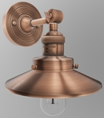](AnisotropyBarnLamp/README.md) [Show](https://github.khronos.org/glTF-Sample-Viewer-Release/?model=https://raw.GithubUserContent.com/KhronosGroup/glTF-Sample-Assets/main/./Models/AnisotropyBarnLamp/glTF-Binary/AnisotropyBarnLamp.glb) -- [Download GLB](https://raw.GithubUserContent.com/KhronosGroup/glTF-Sample-Assets/main/./Models/AnisotropyBarnLamp/glTF-Binary/AnisotropyBarnLamp.glb) | Wayfair AnisotropyBarnLamp model using anisotropy, clearcoat, emissive_strength, transmission, volume, and basisu extensions. Credit: &copy; 2023, Copyright 2023 Wayfair, LLC. [CC BY 4.0 International](https://creativecommons.org/licenses/by/4.0/legalcode)  - Eric Chadwick for Everything |
| [Anisotropy Disc Test](AnisotropyDiscTest/README.md) [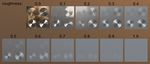](AnisotropyDiscTest/README.md) [Show](https://github.khronos.org/glTF-Sample-Viewer-Release/?model=https://raw.GithubUserContent.com/KhronosGroup/glTF-Sample-Assets/main/./Models/AnisotropyDiscTest/glTF-Binary/AnisotropyDiscTest.glb) -- [Download GLB](https://raw.GithubUserContent.com/KhronosGroup/glTF-Sample-Assets/main/./Models/AnisotropyDiscTest/glTF-Binary/AnisotropyDiscTest.glb) | This model tests the texturemap for KHR_materials_anisotropy. Credit: &copy; 2023, Public. [CC0 1.0 Universal](https://creativecommons.org/publicdomain/zero/1.0/legalcode)  - Eric Chadwick for Everything |
| [Anisotropy Rotation Test](AnisotropyRotationTest/README.md) [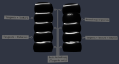](AnisotropyRotationTest/README.md) [Show](https://github.khronos.org/glTF-Sample-Viewer-Release/?model=https://raw.GithubUserContent.com/KhronosGroup/glTF-Sample-Assets/main/./Models/AnisotropyRotationTest/glTF-Binary/AnisotropyRotationTest.glb) -- [Download GLB](https://raw.GithubUserContent.com/KhronosGroup/glTF-Sample-Assets/main/./Models/AnisotropyRotationTest/glTF-Binary/AnisotropyRotationTest.glb) | This model tests rotational offsets for KHR_materials_anisotropy. Credit: &copy; 2023, Analytical Graphics, Inc.. [CC BY 4.0 International](https://creativecommons.org/licenses/by/4.0/legalcode)  - Ed Mackey for Everything |
| [Anisotropy Strength Test](AnisotropyStrengthTest/README.md) [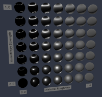](AnisotropyStrengthTest/README.md) [Show](https://github.khronos.org/glTF-Sample-Viewer-Release/?model=https://raw.GithubUserContent.com/KhronosGroup/glTF-Sample-Assets/main/./Models/AnisotropyStrengthTest/glTF-Binary/AnisotropyStrengthTest.glb) -- [Download GLB](https://raw.GithubUserContent.com/KhronosGroup/glTF-Sample-Assets/main/./Models/AnisotropyStrengthTest/glTF-Binary/AnisotropyStrengthTest.glb) | This model tests the strength parameter for KHR_materials_anisotropy. Credit: &copy; 2023, Public. [CC0 1.0 Universal](https://creativecommons.org/publicdomain/zero/1.0/legalcode)  - Ed Mackey for Everything |
| [Attenuation Test](AttenuationTest/README.md)  [Show](https://github.khronos.org/glTF-Sample-Viewer-Release/?model=https://raw.GithubUserContent.com/KhronosGroup/glTF-Sample-Assets/main/./Models/AttenuationTest/glTF-Binary/AttenuationTest.glb) -- [Download GLB](https://raw.GithubUserContent.com/KhronosGroup/glTF-Sample-Assets/main/./Models/AttenuationTest/glTF-Binary/AttenuationTest.glb) | Tests the interactions between attenuation, thickness, and scale. Credit: &copy; 2021, Analytical Graphics, Inc.. [CC BY 4.0 International](https://creativecommons.org/licenses/by/4.0/legalcode)  - Ed Mackey for Everything |
| [Carbon Fibre Ball](CarbonFibre/README.md) [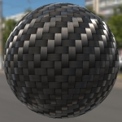](CarbonFibre/README.md) [Show](https://github.khronos.org/glTF-Sample-Viewer-Release/?model=https://raw.GithubUserContent.com/KhronosGroup/glTF-Sample-Assets/main/./Models/CarbonFibre/glTF-Binary/CarbonFibre.glb) -- [Download GLB](https://raw.GithubUserContent.com/KhronosGroup/glTF-Sample-Assets/main/./Models/CarbonFibre/glTF-Binary/CarbonFibre.glb) | Example of anisotropy applied to a ball with a simulated carbon fiber surface. Credit: &copy; 2023, Wayfair. [CC BY 4.0 International](https://creativecommons.org/licenses/by/4.0/legalcode)  - Eric Chadwick for Models and Textures |
| [Chair Damask Purplegold](ChairDamaskPurplegold/README.md)  [Show](https://github.khronos.org/glTF-Sample-Viewer-Release/?model=https://raw.GithubUserContent.com/KhronosGroup/glTF-Sample-Assets/main/./Models/ChairDamaskPurplegold/glTF-Binary/ChairDamaskPurplegold.glb) -- [Download GLB](https://raw.GithubUserContent.com/KhronosGroup/glTF-Sample-Assets/main/./Models/ChairDamaskPurplegold/glTF-Binary/ChairDamaskPurplegold.glb) | Use of sheen to create a high-end small seat (damask). Credit: &copy; 2021, Wayfair. [CC BY 4.0 International](https://creativecommons.org/licenses/by/4.0/legalcode)  - Eric Chadwick for Models and Textures |
| [Clear Coat Car Paint](ClearCoatCarPaint/README.md)  [Show](https://github.khronos.org/glTF-Sample-Viewer-Release/?model=https://raw.GithubUserContent.com/KhronosGroup/glTF-Sample-Assets/main/./Models/ClearCoatCarPaint/glTF-Binary/ClearCoatCarPaint.glb) -- [Download GLB](https://raw.GithubUserContent.com/KhronosGroup/glTF-Sample-Assets/main/./Models/ClearCoatCarPaint/glTF-Binary/ClearCoatCarPaint.glb) | This model is a sphere using the glTF ClearCoat extension overtop a car paint base material.  Credit: &copy; 2023, Public. [CC0 1.0 Universal](https://creativecommons.org/publicdomain/zero/1.0/legalcode)  - Eric Chadwick for Everything |
| [KHR_materials_clearcoat Test](ClearCoatTest/README.md)  [Show](https://github.khronos.org/glTF-Sample-Viewer-Release/?model=https://raw.GithubUserContent.com/KhronosGroup/glTF-Sample-Assets/main/./Models/ClearCoatTest/glTF-Binary/ClearCoatTest.glb) -- [Download GLB](https://raw.GithubUserContent.com/KhronosGroup/glTF-Sample-Assets/main/./Models/ClearCoatTest/glTF-Binary/ClearCoatTest.glb) | Tests if the KHR_materials_clearcoat extension is supported properly. Credit: &copy; 2020, Analytical Graphics, Inc.. [CC BY 4.0 International](https://creativecommons.org/licenses/by/4.0/legalcode)  - Ed Mackey for Everything |
| [Clearcoat Wicker](ClearcoatWicker/README.md)  [Show](https://github.khronos.org/glTF-Sample-Viewer-Release/?model=https://raw.GithubUserContent.com/KhronosGroup/glTF-Sample-Assets/main/./Models/ClearcoatWicker/glTF-Binary/ClearcoatWicker.glb) -- [Download GLB](https://raw.GithubUserContent.com/KhronosGroup/glTF-Sample-Assets/main/./Models/ClearcoatWicker/glTF-Binary/ClearcoatWicker.glb) | This model is a sphere using the glTF ClearCoat to create a wicker material covered with a wrinkled plastic clearcoat material. Credit: &copy; 2023, Public. [CC0 1.0 Universal](https://creativecommons.org/publicdomain/zero/1.0/legalcode)  - Eric Chadwick for Everything |
| [Compare Anisotropy](CompareAnisotropy/README.md) [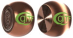](CompareAnisotropy/README.md) [Show](https://github.khronos.org/glTF-Sample-Viewer-Release/?model=https://raw.GithubUserContent.com/KhronosGroup/glTF-Sample-Assets/main/./Models/CompareAnisotropy/glTF-Binary/CompareAnisotropy.glb) -- [Download GLB](https://raw.GithubUserContent.com/KhronosGroup/glTF-Sample-Assets/main/./Models/CompareAnisotropy/glTF-Binary/CompareAnisotropy.glb) | This model compares without anisotropy vs. with anisotropy. Credit: &copy; 2017, Khronos Group. [Khronos Trademark or Logo]()  - Non-copyrightable logo for glTF logo &copy; 2024, Public. [CC0 1.0 Universal](https://creativecommons.org/publicdomain/zero/1.0/legalcode)  - Eric Chadwick and DGG for Everything |
| [Compare Clearcoat](CompareClearcoat/README.md)  [Show](https://github.khronos.org/glTF-Sample-Viewer-Release/?model=https://raw.GithubUserContent.com/KhronosGroup/glTF-Sample-Assets/main/./Models/CompareClearcoat/glTF-Binary/CompareClearcoat.glb) -- [Download GLB](https://raw.GithubUserContent.com/KhronosGroup/glTF-Sample-Assets/main/./Models/CompareClearcoat/glTF-Binary/CompareClearcoat.glb) | This model compares clearcoat methods. Credit: &copy; 2017, Khronos Group. [Khronos Trademark or Logo]()  - Non-copyrightable logo for glTF logo &copy; 2024, Public. [CC0 1.0 Universal](https://creativecommons.org/publicdomain/zero/1.0/legalcode)  - Eric Chadwick and DGG for Everything |
| [Compare Dispersion](CompareDispersion/README.md) [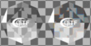](CompareDispersion/README.md) [Show](https://github.khronos.org/glTF-Sample-Viewer-Release/?model=https://raw.GithubUserContent.com/KhronosGroup/glTF-Sample-Assets/main/./Models/CompareDispersion/glTF-Binary/CompareDispersion.glb) -- [Download GLB](https://raw.GithubUserContent.com/KhronosGroup/glTF-Sample-Assets/main/./Models/CompareDispersion/glTF-Binary/CompareDispersion.glb) | This model compares dispersion methods. Credit: &copy; 2017, Khronos Group. [Khronos Trademark or Logo]()  - Non-copyrightable logo for glTF logo &copy; 2024, Public. [CC0 1.0 Universal](https://creativecommons.org/publicdomain/zero/1.0/legalcode)  - Eric Chadwick and DGG for Everything |
| [Compare Emissive Strength](CompareEmissiveStrength/README.md) [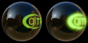](CompareEmissiveStrength/README.md) [Show](https://github.khronos.org/glTF-Sample-Viewer-Release/?model=https://raw.GithubUserContent.com/KhronosGroup/glTF-Sample-Assets/main/./Models/CompareEmissiveStrength/glTF-Binary/CompareEmissiveStrength.glb) -- [Download GLB](https://raw.GithubUserContent.com/KhronosGroup/glTF-Sample-Assets/main/./Models/CompareEmissiveStrength/glTF-Binary/CompareEmissiveStrength.glb) | This model compares emissive versus emissive plus emissive strength. Credit: &copy; 2017, Khronos Group. [Khronos Trademark or Logo]()  - Non-copyrightable logo for glTF logo &copy; 2024, Public. [CC0 1.0 Universal](https://creativecommons.org/publicdomain/zero/1.0/legalcode)  - Eric Chadwick and DGG for Everything |
| [Compare IOR](CompareIor/README.md) [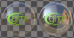](CompareIor/README.md) [Show](https://github.khronos.org/glTF-Sample-Viewer-Release/?model=https://raw.GithubUserContent.com/KhronosGroup/glTF-Sample-Assets/main/./Models/CompareIor/glTF-Binary/CompareIor.glb) -- [Download GLB](https://raw.GithubUserContent.com/KhronosGroup/glTF-Sample-Assets/main/./Models/CompareIor/glTF-Binary/CompareIor.glb) | This model compares IOR methods. Credit: &copy; 2017, Khronos Group. [Khronos Trademark or Logo]()  - Non-copyrightable logo for glTF logo &copy; 2024, Public. [CC0 1.0 Universal](https://creativecommons.org/publicdomain/zero/1.0/legalcode)  - Eric Chadwick and DGG for Everything |
| [Compare Iridescence](CompareIridescence/README.md) [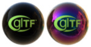](CompareIridescence/README.md) [Show](https://github.khronos.org/glTF-Sample-Viewer-Release/?model=https://raw.GithubUserContent.com/KhronosGroup/glTF-Sample-Assets/main/./Models/CompareIridescence/glTF-Binary/CompareIridescence.glb) -- [Download GLB](https://raw.GithubUserContent.com/KhronosGroup/glTF-Sample-Assets/main/./Models/CompareIridescence/glTF-Binary/CompareIridescence.glb) | This model compares iridescence methods. Credit: &copy; 2017, Khronos Group. [Khronos Trademark or Logo]()  - Non-copyrightable logo for glTF logo &copy; 2024, Public. [CC0 1.0 Universal](https://creativecommons.org/publicdomain/zero/1.0/legalcode)  - Eric Chadwick and DGG for Everything |
| [Compare Sheen](CompareSheen/README.md) [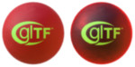](CompareSheen/README.md) [Show](https://github.khronos.org/glTF-Sample-Viewer-Release/?model=https://raw.GithubUserContent.com/KhronosGroup/glTF-Sample-Assets/main/./Models/CompareSheen/glTF-Binary/CompareSheen.glb) -- [Download GLB](https://raw.GithubUserContent.com/KhronosGroup/glTF-Sample-Assets/main/./Models/CompareSheen/glTF-Binary/CompareSheen.glb) | This model compares sheen methods. Credit: &copy; 2017, Khronos Group. [Khronos Trademark or Logo]()  - Non-copyrightable logo for glTF logo &copy; 2024, Public. [CC0 1.0 Universal](https://creativecommons.org/publicdomain/zero/1.0/legalcode)  - Eric Chadwick and DGG for Everything |
| [Compare Specular](CompareSpecular/README.md) [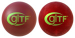](CompareSpecular/README.md) [Show](https://github.khronos.org/glTF-Sample-Viewer-Release/?model=https://raw.GithubUserContent.com/KhronosGroup/glTF-Sample-Assets/main/./Models/CompareSpecular/glTF-Binary/CompareSpecular.glb) -- [Download GLB](https://raw.GithubUserContent.com/KhronosGroup/glTF-Sample-Assets/main/./Models/CompareSpecular/glTF-Binary/CompareSpecular.glb) | This model compares specular methods. Credit: &copy; 2017, Khronos Group. [Khronos Trademark or Logo]()  - Non-copyrightable logo for glTF logo &copy; 2024, Public. [CC0 1.0 Universal](https://creativecommons.org/publicdomain/zero/1.0/legalcode)  - Eric Chadwick and DGG for Everything |
| [Compare Transmission](CompareTransmission/README.md) [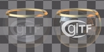](CompareTransmission/README.md) [Show](https://github.khronos.org/glTF-Sample-Viewer-Release/?model=https://raw.GithubUserContent.com/KhronosGroup/glTF-Sample-Assets/main/./Models/CompareTransmission/glTF-Binary/CompareTransmission.glb) -- [Download GLB](https://raw.GithubUserContent.com/KhronosGroup/glTF-Sample-Assets/main/./Models/CompareTransmission/glTF-Binary/CompareTransmission.glb) | This model compares transmission methods. Credit: &copy; 2017, Khronos Group. [Khronos Trademark or Logo]()  - Non-copyrightable logo for glTF logo &copy; 2024, Public. [CC0 1.0 Universal](https://creativecommons.org/publicdomain/zero/1.0/legalcode)  - Eric Chadwick and DGG for Everything |
| [Compare Volume](CompareVolume/README.md) [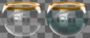](CompareVolume/README.md) [Show](https://github.khronos.org/glTF-Sample-Viewer-Release/?model=https://raw.GithubUserContent.com/KhronosGroup/glTF-Sample-Assets/main/./Models/CompareVolume/glTF-Binary/CompareVolume.glb) -- [Download GLB](https://raw.GithubUserContent.com/KhronosGroup/glTF-Sample-Assets/main/./Models/CompareVolume/glTF-Binary/CompareVolume.glb) | This model compares volume methods. Credit: &copy; 2017, Khronos Group. [Khronos Trademark or Logo]()  - Non-copyrightable logo for glTF logo &copy; 2024, Public. [CC0 1.0 Universal](https://creativecommons.org/publicdomain/zero/1.0/legalcode)  - Eric Chadwick and DGG for Everything |
| [DiffuseTransmissionPlant](DiffuseTransmissionPlant/README.md) [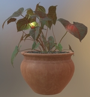](DiffuseTransmissionPlant/README.md) [Show](https://github.khronos.org/glTF-Sample-Viewer-Release/?model=https://raw.GithubUserContent.com/KhronosGroup/glTF-Sample-Assets/main/./Models/DiffuseTransmissionPlant/glTF-Binary/DiffuseTransmissionPlant.glb) -- [Download GLB](https://raw.GithubUserContent.com/KhronosGroup/glTF-Sample-Assets/main/./Models/DiffuseTransmissionPlant/glTF-Binary/DiffuseTransmissionPlant.glb) | Potted plant asset using Diffuse Transmission extension. Credit: &copy; 2024, Darmstadt Graphics Group GmbH. [CC BY 4.0 International](https://creativecommons.org/licenses/by/4.0/legalcode)  - Eric Chadwick for Materials and animation &copy; 2021, Public domain. [CC0 1.0 Universal](https://creativecommons.org/publicdomain/zero/1.0/legalcode)  - Rico Cilliers for Original asset |
| [DiffuseTransmissionTeacup](DiffuseTransmissionTeacup/README.md) [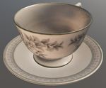](DiffuseTransmissionTeacup/README.md) [Show](https://github.khronos.org/glTF-Sample-Viewer-Release/?model=https://raw.GithubUserContent.com/KhronosGroup/glTF-Sample-Assets/main/./Models/DiffuseTransmissionTeacup/glTF-Binary/DiffuseTransmissionTeacup.glb) -- [Download GLB](https://raw.GithubUserContent.com/KhronosGroup/glTF-Sample-Assets/main/./Models/DiffuseTransmissionTeacup/glTF-Binary/DiffuseTransmissionTeacup.glb) | DiffuseTransmissionTeacup model using Diffuse Transmission extension. Credit: &copy; 2023, Public domain. [CC0 1.0 Universal](https://creativecommons.org/share-your-work/public-domain/cc0)  - Polyhaven.com, and Eric Chadwick for Models and Textures |
| [Dispersion Test](DispersionTest/README.md)  [Show](https://github.khronos.org/glTF-Sample-Viewer-Release/?model=https://raw.GithubUserContent.com/KhronosGroup/glTF-Sample-Assets/main/./Models/DispersionTest/glTF-Binary/DispersionTest.glb) -- [Download GLB](https://raw.GithubUserContent.com/KhronosGroup/glTF-Sample-Assets/main/./Models/DispersionTest/glTF-Binary/DispersionTest.glb) | This model tests the KHR_materials_dispersion extension. Credit: &copy; 2023, AGI. [CC BY 4.0 International](https://creativecommons.org/licenses/by/4.0/legalcode)  - Ed Mackey for Everything |
| [Dragon Attenuation](DragonAttenuation/README.md)  [Show](https://github.khronos.org/glTF-Sample-Viewer-Release/?model=https://raw.GithubUserContent.com/KhronosGroup/glTF-Sample-Assets/main/./Models/DragonAttenuation/glTF-Binary/DragonAttenuation.glb) -- [Download GLB](https://raw.GithubUserContent.com/KhronosGroup/glTF-Sample-Assets/main/./Models/DragonAttenuation/glTF-Binary/DragonAttenuation.glb) | Dragon with background, using material variants, transmission, and volume. Credit: &copy; 1996, Stanford University Computer Graphics Laboratory. [Stanford Graphics Library](https://graphics.stanford.edu/data/3Dscanrep/)  - Stanford University Computer Graphics Laboratory for Original dragon model &copy; 2017, Morgan McGuire. [Stanford Graphics Library](https://graphics.stanford.edu/data/3Dscanrep/)  - Morgan McGuire's Computer Graphics Archive for Conversion and clean up &copy; 2021, Public. [CC0 1.0 Universal](https://creativecommons.org/publicdomain/zero/1.0/legalcode)  - Adobe for Cloth backdrop |
| [Dragon Dispersion](DragonDispersion/README.md) [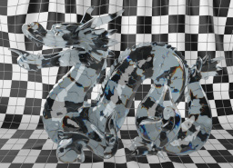](DragonDispersion/README.md) [Show](https://github.khronos.org/glTF-Sample-Viewer-Release/?model=https://raw.GithubUserContent.com/KhronosGroup/glTF-Sample-Assets/main/./Models/DragonDispersion/glTF-Binary/DragonDispersion.glb) -- [Download GLB](https://raw.GithubUserContent.com/KhronosGroup/glTF-Sample-Assets/main/./Models/DragonDispersion/glTF-Binary/DragonDispersion.glb) | Dragon with background, using dispersion, transmission, and volume. Credit: &copy; 1996, Stanford University Computer Graphics Laboratory. [Stanford Graphics Library](https://graphics.stanford.edu/data/3Dscanrep/)  - Stanford University Computer Graphics Laboratory for Original dragon model &copy; 2017, Morgan McGuire. [Stanford Graphics Library](https://graphics.stanford.edu/data/3Dscanrep/)  - Morgan McGuire's Computer Graphics Archive for Conversion and clean up &copy; 2021, Public. [CC0 1.0 Universal](https://creativecommons.org/publicdomain/zero/1.0/legalcode)  - Adobe for Cloth backdrop |
| [Emissive Strength Test](EmissiveStrengthTest/README.md)  [Show](https://github.khronos.org/glTF-Sample-Viewer-Release/?model=https://raw.GithubUserContent.com/KhronosGroup/glTF-Sample-Assets/main/./Models/EmissiveStrengthTest/glTF-Binary/EmissiveStrengthTest.glb) -- [Download GLB](https://raw.GithubUserContent.com/KhronosGroup/glTF-Sample-Assets/main/./Models/EmissiveStrengthTest/glTF-Binary/EmissiveStrengthTest.glb) | Tests if the KHR_materials_emissive_strength extension is supported properly. Credit: &copy; 2022, AGI. [CC BY 4.0 International](https://creativecommons.org/licenses/by/4.0/legalcode)  - Ed Mackey for Everything |
| [Environment Test](EnvironmentTest/README.md)  [Show](https://github.khronos.org/glTF-Sample-Viewer-Release/?model=https://raw.GithubUserContent.com/KhronosGroup/glTF-Sample-Assets/main/./Models/EnvironmentTest/glTF/EnvironmentTest.gltf) | A simple scene with metal and dielectric spheres that range between 0 and 1 roughness. Useful for testing environment lighting. Credit: &copy; 2017, Adobe. [Adobe Stock License](https://stock.adobe.com/license-terms?prev_url=detail&comparison-full#enhanced-license-terms)  - Adobe for Everything |
| [GlamVelvetSofa](GlamVelvetSofa/README.md)  [Show](https://github.khronos.org/glTF-Sample-Viewer-Release/?model=https://raw.GithubUserContent.com/KhronosGroup/glTF-Sample-Assets/main/./Models/GlamVelvetSofa/glTF-Binary/GlamVelvetSofa.glb) -- [Download GLB](https://raw.GithubUserContent.com/KhronosGroup/glTF-Sample-Assets/main/./Models/GlamVelvetSofa/glTF-Binary/GlamVelvetSofa.glb) | Sofa using material variants, sheen, and specular. Credit: &copy; 2021, Wayfair, LLC. [CC BY 4.0 International](https://creativecommons.org/licenses/by/4.0/legalcode)  - Eric Chadwick for Everything |
| [Glass Broken Window](GlassBrokenWindow/README.md) [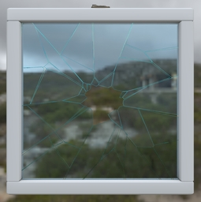](GlassBrokenWindow/README.md) [Show](https://github.khronos.org/glTF-Sample-Viewer-Release/?model=https://raw.GithubUserContent.com/KhronosGroup/glTF-Sample-Assets/main/./Models/GlassBrokenWindow/glTF-Binary/GlassBrokenWindow.glb) -- [Download GLB](https://raw.GithubUserContent.com/KhronosGroup/glTF-Sample-Assets/main/./Models/GlassBrokenWindow/glTF-Binary/GlassBrokenWindow.glb) | This asset demonstrates the combination of two transparency methods in glTF: KHR_materials_transmission for glass and alphaMode:'MASK' for holes in the broken glass. Credit: &copy; 2023, Wayfair. [CC BY 4.0 International](https://creativecommons.org/licenses/by/4.0/legalcode)  - Eric Chadwick for Entire asset |
| [Glass Hurricane Candle Holder](GlassHurricaneCandleHolder/README.md) [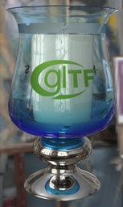](GlassHurricaneCandleHolder/README.md) [Show](https://github.khronos.org/glTF-Sample-Viewer-Release/?model=https://raw.GithubUserContent.com/KhronosGroup/glTF-Sample-Assets/main/./Models/GlassHurricaneCandleHolder/glTF-Binary/GlassHurricaneCandleHolder.glb) -- [Download GLB](https://raw.GithubUserContent.com/KhronosGroup/glTF-Sample-Assets/main/./Models/GlassHurricaneCandleHolder/glTF-Binary/GlassHurricaneCandleHolder.glb) | Glass holder using Materials Tranmission and Materials Volume extensions. Credit: &copy; 2021, Wayfair, LLC. [CC BY 4.0 International](https://creativecommons.org/licenses/by/4.0/legalcode)  - Eric Chadwick for Model and textures &copy; 2015, Khronos Group. [Khronos Trademark or Logo]()  - Non-copyrightable logo for Khronos logo &copy; 2017, Khronos Group. [Khronos Trademark or Logo]()  - Non-copyrightable logo for glTF logo |
| [Glass Vase with Flowers](GlassVaseFlowers/README.md) [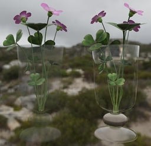](GlassVaseFlowers/README.md) [Show](https://github.khronos.org/glTF-Sample-Viewer-Release/?model=https://raw.GithubUserContent.com/KhronosGroup/glTF-Sample-Assets/main/./Models/GlassVaseFlowers/glTF-Binary/GlassVaseFlowers.glb) -- [Download GLB](https://raw.GithubUserContent.com/KhronosGroup/glTF-Sample-Assets/main/./Models/GlassVaseFlowers/glTF-Binary/GlassVaseFlowers.glb) | This model compares transparency methods for representing glass in glTF: alphaMode:'BLEND' (left) versus the extensions KHR_materials_transmission and KHR_materials_volume (right). Credit: &copy; 2023, Public. [CC0 1.0 Universal](https://creativecommons.org/publicdomain/zero/1.0/legalcode)  - Eric Chadwick for Glass vase &copy; 2023, Public. [CC0 1.0 Universal](https://creativecommons.org/publicdomain/zero/1.0/legalcode)  - Rico Cilliers for Flowers |
| [IORTestGrid](IORTestGrid/README.md) [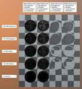](IORTestGrid/README.md) [Show](https://github.khronos.org/glTF-Sample-Viewer-Release/?model=https://raw.GithubUserContent.com/KhronosGroup/glTF-Sample-Assets/main/./Models/IORTestGrid/glTF-Binary/IORTestGrid.glb) -- [Download GLB](https://raw.GithubUserContent.com/KhronosGroup/glTF-Sample-Assets/main/./Models/IORTestGrid/glTF-Binary/IORTestGrid.glb) | Grid of spheres over a checkered backdrop to test IOR rendering. Credit: &copy; 2023, Public. [CC0 1.0 Universal](https://creativecommons.org/publicdomain/zero/1.0/legalcode)  - Eric Chadwick for Everything |
| [IridescenceAbalone](IridescenceAbalone/README.md) [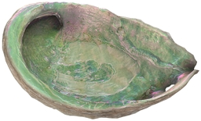](IridescenceAbalone/README.md) [Show](https://github.khronos.org/glTF-Sample-Viewer-Release/?model=https://raw.GithubUserContent.com/KhronosGroup/glTF-Sample-Assets/main/./Models/IridescenceAbalone/glTF-Binary/IridescenceAbalone.glb) -- [Download GLB](https://raw.GithubUserContent.com/KhronosGroup/glTF-Sample-Assets/main/./Models/IridescenceAbalone/glTF-Binary/IridescenceAbalone.glb) | A model of an abalone shell with highly iridescent interior. Credit: &copy; 2015, Abby Crawford. [CC BY 4.0 International](https://creativecommons.org/licenses/by/4.0/legalcode)  - Abby Crawford for Everything &copy; 2023, Eric Chadwick. [CC BY 4.0 International](https://creativecommons.org/licenses/by/4.0/legalcode)  - Eric Chadwick for Materials |
| [Iridescence Dielectric Spheres](IridescenceDielectricSpheres/README.md)  [Show](https://github.khronos.org/glTF-Sample-Viewer-Release/?model=https://raw.GithubUserContent.com/KhronosGroup/glTF-Sample-Assets/main/./Models/IridescenceDielectricSpheres/glTF/IridescenceDielectricSpheres.gltf) | Tests KHR_materials_iridescence on a non-metallic material. Credit: &copy; 2019, Public. [CC0 1.0 Universal](https://creativecommons.org/publicdomain/zero/1.0/legalcode)  - Khronos for Everything |
| [Iridescence Lamp](IridescenceLamp/README.md)  [Show](https://github.khronos.org/glTF-Sample-Viewer-Release/?model=https://raw.GithubUserContent.com/KhronosGroup/glTF-Sample-Assets/main/./Models/IridescenceLamp/glTF-Binary/IridescenceLamp.glb) -- [Download GLB](https://raw.GithubUserContent.com/KhronosGroup/glTF-Sample-Assets/main/./Models/IridescenceLamp/glTF-Binary/IridescenceLamp.glb) | Wayfair Lamp model using transmission, volume, and KHR_materials_iridescence. Credit: &copy; 2022, Wayfair, LLC. [CC BY 4.0 International](https://creativecommons.org/licenses/by/4.0/legalcode)  - Eric Chadwick for Everything |
| [Iridescence Metallic Spheres](IridescenceMetallicSpheres/README.md)  [Show](https://github.khronos.org/glTF-Sample-Viewer-Release/?model=https://raw.GithubUserContent.com/KhronosGroup/glTF-Sample-Assets/main/./Models/IridescenceMetallicSpheres/glTF/IridescenceMetallicSpheres.gltf) | Tests KHR_materials_iridescence on a metallic material. Credit: &copy; 2022, UX3D. [CC0 1.0 Universal](https://creativecommons.org/publicdomain/zero/1.0/legalcode)  - UX3D for Everything |
| [Iridescence Suzanne](IridescenceSuzanne/README.md)  [Show](https://github.khronos.org/glTF-Sample-Viewer-Release/?model=https://raw.GithubUserContent.com/KhronosGroup/glTF-Sample-Assets/main/./Models/IridescenceSuzanne/glTF-Binary/IridescenceSuzanne.glb) -- [Download GLB](https://raw.GithubUserContent.com/KhronosGroup/glTF-Sample-Assets/main/./Models/IridescenceSuzanne/glTF-Binary/IridescenceSuzanne.glb) | Further tests KHR_materials_iridescence. Credit: &copy; 2022, UX3D. [CC0 1.0 Universal](https://creativecommons.org/publicdomain/zero/1.0/legalcode)  - Mathias Kanzler for Initial version &copy; 2021, Pascal Schoen. [CC0 1.0 Universal](https://creativecommons.org/publicdomain/zero/1.0/legalcode)  - Pascal Schoen for Internal clean-up |
| [Iridescent Dish with Olives](IridescentDishWithOlives/README.md)  [Show](https://github.khronos.org/glTF-Sample-Viewer-Release/?model=https://raw.GithubUserContent.com/KhronosGroup/glTF-Sample-Assets/main/./Models/IridescentDishWithOlives/glTF-Binary/IridescentDishWithOlives.glb) -- [Download GLB](https://raw.GithubUserContent.com/KhronosGroup/glTF-Sample-Assets/main/./Models/IridescentDishWithOlives/glTF-Binary/IridescentDishWithOlives.glb) | Dish using transmission, volume, IOR, and specular. [Issues: non-Khronos mark] Credit: &copy; 2020, Wayfair, LLC. [CC BY 4.0 International](https://creativecommons.org/licenses/by/4.0/legalcode)  - Eric Chadwick for Everything |
| [Lamp with Punctual Lights](LightsPunctualLamp/README.md) [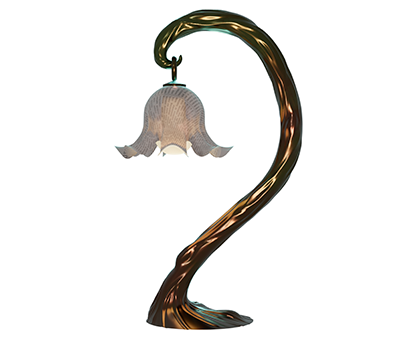](LightsPunctualLamp/README.md) [Show](https://github.khronos.org/glTF-Sample-Viewer-Release/?model=https://raw.GithubUserContent.com/KhronosGroup/glTF-Sample-Assets/main/./Models/LightsPunctualLamp/glTF-Binary/LightsPunctualLamp.glb) -- [Download GLB](https://raw.GithubUserContent.com/KhronosGroup/glTF-Sample-Assets/main/./Models/LightsPunctualLamp/glTF-Binary/LightsPunctualLamp.glb) | Lamp using punctual lights. Credit: &copy; 2021, DGG. [CC BY 4.0 International](https://creativecommons.org/licenses/by/4.0/legalcode)  - DGG for Everything |
| [MandarinOrange](MandarinOrange/README.md) [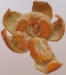](MandarinOrange/README.md) [Show](https://github.khronos.org/glTF-Sample-Viewer-Release/?model=https://raw.GithubUserContent.com/KhronosGroup/glTF-Sample-Assets/main/./Models/MandarinOrange/glTF/MandarinOrange.gltf) | Scattering of light through the tangerine using the glTF diffuse transmission extension is shown in this test. Credit: &copy; 2015, zamdreamer. [CC BY 4.0 International](https://creativecommons.org/licenses/by/4.0/legalcode)  - zamdreamer for Initial creation &copy; 2023, Wayfair. [CC BY 4.0 International](https://creativecommons.org/licenses/by/4.0/legalcode)  - Eric Chadwick for glTF PBR material |
| [Materials Variants Shoe](MaterialsVariantsShoe/README.md)  [Show](https://github.khronos.org/glTF-Sample-Viewer-Release/?model=https://raw.GithubUserContent.com/KhronosGroup/glTF-Sample-Assets/main/./Models/MaterialsVariantsShoe/glTF-Binary/MaterialsVariantsShoe.glb) -- [Download GLB](https://raw.GithubUserContent.com/KhronosGroup/glTF-Sample-Assets/main/./Models/MaterialsVariantsShoe/glTF-Binary/MaterialsVariantsShoe.glb) | A model of a shoe that illustrates use of the KHR_materials_variants extension with three materials included in the asset. Credit: &copy; 2021, Shopify. [CC BY 4.0 International](https://creativecommons.org/licenses/by/4.0/legalcode)  - Shopify for Everthing |
| [Mosquito In Amber](MosquitoInAmber/README.md) [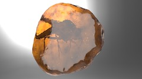](MosquitoInAmber/README.md) [Show](https://github.khronos.org/glTF-Sample-Viewer-Release/?model=https://raw.GithubUserContent.com/KhronosGroup/glTF-Sample-Assets/main/./Models/MosquitoInAmber/glTF-Binary/MosquitoInAmber.glb) -- [Download GLB](https://raw.GithubUserContent.com/KhronosGroup/glTF-Sample-Assets/main/./Models/MosquitoInAmber/glTF-Binary/MosquitoInAmber.glb) | Mosquito in amber by Sketchfab, using transmission, IOR, and volume. Credit: &copy; 2018, Sketchfab. [CC BY 4.0 International](https://creativecommons.org/licenses/by/4.0/legalcode)  - Loic Norgeot for Model &copy; 2019, Sketchfab. [CC BY 4.0 International](https://creativecommons.org/licenses/by/4.0/legalcode)  - Sketchfab for Real-time refraction |
| [PotOfCoals](PotOfCoals/README.md) [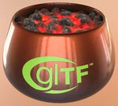](PotOfCoals/README.md) [Show](https://github.khronos.org/glTF-Sample-Viewer-Release/?model=https://raw.GithubUserContent.com/KhronosGroup/glTF-Sample-Assets/main/./Models/PotOfCoals/glTF-Binary/PotOfCoals.glb) -- [Download GLB](https://raw.GithubUserContent.com/KhronosGroup/glTF-Sample-Assets/main/./Models/PotOfCoals/glTF-Binary/PotOfCoals.glb) | Burnt copper pot with a clearcoat, containing emissive hot coals. Credit: &copy; 2023, Darmstadt Graphics Group GmbH. [CC BY 4.0 International](https://creativecommons.org/licenses/by/4.0/legalcode)  - Eric Chadwick for Model and textures &copy; 2015, Khronos Group. [Khronos Trademark or Logo]()  - Non-copyrightable logo for Khronos logo &copy; 2017, Khronos Group. [Khronos Trademark or Logo]()  - Non-copyrightable logo for glTF logo |
| [SheenChair](SheenChair/README.md)  [Show](https://github.khronos.org/glTF-Sample-Viewer-Release/?model=https://raw.GithubUserContent.com/KhronosGroup/glTF-Sample-Assets/main/./Models/SheenChair/glTF-Binary/SheenChair.glb) -- [Download GLB](https://raw.GithubUserContent.com/KhronosGroup/glTF-Sample-Assets/main/./Models/SheenChair/glTF-Binary/SheenChair.glb) | Chair using material variants and sheen. Credit: &copy; 2020, Wayfair, LLC. [CC0 1.0 Universal](https://creativecommons.org/publicdomain/zero/1.0/legalcode)  - Eric Chadwick for Everything |
| [Sheen Cloth](SheenCloth/README.md) [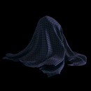](SheenCloth/README.md) [Show](https://github.khronos.org/glTF-Sample-Viewer-Release/?model=https://raw.GithubUserContent.com/KhronosGroup/glTF-Sample-Assets/main/./Models/SheenCloth/glTF/SheenCloth.gltf) | Fabric example using sheen. Credit: &copy; 2020, Microsoft. [CC0 1.0 Universal](https://creativecommons.org/publicdomain/zero/1.0/legalcode)  - Microsoft for Everything |
| [SheenTestGrid](SheenTestGrid/README.md) [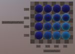](SheenTestGrid/README.md) [Show](https://github.khronos.org/glTF-Sample-Viewer-Release/?model=https://raw.GithubUserContent.com/KhronosGroup/glTF-Sample-Assets/main/./Models/SheenTestGrid/glTF-Binary/SheenTestGrid.glb) -- [Download GLB](https://raw.GithubUserContent.com/KhronosGroup/glTF-Sample-Assets/main/./Models/SheenTestGrid/glTF-Binary/SheenTestGrid.glb) | Grid of spheres over a checkered backdrop to test Sheen rendering. Credit: &copy; 2023, Public. [CC0 1.0 Universal](https://creativecommons.org/publicdomain/zero/1.0/legalcode)  - Eric Chadwick for Everything |
| [SheenWoodLeatherSofa](SheenWoodLeatherSofa/README.md)  [Show](https://github.khronos.org/glTF-Sample-Viewer-Release/?model=https://raw.GithubUserContent.com/KhronosGroup/glTF-Sample-Assets/main/./Models/SheenWoodLeatherSofa/glTF-Binary/SheenWoodLeatherSofa.glb) -- [Download GLB](https://raw.GithubUserContent.com/KhronosGroup/glTF-Sample-Assets/main/./Models/SheenWoodLeatherSofa/glTF-Binary/SheenWoodLeatherSofa.glb) | Sofa asset using sheen, specular, and high-quality tiling textures. Credit: &copy; 2024, Darmstadt Graphics Group GmbH. [CC BY 4.0 International](https://creativecommons.org/licenses/by/4.0/legalcode)  - Eric Chadwick for Improvements &copy; 2021, Public domain. [CC0 1.0 Universal](https://creativecommons.org/publicdomain/zero/1.0/legalcode)  - Fran Calvente for Original asset |
| [Simple Instancing](SimpleInstancing/README.md) [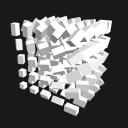](SimpleInstancing/README.md) [Show](https://github.khronos.org/glTF-Sample-Viewer-Release/?model=https://raw.GithubUserContent.com/KhronosGroup/glTF-Sample-Assets/main/./Models/SimpleInstancing/glTF-Binary/SimpleInstancing.glb) -- [Download GLB](https://raw.GithubUserContent.com/KhronosGroup/glTF-Sample-Assets/main/./Models/SimpleInstancing/glTF-Binary/SimpleInstancing.glb) | A simple example for the EXT_mesh_gpu_instancing extension. Credit: &copy; 2023, Public. [CC0 1.0 Universal](https://creativecommons.org/publicdomain/zero/1.0/legalcode)  - Marco Hutter for Everything |
| [SpecGlossVsMetalRough](SpecGlossVsMetalRough/README.md)  [Show](https://github.khronos.org/glTF-Sample-Viewer-Release/?model=https://raw.GithubUserContent.com/KhronosGroup/glTF-Sample-Assets/main/./Models/SpecGlossVsMetalRough/glTF-Binary/SpecGlossVsMetalRough.glb) -- [Download GLB](https://raw.GithubUserContent.com/KhronosGroup/glTF-Sample-Assets/main/./Models/SpecGlossVsMetalRough/glTF-Binary/SpecGlossVsMetalRough.glb) | Tests if the KHR_materials_pbrSpecularGlossiness extension is supported properly. Credit: &copy; 2017, Microsoft. [CC BY 4.0 International](https://creativecommons.org/licenses/by/4.0/legalcode)  - Microsoft for Everything |
| [SpecularSilkPouf](SpecularSilkPouf/README.md) [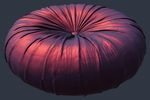](SpecularSilkPouf/README.md) [Show](https://github.khronos.org/glTF-Sample-Viewer-Release/?model=https://raw.GithubUserContent.com/KhronosGroup/glTF-Sample-Assets/main/./Models/SpecularSilkPouf/glTF-Binary/SpecularSilkPouf.glb) -- [Download GLB](https://raw.GithubUserContent.com/KhronosGroup/glTF-Sample-Assets/main/./Models/SpecularSilkPouf/glTF-Binary/SpecularSilkPouf.glb) | Wayfair SpecularSilkPouf model using sheen and specular extensions. Credit: &copy; 2023, Copyright 2023 Wayfair, LLC. [CC BY 4.0 International](https://creativecommons.org/licenses/by/4.0/legalcode)  - Eric Chadwick for Everything |
| [Specular Test](SpecularTest/README.md)  [Show](https://github.khronos.org/glTF-Sample-Viewer-Release/?model=https://raw.GithubUserContent.com/KhronosGroup/glTF-Sample-Assets/main/./Models/SpecularTest/glTF-Binary/SpecularTest.glb) -- [Download GLB](https://raw.GithubUserContent.com/KhronosGroup/glTF-Sample-Assets/main/./Models/SpecularTest/glTF-Binary/SpecularTest.glb) | Tests if the KHR_materials_specular extension is supported correctly. Credit: &copy; 2021, Analytical Graphics, Inc.. [CC BY 4.0 International](https://creativecommons.org/licenses/by/4.0/legalcode)  - Ed Mackey for Everything |
| [StainedGlassLamp](StainedGlassLamp/README.md)  [Show](https://github.khronos.org/glTF-Sample-Viewer-Release/?model=https://raw.GithubUserContent.com/KhronosGroup/glTF-Sample-Assets/main/./Models/StainedGlassLamp/glTF/StainedGlassLamp.gltf) |   Credit: &copy; 2021, Wayfair. [CC BY 4.0 International](https://creativecommons.org/licenses/by/4.0/legalcode)  - Eric Chadwick for Everything |
| [Texture Transform Multi Test](TextureTransformMultiTest/README.md)  [Show](https://github.khronos.org/glTF-Sample-Viewer-Release/?model=https://raw.GithubUserContent.com/KhronosGroup/glTF-Sample-Assets/main/./Models/TextureTransformMultiTest/glTF-Binary/TextureTransformMultiTest.glb) -- [Download GLB](https://raw.GithubUserContent.com/KhronosGroup/glTF-Sample-Assets/main/./Models/TextureTransformMultiTest/glTF-Binary/TextureTransformMultiTest.glb) | Tests if the KHR_texture_transform extension is supported for several inputs. Credit: &copy; 2020, Analytical Graphics, Inc.. [CC BY 4.0 International](https://creativecommons.org/licenses/by/4.0/legalcode)  - Ed Mackey for Everything |
| [Texture Transform Test](TextureTransformTest/README.md)  [Show](https://github.khronos.org/glTF-Sample-Viewer-Release/?model=https://raw.GithubUserContent.com/KhronosGroup/glTF-Sample-Assets/main/./Models/TextureTransformTest/glTF/TextureTransformTest.gltf) | Tests if the KHR_texture_transform extension is supported for BaseColor. Credit: &copy; 2018, Microsoft. [CC0 1.0 Universal](https://creativecommons.org/publicdomain/zero/1.0/legalcode)  - Microsoft for Everything |
| [Toy Car](ToyCar/README.md)  [Show](https://github.khronos.org/glTF-Sample-Viewer-Release/?model=https://raw.GithubUserContent.com/KhronosGroup/glTF-Sample-Assets/main/./Models/ToyCar/glTF-Binary/ToyCar.glb) -- [Download GLB](https://raw.GithubUserContent.com/KhronosGroup/glTF-Sample-Assets/main/./Models/ToyCar/glTF-Binary/ToyCar.glb) | Toy car example using transmission, clearcoat, and sheen. Credit: &copy; 2020, Public. [CC0 1.0 Universal](https://creativecommons.org/publicdomain/zero/1.0/legalcode)  - Guido Odendahl for Initial car model &copy; 2020, Public. [CC0 1.0 Universal](https://creativecommons.org/publicdomain/zero/1.0/legalcode)  - Eric Chadwick for Extensions and scene composition |
| [Transmission Roughness Test](TransmissionRoughnessTest/README.md)  [Show](https://github.khronos.org/glTF-Sample-Viewer-Release/?model=https://raw.GithubUserContent.com/KhronosGroup/glTF-Sample-Assets/main/./Models/TransmissionRoughnessTest/glTF-Binary/TransmissionRoughnessTest.glb) -- [Download GLB](https://raw.GithubUserContent.com/KhronosGroup/glTF-Sample-Assets/main/./Models/TransmissionRoughnessTest/glTF-Binary/TransmissionRoughnessTest.glb) | Tests the interaction between roughness and IOR. Credit: &copy; 2021, Analytical Graphics, Inc.. [CC BY 4.0 International](https://creativecommons.org/licenses/by/4.0/legalcode)  - Ed Mackey for Everything |
| [Transmission Test](TransmissionTest/README.md) [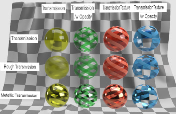](TransmissionTest/README.md) [Show](https://github.khronos.org/glTF-Sample-Viewer-Release/?model=https://raw.GithubUserContent.com/KhronosGroup/glTF-Sample-Assets/main/./Models/TransmissionTest/glTF-Binary/TransmissionTest.glb) -- [Download GLB](https://raw.GithubUserContent.com/KhronosGroup/glTF-Sample-Assets/main/./Models/TransmissionTest/glTF-Binary/TransmissionTest.glb) | Tests if the KHR_materials_transmission extension is supported properly. Credit: &copy; 2020, Public. [CC0 1.0 Universal](https://creativecommons.org/publicdomain/zero/1.0/legalcode)  - Adobe for Everything |
| [TransmissionThinwallTestGrid](TransmissionThinwallTestGrid/README.md) [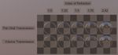](TransmissionThinwallTestGrid/README.md) [Show](https://github.khronos.org/glTF-Sample-Viewer-Release/?model=https://raw.GithubUserContent.com/KhronosGroup/glTF-Sample-Assets/main/./Models/TransmissionThinwallTestGrid/glTF-Binary/TransmissionThinwallTestGrid.glb) -- [Download GLB](https://raw.GithubUserContent.com/KhronosGroup/glTF-Sample-Assets/main/./Models/TransmissionThinwallTestGrid/glTF-Binary/TransmissionThinwallTestGrid.glb) | Grid of spheres over a checkered backdrop to test Thinfilm and IOR rendering. Credit: &copy; 2023, Public. [CC0 1.0 Universal](https://creativecommons.org/publicdomain/zero/1.0/legalcode)  - Eric Chadwick for Everything |
| [Unlit Test](UnlitTest/README.md) [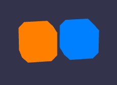](UnlitTest/README.md) [Show](https://github.khronos.org/glTF-Sample-Viewer-Release/?model=https://raw.GithubUserContent.com/KhronosGroup/glTF-Sample-Assets/main/./Models/UnlitTest/glTF-Binary/UnlitTest.glb) -- [Download GLB](https://raw.GithubUserContent.com/KhronosGroup/glTF-Sample-Assets/main/./Models/UnlitTest/glTF-Binary/UnlitTest.glb) | Tests if the KHR_materials_unlit extension is supported properly. Credit: &copy; 2019, Analytical Graphics, Inc.. [CC BY 4.0 International](https://creativecommons.org/licenses/by/4.0/legalcode)  - Ed Mackey for Everything |
| [Xmp Metadata Rounded Cube](XmpMetadataRoundedCube/README.md) [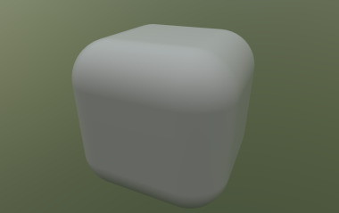](XmpMetadataRoundedCube/README.md) [Show](https://github.khronos.org/glTF-Sample-Viewer-Release/?model=https://raw.GithubUserContent.com/KhronosGroup/glTF-Sample-Assets/main/./Models/XmpMetadataRoundedCube/glTF-Binary/XmpMetadataRoundedCube.glb) -- [Download GLB](https://raw.GithubUserContent.com/KhronosGroup/glTF-Sample-Assets/main/./Models/XmpMetadataRoundedCube/glTF-Binary/XmpMetadataRoundedCube.glb) | Test of the XMP metadata extension - KHR_xmp_json_ld. Credit: &copy; 2021, Adam Morris. [CC BY 4.0 International](https://creativecommons.org/licenses/by/4.0/legalcode)  - Adam Morris for Everything |
---

### Copyright

&copy; 2023, The Khronos Group.

**License:** [Creative Commons Attribtution 4.0 International](https://creativecommons.org/licenses/by/4.0/legalcode)

#### Generated by modelmetadata
