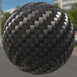
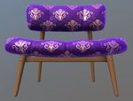
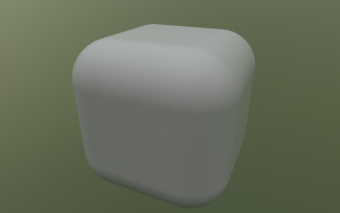

# glTF 2.0 Sample Assets

## Models tagged with **issues**

Models with one or more issues with respect to ownership, license, or markings.

## Other Tagged Listings

* [#all](Models.md) - All models listed alphabetically.
* [#core](Models-core.md) - Models that only use the core glTF V2.0 features and capabilities.
* [#extension](Models-extension.md) - Models that use one or more extensions.
* [#issues](Models-issues.md) - Models with one or more issues with respect to ownership, license, or markings.
* [#showcase](Models-showcase.md) - Models that are featured in some glTF/Khronos publicity.
* [#testing](Models-testing.md) - Models that are used for testing various features or capabilities of importers, viewers, or converters.
* [#video](Models-video.md) - Models used in any glTF video tutorial.
* [#written](Models-written.md) - Models used in any written glTF tutorial or guide.

| Model   | Description |
|---------|-------------|
| [Antique Camera](AntiqueCamera/README.md)  [Show](https://github.khronos.org/glTF-Sample-Viewer-Release/?model=https://raw.GithubUserContent.com/KhronosGroup/glTF-Sample-Assets/main/./Models/AntiqueCamera/glTF-Binary/AntiqueCamera.glb) -- [Download GLB](https://raw.GithubUserContent.com/KhronosGroup/glTF-Sample-Assets/main/./Models/AntiqueCamera/glTF-Binary/AntiqueCamera.glb) | Static model of old camera on a tripod. [Issues: non-Khronos mark] Credit: &copy; 2018, UX3D. [CC0 1.0 Universal](https://creativecommons.org/publicdomain/zero/1.0/legalcode)  - Maximillan Kamps for Everything &copy; 2017, UX3D. [UX3D Trademark or Logo]()  - Non-copyrightable logo for UX3D logo |
| [Box Textured](BoxTextured/README.md)  [Show](https://github.khronos.org/glTF-Sample-Viewer-Release/?model=https://raw.GithubUserContent.com/KhronosGroup/glTF-Sample-Assets/main/./Models/BoxTextured/glTF-Binary/BoxTextured.glb) -- [Download GLB](https://raw.GithubUserContent.com/KhronosGroup/glTF-Sample-Assets/main/./Models/BoxTextured/glTF-Binary/BoxTextured.glb) | Box with a power-of-2 texture. [Issues: non-Khronos mark] Credit: &copy; 2017, Cesium. [CC-BY 4.0 International with Trademark Limitations]()  - Cesium for Everything &copy; 2015, Cesium. [Cesium Trademark or Logo]()  - Non-copyrightable logo for Cesium logo |
| [Box Textured not 2^N](BoxTexturedNonPowerOfTwo/README.md)  [Show](https://github.khronos.org/glTF-Sample-Viewer-Release/?model=https://raw.GithubUserContent.com/KhronosGroup/glTF-Sample-Assets/main/./Models/BoxTexturedNonPowerOfTwo/glTF-Binary/BoxTexturedNonPowerOfTwo.glb) -- [Download GLB](https://raw.GithubUserContent.com/KhronosGroup/glTF-Sample-Assets/main/./Models/BoxTexturedNonPowerOfTwo/glTF-Binary/BoxTexturedNonPowerOfTwo.glb) | Box with a non-power-of-2 (NPOT) texture. Not all implementations support NPOT textures. [Issues: non-Khronos mark] Credit: &copy; 2017, Cesium. [CC-BY 4.0 International with Trademark Limitations]()  - Cesium for Everything &copy; 2015, Cesium. [Cesium Trademark or Logo]()  - Non-copyrightable logo for Cesium logo |
| [Carbon Fibre Ball](CarbonFibre/README.md)  [Show](https://github.khronos.org/glTF-Sample-Viewer-Release/?model=https://raw.GithubUserContent.com/KhronosGroup/glTF-Sample-Assets/main/./Models/CarbonFibre/glTF-Binary/CarbonFibre.glb) -- [Download GLB](https://raw.GithubUserContent.com/KhronosGroup/glTF-Sample-Assets/main/./Models/CarbonFibre/glTF-Binary/CarbonFibre.glb) | Example of clearcoat applied to a ball with a simulated carbon fiber surface. Credit: &copy; 2023, Wayfair. [CC BY 4.0 International](https://creativecommons.org/licenses/by/4.0/legalcode)  - Eric Chadwick for Models and Textures |
| [Cesium Man](CesiumMan/README.md)  [Show](https://github.khronos.org/glTF-Sample-Viewer-Release/?model=https://raw.GithubUserContent.com/KhronosGroup/glTF-Sample-Assets/main/./Models/CesiumMan/glTF-Binary/CesiumMan.glb) -- [Download GLB](https://raw.GithubUserContent.com/KhronosGroup/glTF-Sample-Assets/main/./Models/CesiumMan/glTF-Binary/CesiumMan.glb) | Textured. Animations. Skins. [Issues: non-Khronos mark] Credit: &copy; 2017, Cesium. [CC-BY 4.0 International with Trademark Limitations]()  - Cesium for Everything &copy; 2015, Cesium. [Cesium Trademark or Logo]()  - Non-copyrightable logo for Cesium logo |
| [Cesium Milk Truck](CesiumMilkTruck/README.md)  [Show](https://github.khronos.org/glTF-Sample-Viewer-Release/?model=https://raw.GithubUserContent.com/KhronosGroup/glTF-Sample-Assets/main/./Models/CesiumMilkTruck/glTF-Binary/CesiumMilkTruck.glb) -- [Download GLB](https://raw.GithubUserContent.com/KhronosGroup/glTF-Sample-Assets/main/./Models/CesiumMilkTruck/glTF-Binary/CesiumMilkTruck.glb) | Textured. Multiple nodes/meshes. Animations. [Issues: non-Khronos mark] Credit: &copy; 2017, Cesium. [CC-BY 4.0 International with Trademark Limitations]()  - Cesium for Everything &copy; 2015, Cesium. [Cesium Trademark or Logo]()  - Non-copyrightable logo for Cesium logo |
| [Chair Damask Purplegold](ChairDamaskPurplegold/README.md)  [Show](https://github.khronos.org/glTF-Sample-Viewer-Release/?model=https://raw.GithubUserContent.com/KhronosGroup/glTF-Sample-Assets/main/./Models/ChairDamaskPurplegold/glTF/ChairDamaskPurplegold.gltf) | Use of sheen to create a high-end small seat (damask). Credit: &copy; 2021, Wayfair. [CC BY 4.0 International](https://creativecommons.org/licenses/by/4.0/legalcode)  - Eric Chadwick for Models and Textures |
| [Directional Light](DirectionalLight/README.md)  [Show](https://github.khronos.org/glTF-Sample-Viewer-Release/?model=https://raw.GithubUserContent.com/KhronosGroup/glTF-Sample-Assets/main/./Models/DirectionalLight/glTF-Binary/DirectionalLight.glb) -- [Download GLB](https://raw.GithubUserContent.com/KhronosGroup/glTF-Sample-Assets/main/./Models/DirectionalLight/glTF-Binary/DirectionalLight.glb) | Verification of light calculations Credit: &copy; 2020, Public. [CC0 1.0 Universal](https://creativecommons.org/publicdomain/zero/1.0/legalcode)  - Rickard Sahlin for Everything |
| [Primitive Mode Normals Test](PrimitiveModeNormalsTest/README.md)  [Show](https://github.khronos.org/glTF-Sample-Viewer-Release/?model=https://raw.GithubUserContent.com/KhronosGroup/glTF-Sample-Assets/main/./Models/PrimitiveModeNormalsTest/glTF/PrimitiveModeNormalsTest.gltf) | Tests rendering of points, lines, and triangles with and without normals. Credit: &copy; 2020, public. [CC0 1.0 Universal](https://creativecommons.org/publicdomain/zero/1.0/legalcode)  - Unknown for Everything |
| [Recursive Skeletons](RecursiveSkeletons/README.md)  [Show](https://github.khronos.org/glTF-Sample-Viewer-Release/?model=https://raw.GithubUserContent.com/KhronosGroup/glTF-Sample-Assets/main/./Models/RecursiveSkeletons/glTF-Binary/RecursiveSkeletons.glb) -- [Download GLB](https://raw.GithubUserContent.com/KhronosGroup/glTF-Sample-Assets/main/./Models/RecursiveSkeletons/glTF-Binary/RecursiveSkeletons.glb) | Tests unusual skinning cases with reused meshes and recursive skeletons. Credit: &copy; 2017, Cesium. [CC BY 4.0 International](https://creativecommons.org/licenses/by/4.0/legalcode)  - Cesium for Everything |
| [Xmp Metadata Rounded Cube](XmpMetadataRoundedCube/README.md)  [Show](https://github.khronos.org/glTF-Sample-Viewer-Release/?model=https://raw.GithubUserContent.com/KhronosGroup/glTF-Sample-Assets/main/./Models/XmpMetadataRoundedCube/glTF-Binary/XmpMetadataRoundedCube.glb) -- [Download GLB](https://raw.GithubUserContent.com/KhronosGroup/glTF-Sample-Assets/main/./Models/XmpMetadataRoundedCube/glTF-Binary/XmpMetadataRoundedCube.glb) | Test of the XMP metadata extension - KHR_xmp_json_ld. Credit: &copy; 2021, Adam Morris. [CC BY 4.0 International](https://creativecommons.org/licenses/by/4.0/legalcode)  - Adam Morris for Everything |
---

### Copyright

&copy; 2023, The Khronos Group.

**License:** [Creative Commons Attribtution 4.0 International](https://creativecommons.org/licenses/by/4.0/legalcode)

#### Generated by modelmetadata
