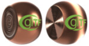
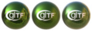
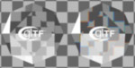
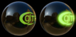
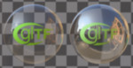
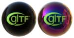
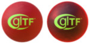
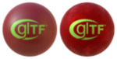
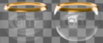
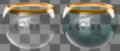

# glTF 2.0 Sample Assets

## Models tagged with '**pbrtest**'

Models that are used for illustrating the effect of PBR properties.

## Other Tagged Listings

* [#all](Models.md) - All models listed alphabetically.
* [#core](Models-core.md) - Models that only use the core glTF 2.0 features and capabilities.
* [#extension](Models-extension.md) - Models that use one or more extensions.
* [#issues](Models-issues.md) - Models with one or more issues with respect to ownership, license, or markings.
* [#showcase](Models-showcase.md) - Models that are featured in some glTF/Khronos publicity.
* [#testing](Models-testing.md) - Models that are used for testing various features or capabilities of importers, viewers, or converters.
* [#pbrtest](Models-pbrtest.md) - Models that are used for illustrating the effect of PBR properties.
* [#video](Models-video.md) - Models used in any glTF video tutorial.
* [#written](Models-written.md) - Models used in any written glTF tutorial or guide.

| Model   | Description |
|---------|-------------|
| [Compare Alpha Coverage](CompareAlphaCoverage/README.md)  [Show](https://github.khronos.org/glTF-Sample-Viewer-Release/?model=https://raw.githubusercontent.com/KhronosGroup/glTF-Sample-Assets/main/./Models/CompareAlphaCoverage/glTF-Binary/CompareAlphaCoverage.glb) -- [Download GLB](https://raw.githubusercontent.com/KhronosGroup/glTF-Sample-Assets/main/./Models/CompareAlphaCoverage/glTF-Binary/CompareAlphaCoverage.glb) | This model compares alpha coverage methods. Credit: &copy; 2017, Khronos Group. [Khronos Trademark or Logo](../LICENSES/LicenseRef-LegalMark-Khronos.txt)  - Non-copyrightable logo for glTF logo &copy; 2024, Public. [Creative Commons Zero v1.0 Universal](https://creativecommons.org/publicdomain/zero/1.0/legalcode)  - Eric Chadwick and DGG for Everything |
| [Compare Ambient Occlusion](CompareAmbientOcclusion/README.md)  [Show](https://github.khronos.org/glTF-Sample-Viewer-Release/?model=https://raw.githubusercontent.com/KhronosGroup/glTF-Sample-Assets/main/./Models/CompareAmbientOcclusion/glTF-Binary/CompareAmbientOcclusion.glb) -- [Download GLB](https://raw.githubusercontent.com/KhronosGroup/glTF-Sample-Assets/main/./Models/CompareAmbientOcclusion/glTF-Binary/CompareAmbientOcclusion.glb) | This model compares without occlusion versus with occlusion. Credit: &copy; 2017, Khronos Group. [Khronos Trademark or Logo](../LICENSES/LicenseRef-LegalMark-Khronos.txt)  - Non-copyrightable logo for glTF logo &copy; 2024, Public. [Creative Commons Zero v1.0 Universal](https://creativecommons.org/publicdomain/zero/1.0/legalcode)  - Polyhaven for Models &copy; 2024, Public. [Creative Commons Zero v1.0 Universal](https://creativecommons.org/publicdomain/zero/1.0/legalcode)  - Eric Chadwick and DGG for Textures |
| [Compare Anisotropy](CompareAnisotropy/README.md)  [Show](https://github.khronos.org/glTF-Sample-Viewer-Release/?model=https://raw.githubusercontent.com/KhronosGroup/glTF-Sample-Assets/main/./Models/CompareAnisotropy/glTF-Binary/CompareAnisotropy.glb) -- [Download GLB](https://raw.githubusercontent.com/KhronosGroup/glTF-Sample-Assets/main/./Models/CompareAnisotropy/glTF-Binary/CompareAnisotropy.glb) | This model compares without anisotropy vs. with anisotropy. Credit: &copy; 2017, Khronos Group. [Khronos Trademark or Logo](../LICENSES/LicenseRef-LegalMark-Khronos.txt)  - Non-copyrightable logo for glTF logo &copy; 2024, Public. [Creative Commons Zero v1.0 Universal](https://creativecommons.org/publicdomain/zero/1.0/legalcode)  - Eric Chadwick and DGG for Everything |
| [Compare Base Color](CompareBaseColor/README.md)  [Show](https://github.khronos.org/glTF-Sample-Viewer-Release/?model=https://raw.githubusercontent.com/KhronosGroup/glTF-Sample-Assets/main/./Models/CompareBaseColor/glTF-Binary/CompareBaseColor.glb) -- [Download GLB](https://raw.githubusercontent.com/KhronosGroup/glTF-Sample-Assets/main/./Models/CompareBaseColor/glTF-Binary/CompareBaseColor.glb) | This model compares base color methods. Credit: &copy; 2017, Khronos Group. [Khronos Trademark or Logo](../LICENSES/LicenseRef-LegalMark-Khronos.txt)  - Non-copyrightable logo for glTF logo &copy; 2024, Public. [Creative Commons Zero v1.0 Universal](https://creativecommons.org/publicdomain/zero/1.0/legalcode)  - Eric Chadwick and DGG for Everything |
| [Compare Clearcoat](CompareClearcoat/README.md)  [Show](https://github.khronos.org/glTF-Sample-Viewer-Release/?model=https://raw.githubusercontent.com/KhronosGroup/glTF-Sample-Assets/main/./Models/CompareClearcoat/glTF-Binary/CompareClearcoat.glb) -- [Download GLB](https://raw.githubusercontent.com/KhronosGroup/glTF-Sample-Assets/main/./Models/CompareClearcoat/glTF-Binary/CompareClearcoat.glb) | This model compares clearcoat methods. Credit: &copy; 2017, Khronos Group. [Khronos Trademark or Logo](../LICENSES/LicenseRef-LegalMark-Khronos.txt)  - Non-copyrightable logo for glTF logo &copy; 2024, Public. [Creative Commons Zero v1.0 Universal](https://creativecommons.org/publicdomain/zero/1.0/legalcode)  - Eric Chadwick and DGG for Everything |
| [Compare Dispersion](CompareDispersion/README.md)  [Show](https://github.khronos.org/glTF-Sample-Viewer-Release/?model=https://raw.githubusercontent.com/KhronosGroup/glTF-Sample-Assets/main/./Models/CompareDispersion/glTF-Binary/CompareDispersion.glb) -- [Download GLB](https://raw.githubusercontent.com/KhronosGroup/glTF-Sample-Assets/main/./Models/CompareDispersion/glTF-Binary/CompareDispersion.glb) | This model compares dispersion methods. Credit: &copy; 2017, Khronos Group. [Khronos Trademark or Logo](../LICENSES/LicenseRef-LegalMark-Khronos.txt)  - Non-copyrightable logo for glTF logo &copy; 2024, Public. [Creative Commons Zero v1.0 Universal](https://creativecommons.org/publicdomain/zero/1.0/legalcode)  - Eric Chadwick and DGG for Everything |
| [Compare Emissive Strength](CompareEmissiveStrength/README.md)  [Show](https://github.khronos.org/glTF-Sample-Viewer-Release/?model=https://raw.githubusercontent.com/KhronosGroup/glTF-Sample-Assets/main/./Models/CompareEmissiveStrength/glTF-Binary/CompareEmissiveStrength.glb) -- [Download GLB](https://raw.githubusercontent.com/KhronosGroup/glTF-Sample-Assets/main/./Models/CompareEmissiveStrength/glTF-Binary/CompareEmissiveStrength.glb) | This model compares emissive versus emissive plus emissive strength. Credit: &copy; 2017, Khronos Group. [Khronos Trademark or Logo](../LICENSES/LicenseRef-LegalMark-Khronos.txt)  - Non-copyrightable logo for glTF logo &copy; 2024, Public. [Creative Commons Zero v1.0 Universal](https://creativecommons.org/publicdomain/zero/1.0/legalcode)  - Eric Chadwick and DGG for Everything |
| [Compare IOR](CompareIor/README.md)  [Show](https://github.khronos.org/glTF-Sample-Viewer-Release/?model=https://raw.githubusercontent.com/KhronosGroup/glTF-Sample-Assets/main/./Models/CompareIor/glTF-Binary/CompareIor.glb) -- [Download GLB](https://raw.githubusercontent.com/KhronosGroup/glTF-Sample-Assets/main/./Models/CompareIor/glTF-Binary/CompareIor.glb) | This model compares IOR methods. Credit: &copy; 2017, Khronos Group. [Khronos Trademark or Logo](../LICENSES/LicenseRef-LegalMark-Khronos.txt)  - Non-copyrightable logo for glTF logo &copy; 2024, Public. [Creative Commons Zero v1.0 Universal](https://creativecommons.org/publicdomain/zero/1.0/legalcode)  - Eric Chadwick and DGG for Everything |
| [Compare Iridescence](CompareIridescence/README.md)  [Show](https://github.khronos.org/glTF-Sample-Viewer-Release/?model=https://raw.githubusercontent.com/KhronosGroup/glTF-Sample-Assets/main/./Models/CompareIridescence/glTF-Binary/CompareIridescence.glb) -- [Download GLB](https://raw.githubusercontent.com/KhronosGroup/glTF-Sample-Assets/main/./Models/CompareIridescence/glTF-Binary/CompareIridescence.glb) | This model compares iridescence methods. Credit: &copy; 2017, Khronos Group. [Khronos Trademark or Logo](../LICENSES/LicenseRef-LegalMark-Khronos.txt)  - Non-copyrightable logo for glTF logo &copy; 2024, Public. [Creative Commons Zero v1.0 Universal](https://creativecommons.org/publicdomain/zero/1.0/legalcode)  - Eric Chadwick and DGG for Everything |
| [Compare Metallic](CompareMetallic/README.md)  [Show](https://github.khronos.org/glTF-Sample-Viewer-Release/?model=https://raw.githubusercontent.com/KhronosGroup/glTF-Sample-Assets/main/./Models/CompareMetallic/glTF-Binary/CompareMetallic.glb) -- [Download GLB](https://raw.githubusercontent.com/KhronosGroup/glTF-Sample-Assets/main/./Models/CompareMetallic/glTF-Binary/CompareMetallic.glb) | This model compares metallic methods. Credit: &copy; 2017, Khronos Group. [Khronos Trademark or Logo](../LICENSES/LicenseRef-LegalMark-Khronos.txt)  - Non-copyrightable logo for glTF logo &copy; 2024, Public. [Creative Commons Zero v1.0 Universal](https://creativecommons.org/publicdomain/zero/1.0/legalcode)  - Eric Chadwick and DGG for Everything |
| [Compare Normal](CompareNormal/README.md)  [Show](https://github.khronos.org/glTF-Sample-Viewer-Release/?model=https://raw.githubusercontent.com/KhronosGroup/glTF-Sample-Assets/main/./Models/CompareNormal/glTF-Binary/CompareNormal.glb) -- [Download GLB](https://raw.githubusercontent.com/KhronosGroup/glTF-Sample-Assets/main/./Models/CompareNormal/glTF-Binary/CompareNormal.glb) | This model compares normal methods. Credit: &copy; 2017, Khronos Group. [Khronos Trademark or Logo](../LICENSES/LicenseRef-LegalMark-Khronos.txt)  - Non-copyrightable logo for glTF logo &copy; 2024, Public. [Creative Commons Zero v1.0 Universal](https://creativecommons.org/publicdomain/zero/1.0/legalcode)  - Eric Chadwick and DGG for Everything |
| [Compare Roughness](CompareRoughness/README.md)  [Show](https://github.khronos.org/glTF-Sample-Viewer-Release/?model=https://raw.githubusercontent.com/KhronosGroup/glTF-Sample-Assets/main/./Models/CompareRoughness/glTF-Binary/CompareRoughness.glb) -- [Download GLB](https://raw.githubusercontent.com/KhronosGroup/glTF-Sample-Assets/main/./Models/CompareRoughness/glTF-Binary/CompareRoughness.glb) | This model compares roughness methods. Credit: &copy; 2017, Khronos Group. [Khronos Trademark or Logo](../LICENSES/LicenseRef-LegalMark-Khronos.txt)  - Non-copyrightable logo for glTF logo &copy; 2024, Public. [Creative Commons Zero v1.0 Universal](https://creativecommons.org/publicdomain/zero/1.0/legalcode)  - Eric Chadwick and DGG for Everything |
| [Compare Sheen](CompareSheen/README.md)  [Show](https://github.khronos.org/glTF-Sample-Viewer-Release/?model=https://raw.githubusercontent.com/KhronosGroup/glTF-Sample-Assets/main/./Models/CompareSheen/glTF-Binary/CompareSheen.glb) -- [Download GLB](https://raw.githubusercontent.com/KhronosGroup/glTF-Sample-Assets/main/./Models/CompareSheen/glTF-Binary/CompareSheen.glb) | This model compares sheen methods. Credit: &copy; 2017, Khronos Group. [Khronos Trademark or Logo](../LICENSES/LicenseRef-LegalMark-Khronos.txt)  - Non-copyrightable logo for glTF logo &copy; 2024, Public. [Creative Commons Zero v1.0 Universal](https://creativecommons.org/publicdomain/zero/1.0/legalcode)  - Eric Chadwick and DGG for Everything |
| [Compare Specular](CompareSpecular/README.md)  [Show](https://github.khronos.org/glTF-Sample-Viewer-Release/?model=https://raw.githubusercontent.com/KhronosGroup/glTF-Sample-Assets/main/./Models/CompareSpecular/glTF-Binary/CompareSpecular.glb) -- [Download GLB](https://raw.githubusercontent.com/KhronosGroup/glTF-Sample-Assets/main/./Models/CompareSpecular/glTF-Binary/CompareSpecular.glb) | This model compares specular methods. Credit: &copy; 2017, Khronos Group. [Khronos Trademark or Logo](../LICENSES/LicenseRef-LegalMark-Khronos.txt)  - Non-copyrightable logo for glTF logo &copy; 2024, Public. [Creative Commons Zero v1.0 Universal](https://creativecommons.org/publicdomain/zero/1.0/legalcode)  - Eric Chadwick and DGG for Everything |
| [Compare Transmission](CompareTransmission/README.md)  [Show](https://github.khronos.org/glTF-Sample-Viewer-Release/?model=https://raw.githubusercontent.com/KhronosGroup/glTF-Sample-Assets/main/./Models/CompareTransmission/glTF-Binary/CompareTransmission.glb) -- [Download GLB](https://raw.githubusercontent.com/KhronosGroup/glTF-Sample-Assets/main/./Models/CompareTransmission/glTF-Binary/CompareTransmission.glb) | This model compares transmission methods. Credit: &copy; 2017, Khronos Group. [Khronos Trademark or Logo](../LICENSES/LicenseRef-LegalMark-Khronos.txt)  - Non-copyrightable logo for glTF logo &copy; 2024, Public. [Creative Commons Zero v1.0 Universal](https://creativecommons.org/publicdomain/zero/1.0/legalcode)  - Eric Chadwick and DGG for Everything |
| [Compare Volume](CompareVolume/README.md)  [Show](https://github.khronos.org/glTF-Sample-Viewer-Release/?model=https://raw.githubusercontent.com/KhronosGroup/glTF-Sample-Assets/main/./Models/CompareVolume/glTF-Binary/CompareVolume.glb) -- [Download GLB](https://raw.githubusercontent.com/KhronosGroup/glTF-Sample-Assets/main/./Models/CompareVolume/glTF-Binary/CompareVolume.glb) | This model compares volume methods. Credit: &copy; 2017, Khronos Group. [Khronos Trademark or Logo](../LICENSES/LicenseRef-LegalMark-Khronos.txt)  - Non-copyrightable logo for glTF logo &copy; 2024, Public. [Creative Commons Zero v1.0 Universal](https://creativecommons.org/publicdomain/zero/1.0/legalcode)  - Eric Chadwick and DGG for Everything |
---

### Copyright

&copy; 2026, The Khronos Group.

**License:** [Creative Commons Attribution 4.0 International](https://creativecommons.org/licenses/by/4.0/legalcode)

<!-- This file is auto-generated by modelmetadata. Do not edit by hand. -->
